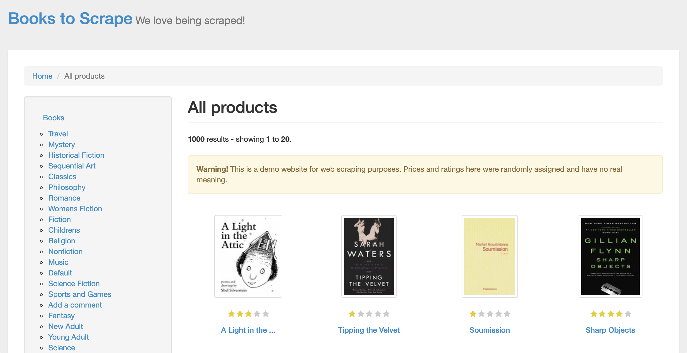
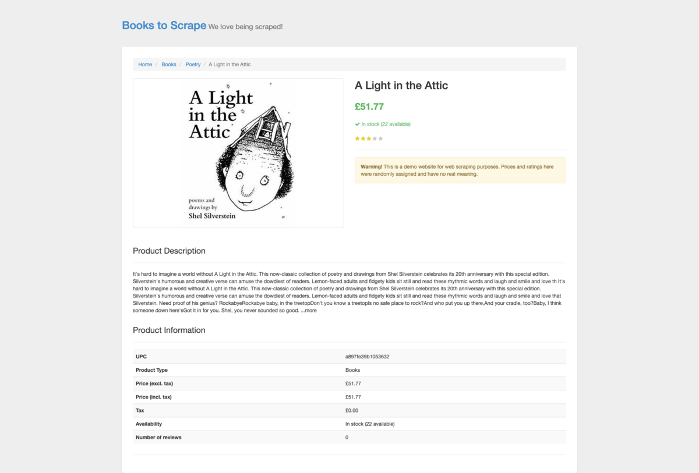

# 第5章　Scrapy ShellとXpath


## はじめに

TODO

### Xpathとは

TODO

### Scrapy Shellとは

Scrapy Shellを使って、下記のサイトのすべての値を取得する方法をまとめておきます。

* [Books to Scrape](http://books.toscrape.com/)



```
$ scrapy shell 'http://books.toscrape.com/'
```

#### タイトル

タイトルの「Books to Scrape We love being scraped!」を取得する。

```text
In [20]: response.xpath('//*[@class="col-sm-8 h1"]/a/text()').get()                                                                                                                  
Out[20]: 'Books to Scrape'

In [22]: response.xpath('//*[@class="col-sm-8 h1"]/small/text()').get()                                                                                                              
Out[22]: ' We love being scraped!'
```

#### Homeボタン

タイトルの下にあるHomeボタンの文字とURLを取得する。

```text
In [23]: response.xpath('//*[@class="breadcrumb"]/li/a/text()').get()                                                                                                                
Out[23]: 'Home'

In [24]: response.xpath('//*[@class="breadcrumb"]/li/a/@href').get()                                                                                                                 
Out[24]: 'index.html'

In [28]:                                                                                                                                                     
Out[28]: 'http://books.toscrape.com/index.html'
```

#### Homeボタン横の文字

タイトルの下にあるHomeボタンの横の「All products」の文字を取得する。

```text
In [30]: response.xpath('//*[@class="active"]/text()').get()                                                                                                                         
Out[30]: 'All products'
```

#### ナビゲーションのタイトル

左端のナビゲーションのタイトルの「Book」の文字とURLを取得する。

```text
In [32]: str = response.xpath('//*[@class="nav nav-list"]/li/a/text()').get()
In [41]: print(str.replace(" ", "").replace("\n", ""))                                                                                                                               
Books

In [45]: response.xpath('//*[@class="nav nav-list"]/li/a/@href').get()                                                                                                               
Out[45]: 'catalogue/category/books_1/index.html'
```

#### ナビゲーションのリスト

左端のナビゲーションのリストの文字とURLをとる。

```text
In [91]: response.xpath('//*[@class="side_categories"]/ul/li/ul/li/a/@href').getall()                                                                                                
Out[91]: 
['catalogue/category/books/travel_2/index.html',
 'catalogue/category/books/mystery_3/index.html',
【略】
 'catalogue/category/books/erotica_50/index.html',
 'catalogue/category/books/crime_51/index.html']

In [104]: strings = response.xpath('//*[@class="side_categories"]/ul/li/ul/li/a/text()').getall()                                                                                    

In [105]: list = [] 
     ...:  
     ...: for string in strings: 
     ...:     string = string.replace(' ', '') 
     ...:     string = string.replace('\n', '') 
     ...:     list.append(string) 
     ...:  
     ...: print(list)                                                                                                                                                                
['Travel', 'Mystery', 'HistoricalFiction', 'SequentialArt', 'Classics', 'Philosophy', 'Romance', 'WomensFiction', 'Fiction', 'Childrens', 'Religion', 'Nonfiction', 'Music', 'Default', 'ScienceFiction', 'SportsandGames', 'Addacomment', 'Fantasy', 'NewAdult', 'YoungAdult', 'Science', 'Poetry', 'Paranormal', 'Art', 'Psychology', 'Autobiography', 'Parenting', 'AdultFiction', 'Humor', 'Horror', 'History', 'FoodandDrink', 'ChristianFiction', 'Business', 'Biography', 'Thriller', 'Contemporary', 'Spirituality', 'Academic', 'SelfHelp', 'Historical', 'Christian', 'Suspense', 'ShortStories', 'Novels', 'Health', 'Politics', 'Cultural', 'Erotica', 'Crime']
```

#### 書籍一覧のタイトル

書籍一覧のタイトルの「All products」という文字を取得する。

```text
In [108]: response.xpath('//h1/text()').get()                                                                                                                                        
Out[108]: 'All products'
```

#### ページャの部分

書籍一覧のタイトルの下の「1000 results - showing 1 to 20.」の部分を取得する。ソースを見るとこれ以上辿れないので、`following-sibling::text()`で子孫を取得するようにしている。

```text
In [114]: response.xpath('//*[@class="form-horizontal"]/strong/text()').getall()                                                                                                     
Out[114]: ['1000', '1', '20']

In [116]: response.xpath('//*[@class="form-horizontal"]/strong/following-sibling::text()').getall()                                                                                  
Out[116]: 
[' results - showing ',
 ' to ',
 '.\n                \n            \n            \n        \n    ']
```

#### ワーニングの部分

書籍一覧のタイトルの下の「ワーニング」の文字列を取得する。

```text
In [118]: response.xpath('//*[@class="alert alert-warning"]/strong/text()').get()                                                                                                    
Out[118]: 'Warning!'

In [119]: response.xpath('//*[@class="alert alert-warning"]/text()').get()                                                                                                           
Out[119]: ' This is a demo website for web scraping purposes. Prices and ratings here were randomly assigned and have no real meaning.'
```

#### 書籍の画像のURL

書籍の画像のURLを取得する。

```text
In [122]: response.xpath('//*[@class="image_container"]/a/@href').getall()                                                                                                           
Out[122]: 
['catalogue/a-light-in-the-attic_1000/index.html',
 'catalogue/tipping-the-velvet_999/index.html',
 'catalogue/soumission_998/index.html',
 'catalogue/sharp-objects_997/index.html',
 'catalogue/sapiens-a-brief-history-of-humankind_996/index.html',
 'catalogue/the-requiem-red_995/index.html',
 'catalogue/the-dirty-little-secrets-of-getting-your-dream-job_994/index.html',
 'catalogue/the-coming-woman-a-novel-based-on-the-life-of-the-infamous-feminist-victoria-woodhull_993/index.html',
 'catalogue/the-boys-in-the-boat-nine-americans-and-their-epic-quest-for-gold-at-the-1936-berlin-olympics_992/index.html',
 'catalogue/the-black-maria_991/index.html',
 'catalogue/starving-hearts-triangular-trade-trilogy-1_990/index.html',
 'catalogue/shakespeares-sonnets_989/index.html',
 'catalogue/set-me-free_988/index.html',
 'catalogue/scott-pilgrims-precious-little-life-scott-pilgrim-1_987/index.html',
 'catalogue/rip-it-up-and-start-again_986/index.html',
 'catalogue/our-band-could-be-your-life-scenes-from-the-american-indie-underground-1981-1991_985/index.html',
 'catalogue/olio_984/index.html',
 'catalogue/mesaerion-the-best-science-fiction-stories-1800-1849_983/index.html',
 'catalogue/libertarianism-for-beginners_982/index.html',
 'catalogue/its-only-the-himalayas_981/index.html']
```

#### 書籍のタイトル

書籍のタイトルを取得する。

```text
In [155]: response.xpath('//h3/a/text()').getall()                                                                                                                                   
Out[155]: 
['A Light in the ...',
 'Tipping the Velvet',
 'Soumission',
 'Sharp Objects',
 'Sapiens: A Brief History ...',
 'The Requiem Red',
 'The Dirty Little Secrets ...',
 'The Coming Woman: A ...',
 'The Boys in the ...',
 'The Black Maria',
 'Starving Hearts (Triangular Trade ...',
 "Shakespeare's Sonnets",
 'Set Me Free',
 "Scott Pilgrim's Precious Little ...",
 'Rip it Up and ...',
 'Our Band Could Be ...',
 'Olio',
 'Mesaerion: The Best Science ...',
 'Libertarianism for Beginners',
 "It's Only the Himalayas"]
```

#### レビューの星

レビューの星の数を取得する。ソースを見るとわかるが、一筋縄ではいかないので、`contains(@class, "star-rating")]`として、`star-rating`を含むクラスを取るようにしている。

```text
In [125]: response.xpath('//*[contains(@class, "star-rating")]/@class').getall()                                                                                                     
Out[125]: 
['star-rating Three',
 'star-rating One',
 'star-rating One',
【略】
 'star-rating One',
 'star-rating Two',
 'star-rating Two']
```

#### 書籍の金額

書籍の金額を取得する。

```text
In [127]: response.xpath('//*[@class="price_color"]/text()').getall()                                                                                                                
Out[127]: 
['£51.77',
 '£53.74',
 '£50.10',
 '£47.82',
 '£54.23',
 '£22.65',
 '£33.34',
 '£17.93',
 '£22.60',
 '£52.15',
 '£13.99',
 '£20.66',
 '£17.46',
 '£52.29',
 '£35.02',
 '£57.25',
 '£23.88',
 '£37.59',
 '£51.33',
 '£45.17']
```

#### 書籍の在庫ステータス

書籍の在庫ステータス「In stock」を取得する。これで取ると、同じ階層の`i`タグの空テキストも入るので20個のはずが40個返る。

```text
In [131]: response.xpath('//*[@class="instock availability"]/text()').getall()                                                                                                       
Out[131]: 
['\n    ',
 '\n    \n        In stock\n    \n',
 '\n    ',
 '\n    \n        In stock\n    \n',
【略】
 '\n    \n        In stock\n    \n',
 '\n    ',
 '\n    \n        In stock\n    \n']
```

なので、１つ上の階層から`following-sibling::text()`でノードと同じ階層にあり、かつ後に出てくる兄弟ノードの集合を取る。後は改行と空白を削除する。

```text
In [152]: response.xpath('//*[@class="icon-ok"]/following-sibling::text()').getall()                                                                                                 
Out[152]: 
['\n    \n        In stock\n    \n',
 '\n    \n        In stock\n    \n',
 '\n    \n        In stock\n    \n',
【略】
 '\n    \n        In stock\n    \n',
 '\n    \n        In stock\n    \n',
 '\n    \n        In stock\n    \n']
```

#### カートに入れるボタン

カートに入れるボタンの文字を取得する。

```text
In [154]: response.xpath('//*[@class="btn btn-primary btn-block"]/text()').getall()                                                                                                  
Out[154]: 
['Add to basket',
 'Add to basket',
 'Add to basket',
 'Add to basket',
 'Add to basket',
 'Add to basket',
 'Add to basket',
 'Add to basket',
 'Add to basket',
 'Add to basket',
 'Add to basket',
 'Add to basket',
 'Add to basket',
 'Add to basket',
 'Add to basket',
 'Add to basket',
 'Add to basket',
 'Add to basket',
 'Add to basket',
 'Add to basket']
```

#### 1番下のページャ

1番下のページャの文字を取得する。

```text
In [159]: response.xpath('//*[@class="current"]/text()').get()                                                                                                                       
Out[159]: '\n            \n                Page 1 of 50\n            \n            '
```

#### 1番下のNextボタン

1番下のNextボタンの文字とURLを取得する。

```text
In [166]: response.xpath('//*[@class="next"]/a/@href').get()                                                                                                                         
Out[166]: 'catalogue/page-2.html'

In [167]: response.xpath('//*[@class="next"]/a/text()').get()                                                                                                                        
Out[167]: 'next'
```

### 書籍の詳細ページ

ここからは[書籍の詳細ページ](http://books.toscrape.com/catalogue/a-light-in-the-attic_1000/index.html)の中身の情報を全部とってみます。

```
$ scrapy shell 'http://books.toscrape.com/catalogue/a-light-in-the-attic_1000/index.html'
```



#### パンくずリストの商品名

パンくずリストのパンくずと商品名を取る。

```text
In [11]: response.xpath('//*[@class="breadcrumb"]/li/a/text()').getall()                                                                                      
Out[11]: ['Home', 'Books', 'Poetry']

In [6]: response.xpath('//*[@class="active"]/text()').get()                                                                                                   
Out[6]: 'A Light in the Attic'
```

#### 商品画像のURL

商品画像のURLをとる。

```text
In [12]: response.xpath('//*[@class="item active"]/img/@src').get()                                                                                           
Out[12]: '../../media/cache/fe/72/fe72f0532301ec28892ae79a629a293c.jpg'
```

#### 商品名、金額、ステータス

商品名、金額、ステータスを取得する

```text
In [14]: response.xpath('//h1/text()').get()                                                                                                                  
Out[14]: 'A Light in the Attic'

In [15]: response.xpath('//*[@class="price_color"]/text()').get()                                                                                             
Out[15]: '£51.77'

In [20]: response.xpath('//*[@class="instock availability"]/i/following-sibling::text()').get()                                                               
Out[20]: '\n    \n        In stock (22 available)\n    \n'

In [22]: response.xpath('//*[contains(@class, "star-rating")]/@class').get()                                                                                  
Out[22]: 'star-rating Three'
```

#### 説明文のタイトルと説明文

説明文のタイトルと説明文を取得する。クラスが`product_description`のノードと同じ階層にあり、かつ後に出てくる兄弟ノードの`p`の集合からテキストを取る。

```text
In [24]: response.xpath('//h2/text()').get()                                                                                                                  
Out[24]: 'Product Description'

In [30]: response.xpath('//*[@id="product_description"]/following-sibling::p/text()').get()                                                                   
Out[30]: "It's hard to imagine a world without A Light in the Attic. This now-classic collection of poetry and drawings from Shel Silverstein celebrates its 20th anniversary with this special edition. Silverstein's humorous and creative verse can amuse the dowdiest of readers. Lemon-faced adults and fidgety kids sit still and read these rhythmic words and laugh and smile and love th It's hard to imagine a world without A Light in the Attic. This now-classic collection of poetry and drawings from Shel Silverstein celebrates its 20th anniversary with this special edition. Silverstein's humorous and creative verse can amuse the dowdiest of readers. Lemon-faced adults and fidgety kids sit still and read these rhythmic words and laugh and smile and love that Silverstein. Need proof of his genius? RockabyeRockabye baby, in the treetopDon't you know a treetopIs no safe place to rock?And who put you up there,And your cradle, too?Baby, I think someone down here'sGot it in for you. Shel, you never sounded so good. ...more"
```

#### 商品の情報一覧

商品の情報一覧をすべて取得する。

```text
In [60]: response.xpath('//th[text()="UPC"]/following-sibling::td/text()').get()                                                                              
Out[60]: 'a897fe39b1053632'

In [61]: response.xpath('//th[text()="Product Type"]/following-sibling::td/text()').get()                                                                     
Out[61]: 'Books'

In [62]: response.xpath('//th[text()="Price (excl. tax)"]/following-sibling::td/text()').get()                                                                
Out[62]: '£51.77'

In [63]: response.xpath('//th[text()="Price (incl. tax)"]/following-sibling::td/text()').get()                                                                
Out[63]: '£51.77'

In [64]: response.xpath('//th[text()="Tax"]/following-sibling::td/text()').get()                                                                              
Out[64]: '£0.00'

In [65]: response.xpath('//th[text()="Availability"]/following-sibling::td/text()').get()                                                                     
Out[65]: 'In stock (22 available)'

In [67]: response.xpath('//th[text()="Number of reviews"]/following-sibling::td/text()').get()                                                                
Out[67]: '0'
```

同じことを繰り返し書くの大変なので、テーブルなんかは名前を返るだけで値がとれるので、そのための関数を書く。

```text
n [68]: def table_info(response, name): 
    ...:     return response.xpath('//th[text()="' + name + '"]/following-sibling::td/text()').get() 

In [70]: table_info(response, "UPC")                                                                                                                          
Out[70]: 'a897fe39b1053632'

In [72]: table_info(response, "Product Type")                                                                                                                 
Out[72]: 'Books'

In [73]: table_info(response, "Number of reviews")                                                                                                            
Out[73]: '0'

In [74]: table_info(response, "Tax")                                                                                                                          
Out[74]: '£0.00'

In [75]: table_info(response, "Availability")                                                                                                                 
Out[75]: 'In stock (22 available)'
```

