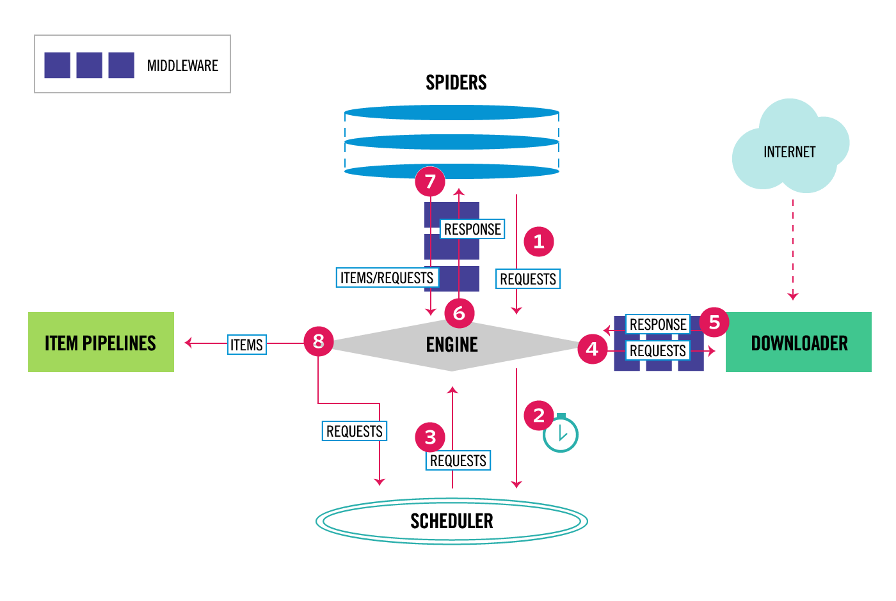

# 第2章　Scrapyとは

## はじめに

ここではScrapyの基本的な使い方をまとめておきます。加えて、各ファイルの役割、アーキテクチャについても簡単におさらいしておきます。

### Scrapyとは

Scrapyとは、起点となるURLを決定し、特定の条件のもとでクローラーを移動させ、Webサイトをクロールさせることで、構造化されたデータを抽出するためのPythonのフレームワークです。wget、正規表現、BeautifulSoup、Seleniumなどを組み合わせることで、クローラーの作成やWebスクレイピングはできますが、Scrapyを使うことで、スクレイピングの作業に集中してクローラーを作ることが可能です。

例えば、行儀よくスクレイピングするためのオプション\(後述\)をはじめ、データを連携して処理するパイプライン機能など、スクレイピングで利用したい様々な機能が、デフォルトで利用可能なため、1からクローラーを作り、様々な機能を新しく実装する必要がない点が特徴かと思います。

もちろん、フレームワークなので、それで対応できないものについては、1から自前のクローラーを作る必要があるので、必ずしもScrapyが優れているわけでもないと思いますが、非常に便利なフレームワークなので、ここではScrapyに焦点を当てて説明していきます。

### Scrapyのプロジェクト

まずはScrapyをインストールしていきます。ご自身の環境に合わせてpipやcondaでインストールしてください。仮想環境が必要であれば、仮想環境を作ってからインストールしてください。ここでは、pipでインストールします。

```text
# conda install -c conda-forge scrapy
$ pip install Scrapy

$ scrapy -V
Scrapy 2.0.1
```

Scrapyのプロジェクトファイルは、下記のコマンドで生成できます。ここでは、"sample\_pj"という名前のプロジェクトフォルダを作成しています。 

```text
$ scrapy startproject sample_pj
New Scrapy project 'sample_pj', using template directory '/Library/Frameworks/Python.framework/Versions/3.8/lib/python3.8/site-packages/scrapy/templates/project', created in:
    /Users/aki/Desktop/sample_pj

You can start your first spider with:
    cd sample_pj
    scrapy genspider example example.com
```

scrapy genspiderコマンドでクローラーの名前とスクレイピングしたいページのURLを指定します。指示にしたがって、scrapy genspiderコマンドでクローラーの名前"sample"と対象のサイトのURLとして"example.com"を指定します。

```text
$ cd sample_pj
~/Desktop/sample_pj 

$ scrapy genspider sample example.com
Created spider 'sample' using template 'basic' in module:
  sample_pj.spiders.sample
```

これでプロジェクトフォルダの作成は完了です。ここからスクリプトを記述して、スクレイピングを行っていきます。

### Scrapyの.pyファイル

さきほどのコマンドを実行すると、下記のようなフォルダが生成されます。各.pyファイルの役割をまとめておきます。

```text
$ tree ~/Desktop/sample_pj/
/Users/aki/Desktop/sample_pj/
├── sample_pj
│   ├── __init__.py
│   ├── items.py
│   ├── middlewares.py
│   ├── pipelines.py
│   ├── settings.py
│   └── spiders
│       ├── __init__.py
│       └── sample.py
└── scrapy.cfg
```

#### items.py

出力されるデータの形式を定義し、構造化されたデータを格納するために使用されます。矛盾したデータや、typoなどによる意図していないデータの混入を防ぐために利用できます。絶対に必要というわけではありませんが、使用することでクローラーを安定して運用できます。

出力データの形式を定義するために、Scrapyは Itemクラスを提供しています。Itemオブジェクトは、スクレイピングされたデータを収集するためのコンテナなようなもので、定義していない値などは弾かれてしまいます。

下記のように必要なデータを宣言します。

```text
class Product(scrapy.Item):
    X = scrapy.Field()
    Y = scrapy.Field()
    Z = scrapy.Field()
```

#### Spiders

scrapy genspiderコマンドで生成したSpidersディレクトリの中のsample.pyに、クローラーの動きやスクレイピングのコードなど、スクレイピング方法を定義するクラスです。このような感じで記述します。

QuotesSpiderは、allowed\_domainsで許可されたドメイン内において、start\_urlsで指定されたURLを起点に、QuotesSpiderは動き始めます。 URLのRequestを生成するstart\_requestsメソッドと、リクエストのコールバック関数としてparseメソッドを呼び出します。コールバック関数は、レスポンスであるWebページをセレクターを使用してページ内容をパースし、データの抽出を行い、辞書形式でアイテムを返します。そして、スパイダーから返されたアイテムは、データベースやcsv、JSONで保存できます。

```text
import scrapy


class QuotesSpider(scrapy.Spider):
    name = 'quotes'
    allowed_domains = ['quotes.toscrape.com']
    start_urls = ['http://quotes.toscrape.com/']

    def parse(self, response):
        quotes = response.xpath('//*[@class="quote"]')
        for quote in quotes:
            text = quote.xpath('.//*[@class="text"]/text()').get()
            author = quote.xpath('.//*[@class="author"]/text()').get()
            tags = quote.xpath('.//*[@class="tag"]/text()').getall()

            yield {
                "text": text,
                "author": author,
                "tags": tags
            }

        next_page_url = response.xpath('//*[@class="next"]/a/@href').get()
        abs_next_page_url = response.urljoin(next_page_url)
        if next_page_url is not None:
            yield scrapy.Request(abs_next_page_url, callback=self.parse)
```

* name：ターミナルでクローラーを起動させる場合に必要なクローラーの名前です。
* allowed\_domains：クロールできるドメインの文字列を渡します。
* start\_urls：クロールを開始するURLのリストです。複数指定できます。


### Scrapyのアーキテクチャ

ああああ



### Scrapyの環境設定


