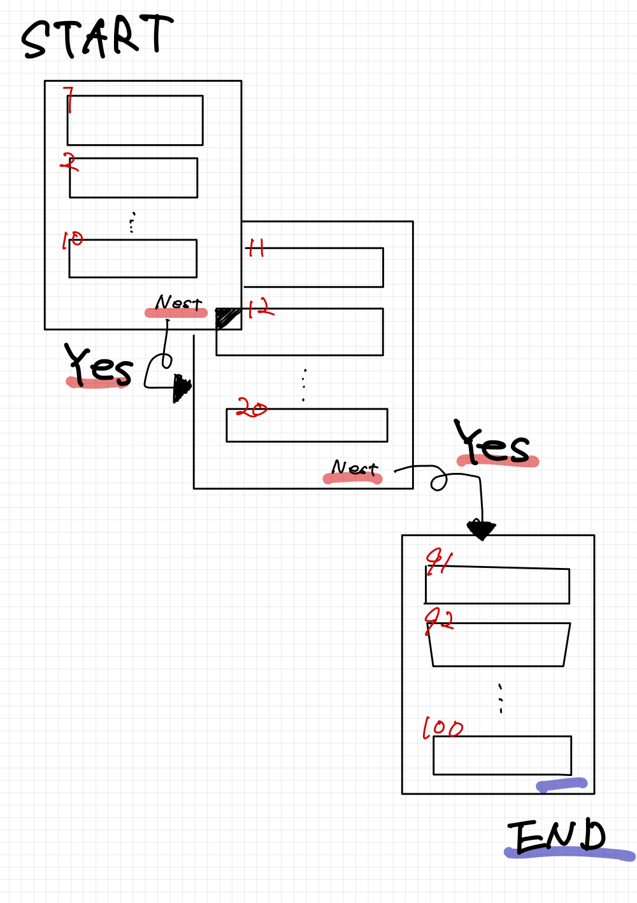

# 第4章　Scrapy Tutorial1

## はじめに

ここでは、Scrapyのドキュメントに載っている[チュートリアル](https://docs.scrapy.org/en/latest/intro/tutorial.html)を参考に、Scrapyでクローラーを作成する。チュートリアルを完全に再現するわけではなく、チュートリアルを題材にしながら寄り道しながら進めていきます。チュートリアルを実行されたい方はドキュメントを参照ください。スクレイピングの対象にするサイトは、チュートリアルと同じで下記の有名人の名言サイトです。

* [quotes.toscrape.com](http://quotes.toscrape.com/) 

### プロジェクトの作成

まずはプロジェクトを作成します。ここではプロジェクトの名前は「sample\_quotes」で、クローラーの名前を「quotes\_spider」としています。プロジェクトを作ったら、settings.pyの中身を礼儀が正しいように書き換えるのは忘れずに行います。

今回は「spiders/quotes\_spider.py」と「settings.py」だけ使います。これだけでも動かせるので。

```text
$ scrapy startproject sample_quotes
$ cd sample_quotes
$ scrapy genspider quotes_spider quotes.toscrape.com

$ tree
.
├── sample_quotes
│   ├── __init__.py
│   ├── items.py
│   ├── middlewares.py
│   ├── pipelines.py
│   ├── settings.py **これ**
│   └── spiders
│       ├── __init__.py
│       └── quotes_spider.py **これ**
└── scrapy.cfg
```

### HTML構造の調査とクローラーの設計

スクレイピングする前に、スクレイピングするページのHTML構造を確認します。こんページであれば、黒枠のブロックごとに青い線の「名言」、赤い線の「名前」、黄色い線の「タグ」が同じようなレイアウトで表示されています。


同じようなレイアウトで表示されているということは、HTMLの書き方も同じようになっているということです。実際にブラウザの検証機能で確認すると、同じようなHTML構造になっています。


これであれば、「ブロックを取得→詳細をスクレイピング→次のブロック→詳細をスクレイピング」ということを繰り返せば取得できそうです。実際に値がとれるか、Scrapy Shellを利用して確認します。

### Scrapy Shell

URLを渡して、Scrapy Shellでレスポンスを受け取ります。

```text
$ scrapy shell "http://quotes.toscrape.com/"

In [1]: response                                                                                                                        
Out[1]: <200 http://quotes.toscrape.com/>
```

まずはブロックの部分を取得します。ブロックの部分は、classがすべて「quote」なので、それを`xpath`に渡します。cssセレクタで指定することも可能ですが、ここでは、xpathにしぼります。xpathセレクターの使い方は、ドキュメントの[Selectors](https://docs.scrapy.org/en/latest/topics/selectors.html)を参照してください。

```text
In [2]: response.xpath('//*[@class="quote"]')                                                                                           
Out[2]: 
[<Selector xpath='//*[@class="quote"]' data='<div class="quote" itemscope itemtype...'>,
 <Selector xpath='//*[@class="quote"]' data='<div class="quote" itemscope itemtype...'>,
 <Selector xpath='//*[@class="quote"]' data='<div class="quote" itemscope itemtype...'>,
 <Selector xpath='//*[@class="quote"]' data='<div class="quote" itemscope itemtype...'>,
 <Selector xpath='//*[@class="quote"]' data='<div class="quote" itemscope itemtype...'>,
 <Selector xpath='//*[@class="quote"]' data='<div class="quote" itemscope itemtype...'>,
 <Selector xpath='//*[@class="quote"]' data='<div class="quote" itemscope itemtype...'>,
 <Selector xpath='//*[@class="quote"]' data='<div class="quote" itemscope itemtype...'>,
 <Selector xpath='//*[@class="quote"]' data='<div class="quote" itemscope itemtype...'>,
 <Selector xpath='//*[@class="quote"]' data='<div class="quote" itemscope itemtype...'>]
```

数を数えてみると、10が返ってきます。ページの名言ブロックと一致しているのでOKですね。次は詳細部分をスクレイピングします。

```text
In [3]: len(response.xpath('//*[@class="quote"]')   )                                                                                   
Out[3]: 10
```

まずは名言を取得します。まずは、1番上のブロックをquoteに格納します。そして、quoteを使って、名言部分を先ほどと同じように`xpath`で指定します。名言は、classがすべて「text」なので、それをxpathに渡します。

```text
In [4]: quotes = response.xpath('//*[@class="quote"]')                                                                                  
In [5]: quote = quotes[0]                                                                                                               

In [6]: quote.xpath('.//*[@class="text"]/text()').get()                                                                                 
Out[6]: '“The world as we have created it is a process of our thinking. It cannot be changed without changing our thinking.”'
```

次は、同じ要領で「名前」と「タグ」をスクレイピングします。

```text
In [7]: quote.xpath('.//*[@class="author"]/text()').get()                                                                               
Out[7]: 'Albert Einstein'

In [8]: quote.xpath('.//*[@class="tag"]/text()').getall()                                                                               
Out[8]: ['change', 'deep-thoughts', 'thinking', 'world']
```

これでスクレイピングしたい情報のコードが書けました。これをブロックごとに繰り返したいので、下記のように`for-loop`で書き直し、取得した値は`yield`で出力します。

```text
quotes = response.xpath('//*[@class="quote"]')

for quote in quotes:
    text = quote.xpath('.//*[@class="text"]/text()').get()
    author = quote.xpath('.//*[@class="author"]/text()').get()
    tags = quote.xpath('.//*[@class="tag"]/text()').getall()

    yield {
        "text": text,
        "author": author,
        "tags": tags
    }
```

このページ1枚であればこれで良いのですが、全部で10ページあるので、次のページにクローラーを動かせるように、コードを追加します。次のページへの判断は「Next」があるかどうかで判断させます。10ページを見ると「Next」がないので、これ以上はクローラーは進まなくなります。

「Next」があるかどうかを調べるためにScrapy Shellで確認します。このボタンはclassが「next」でa要素に次のページへのURLがついているので、それがあるかないかで判定します。

```text
In [9]: response.xpath('//*[@class="next"]/a/@href').get()                                                                              
Out[9]: '/page/2/'
```

URLがあるかどうかで判定するのはこれで良いのですが、クローラーがこの相対パスのURLでは移動できません。なので、完全パスにURLを`urljoin`で修正します。

```text
next_page_url = response.xpath('//*[@class="next"]/a/@href').get()
abs_next_page_url = response.urljoin(next_page_url)
if abs_next_page_url is not None:
    yield Request(abs_next_page_url, callback=self.parse)
```

これで10ページ文の名言100個をスクレイピングする準備ができました。これを実行していきます。ページの移動のさせ方は下記のようにページ番号をインクリメントするように書いても問題ないです。

```text
class QuotesSpiderSpider(Spider):
    name = 'quotes_spider'
    allowed_domains = ['quotes.toscrape.com']
    
    page_number = 2
    start_urls = ['http://quotes.toscrape.com/page/1/']

    def parse(self, response):
        【略】
        
        next_page = 'http://quotes.toscrape.com/page/' + str(QuoteSpider.page_number) + '/'
        if QuoteSpider.page_number < 11:
            QuoteSpider.page_number += 1
            yield response.follow(next_page, callback=self.parse)
```

### クローラーの実行

ここまでのコードを「spiders/quotes\_spider.py」に書き込むと下記のようになります。

```text
# -*- coding: utf-8 -*-
from scrapy import Spider
from scrapy import Request


class QuotesSpiderSpider(Spider):
    name = 'quotes_spider'
    allowed_domains = ['quotes.toscrape.com']
    start_urls = ['http://quotes.toscrape.com/']

    def parse(self, response):
        quotes = response.xpath('//*[@class="quote"]')

        for quote in quotes:
            text = quote.xpath('.//*[@class="text"]/text()').get()
            author = quote.xpath('.//*[@class="author"]/text()').get()
            tags = quote.xpath('.//*[@class="tag"]/text()').getall()

            yield {
                "text": text,
                "author": author,
                "tags": tags
            }

        next_page_url = response.xpath('//*[@class="next"]/a/@href').get()
        abs_next_page_url = response.urljoin(next_page_url)
        if abs_next_page_url is not None:
            yield Request(abs_next_page_url, callback=self.parse)
```

このクローラーのイメージを書くとこんな感じになります。



では、`scrapy crawl`コマンドでクローラーを実行します。ここではJSONで書き出します。大量のログとともに、スクレイピングされていきます。

```text
$ scrapy crawl quotes_spider -o result.json
```

アウトレットされたJSONを確認してみます。プロジェクト内に書き出されているはずです。


結果を確認すると、どうやら期待通りに動いてくれているようです。`jq`コマンドはJSONを整形して表示してくれるものです。

```text
# brew install jq
$ cat result.json | jq | head -n 30
[
  {
    "text": "“The world as we have created it is a process of our thinking. It cannot be changed without changing our thinking.”",
    "author": "Albert Einstein",
    "tags": [
      "change",
      "deep-thoughts",
      "thinking",
      "world"
    ]
  },
  {
    "text": "“It is our choices, Harry, that show what we truly are, far more than our abilities.”",
    "author": "J.K. Rowling",
    "tags": [
      "abilities",
      "choices"
    ]
  },
  {
    "text": "“There are only two ways to live your life. One is as though nothing is a miracle. The other is as though everything is a miracle.”",
    "author": "Albert Einstein",
    "tags": [
      "inspirational",
      "life",
      "live",
      "miracle",
      "miracles"
    ]
  },

```

### ログ情報

`scrapy crawl`コマンドでクローラーを実行すると大量のログが出力されますが、これがどのようなログなのか、まとめていきます。ある程度のブロックごとに小分けして内容をまとめます。

まずは最初の数行を確認します。ここらへんは、scrapyのバージョンとか、関連するライブラリのバージョン、クローラーの名前、書き出し形式やそのファイル名、robots.txtに従うかどうか、みたいなことが書いてあります。

```text
$ scrapy crawl quotes_spider -o result.json
scrapy crawl quotes_spider -o result.json
2020-05-24 00:15:32 [scrapy.utils.log] INFO: Scrapy 2.0.1 started (bot: sample_quotes)
2020-05-24 00:15:32 [scrapy.utils.log] INFO: Versions: lxml 4.5.0.0, libxml2 2.9.10, cssselect 1.1.0, parsel 1.5.2, w3lib 1.21.0, Twisted 20.3.0, Python 3.8.2 (v3.8.2:7b3ab5921f, Feb 24 2020, 17:52:18) - [Clang 6.0 (clang-600.0.57)], pyOpenSSL 19.1.0 (OpenSSL 1.1.1g  21 Apr 2020), cryptography 2.9.1, Platform macOS-10.15.4-x86_64-i386-64bit
2020-05-24 00:15:32 [scrapy.utils.log] DEBUG: Using reactor: twisted.internet.selectreactor.SelectReactor
2020-05-24 00:15:32 [scrapy.crawler] INFO: Overridden settings:
{'BOT_NAME': 'sample_quotes',
 'CONCURRENT_REQUESTS': 1,
 'DOWNLOAD_DELAY': 3,
 'FEED_FORMAT': 'json',
 'FEED_URI': 'result.json',
 'NEWSPIDER_MODULE': 'sample_quotes.spiders',
 'ROBOTSTXT_OBEY': True,
 'SPIDER_MODULES': ['sample_quotes.spiders']}
```

ここらへんの行は、middlewareの設定が書いてあります。さきほどの部分でROBOTSTXT\_OBEYがTrueになっていましたが、このmiddlewareの中で、RobotsTxtMiddleware\(9行目\)が有効になっていることもわかります。どのタイミングでMidllewareによってパイプラインが拡張されるのかは、ScrapyのアーキテクチャのMiddlewareの部分を見ればわかると思います。

```text
2020-05-24 00:15:32 [scrapy.extensions.telnet] INFO: Telnet Password: 1a8dbcb6e9a6c554
2020-05-24 00:15:32 [scrapy.middleware] INFO: Enabled extensions:
['scrapy.extensions.corestats.CoreStats',
 'scrapy.extensions.telnet.TelnetConsole',
 'scrapy.extensions.memusage.MemoryUsage',
 'scrapy.extensions.feedexport.FeedExporter',
 'scrapy.extensions.logstats.LogStats']
2020-05-24 00:15:32 [scrapy.middleware] INFO: Enabled downloader middlewares:
['scrapy.downloadermiddlewares.robotstxt.RobotsTxtMiddleware',
 'scrapy.downloadermiddlewares.httpauth.HttpAuthMiddleware',
 'scrapy.downloadermiddlewares.downloadtimeout.DownloadTimeoutMiddleware',
 'scrapy.downloadermiddlewares.defaultheaders.DefaultHeadersMiddleware',
 'scrapy.downloadermiddlewares.useragent.UserAgentMiddleware',
 'scrapy.downloadermiddlewares.retry.RetryMiddleware',
 'scrapy.downloadermiddlewares.redirect.MetaRefreshMiddleware',
 'scrapy.downloadermiddlewares.httpcompression.HttpCompressionMiddleware',
 'scrapy.downloadermiddlewares.redirect.RedirectMiddleware',
 'scrapy.downloadermiddlewares.cookies.CookiesMiddleware',
 'scrapy.downloadermiddlewares.httpproxy.HttpProxyMiddleware',
 'scrapy.downloadermiddlewares.stats.DownloaderStats']
2020-05-24 00:15:32 [scrapy.middleware] INFO: Enabled spider middlewares:
['scrapy.spidermiddlewares.httperror.HttpErrorMiddleware',
 'scrapy.spidermiddlewares.offsite.OffsiteMiddleware',
 'scrapy.spidermiddlewares.referer.RefererMiddleware',
 'scrapy.spidermiddlewares.urllength.UrlLengthMiddleware',
 'scrapy.spidermiddlewares.depth.DepthMiddleware']
2020-05-24 00:15:32 [scrapy.middleware] INFO: Enabled item pipelines:
[]
```

続きを進めていきます。4行目でrobotx.txtのページにリクエストを送っています。6行目を見るとスクレイピングが開始され、7行目からその結果が出力されています。

```text
2020-05-24 00:15:32 [scrapy.core.engine] INFO: Spider opened
2020-05-24 00:15:32 [scrapy.extensions.logstats] INFO: Crawled 0 pages (at 0 pages/min), scraped 0 items (at 0 items/min)
2020-05-24 00:15:32 [scrapy.extensions.telnet] INFO: Telnet console listening on 127.0.0.1:6024
2020-05-24 00:15:33 [scrapy.core.engine] DEBUG: Crawled (404) <GET http://quotes.toscrape.com/robots.txt> (referer: None)
2020-05-24 00:15:36 [scrapy.core.engine] DEBUG: Crawled (200) <GET http://quotes.toscrape.com/> (referer: None)
2020-05-24 00:15:37 [scrapy.core.scraper] DEBUG: Scraped from <200 http://quotes.toscrape.com/>
{'text': '“The world as we have created it is a process of our thinking. It cannot be changed without changing our thinking.”', 'author': 'Albert Einstein', 'tags': ['change', 'deep-thoughts', 'thinking', 'world']}
```

100個目のスクレイピングが終わったところから、ログを眺めていきます。「'downloader/request\_count': 11」「'downloader/request\_method\_count/GET': 11」なのはrobot.txtが1ページと名言が10ページの合計11ページにリクエスト\(GET\)したということです。

「'downloader/response\_status\_count/200':10」「'downloader/response\_status\_count/404': 1」なのはrobot.txtが1ページが404で名言の10ページは200で正常に返ってきたからですね。

終了時刻の後にある「'item\_scraped\_count': 100」は100個のアイテムをスクレイピングしたことを意味します。その他のログは書いてあるとおりです。

```text
2020-05-24 00:16:09 [scrapy.dupefilters] DEBUG: Filtered duplicate request: <GET http://quotes.toscrape.com/page/10/> - no more duplicates will be shown (see DUPEFILTER_DEBUG to show all duplicates)
2020-05-24 00:16:09 [scrapy.core.engine] INFO: Closing spider (finished)
2020-05-24 00:16:09 [scrapy.extensions.feedexport] INFO: Stored json feed (100 items) in: result.json
2020-05-24 00:16:09 [scrapy.statscollectors] INFO: Dumping Scrapy stats:
{'downloader/request_bytes': 2881,
 'downloader/request_count': 11,
 'downloader/request_method_count/GET': 11,
 'downloader/response_bytes': 24911,
 'downloader/response_count': 11,
 'downloader/response_status_count/200': 10,
 'downloader/response_status_count/404': 1,
 'dupefilter/filtered': 1,
 'elapsed_time_seconds': 36.456222,
 'finish_reason': 'finished',
 'finish_time': datetime.datetime(2020, 5, 23, 15, 16, 9, 281111),
 'item_scraped_count': 100,
 'log_count/DEBUG': 112,
 'log_count/INFO': 11,
 'memusage/max': 49393664,
 'memusage/startup': 49393664,
 'request_depth_max': 10,
 'response_received_count': 11,
 'robotstxt/request_count': 1,
 'robotstxt/response_count': 1,
 'robotstxt/response_status_count/404': 1,
 'scheduler/dequeued': 10,
 'scheduler/dequeued/memory': 10,
 'scheduler/enqueued': 10,
 'scheduler/enqueued/memory': 10,
 'start_time': datetime.datetime(2020, 5, 23, 15, 15, 32, 824889)}
2020-05-24 00:16:09 [scrapy.core.engine] INFO: Spider closed (finished)
```

