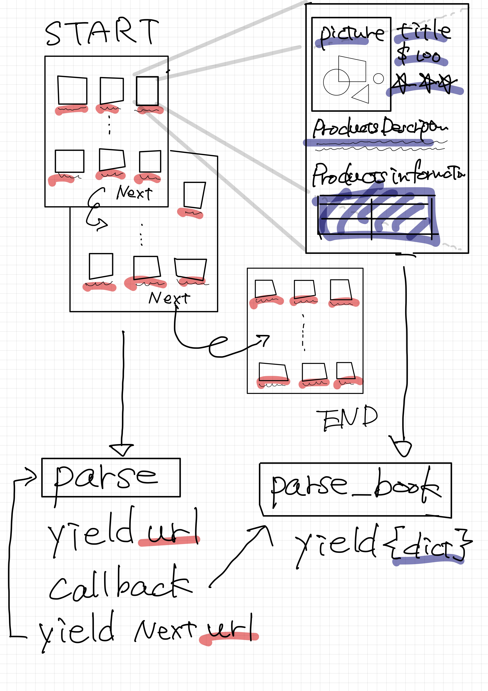

# 第6章　Scrapy Tutorial2

## はじめに

ここでは、架空のオンライン書店のWebページをスクレイピングし、Scrapyでクローラーを作成します。架空のオンライン書店とはいえ、HTMLの構造は一般的なECサイトなどとは変わらないので、非常によい練習になると思います。

* [Books to scrape](http://books.toscrape.com/)

### プロジェクトの作成

まずはプロジェクトを作成します。ここではプロジェクトの名前は「sample\_books」で、クローラーの名前を「books\_spider」としています。今回も前のチュートリアルと同じく「spiders/books\_spider.py」だけ使います。

```text
$ scrapy startproject sample_books
$ cd sample_books
$ scrapy genspider books_spider books.toscrape.com/

➜ tree
.
├── sample_books
│   ├── __init__.py
│   ├── items.py
│   ├── middlewares.py
│   ├── pipelines.py
│   ├── settings.py
│   └── spiders
│       ├── __init__.py
│       └── books_spider.py
└── scrapy.cfg

```

### HTML構造の調査とクローラーの設計

スクレイピングする前に、スクレイピングするページのHTML構造を確認します。このようなページであれば、まず「各書籍のURLを取得」→「順に詳細ページをスクレイピング」→「次のページへ移動」→「各書籍のURLを取得」→「詳細ページをスクレイピング」というようなイメージでクローラーを動かせば良いように思います。



### 必要な項目のスクレイピング

最初のチュートリアルと同じです。このページのURLを渡して、Scrapy Shellでレスポンスを受け取ります。scrapy shellを起動しているのであれば、`fetch`でレスポンスを受け取ることができます。

```text
# scrapy shell "http://books.toscrape.com"      
In [13]: fetch("http://books.toscrape.com")                                                                                        
```

まずは各書籍のページへ移動するためのURLを取得します。このページは第5章ですべての値を取得してるので、取りたい値のXpathは、それを参照すればよいですね。

例えば、「//h3/a/@href」と指定すれば、ページ内の書籍のURLが一覧で取得できます。「//h3/a/@href」だと検索に引っかかるのは、1つの書籍ではなくページ内の書籍のURLです。

このURLのリストをfor-loopで回すことで、各書籍のページへリクエストを送ることができます。

```text
In [14]: response.xpath('//h3/a/@href').getall()                                                                                        
Out[14]: 
['catalogue/a-light-in-the-attic_1000/index.html',
 'catalogue/tipping-the-velvet_999/index.html',
 'catalogue/soumission_998/index.html',
 'catalogue/sharp-objects_997/index.html',
 'catalogue/sapiens-a-brief-history-of-humankind_996/index.html',
 'catalogue/the-requiem-red_995/index.html',
 'catalogue/the-dirty-little-secrets-of-getting-your-dream-job_994/index.html',
 'catalogue/the-coming-woman-a-novel-based-on-the-life-of-the-infamous-feminist-victoria-woodhull_993/index.html',
 'catalogue/the-boys-in-the-boat-nine-americans-and-their-epic-quest-for-gold-at-the-1936-berlin-olympics_992/index.html',
 'catalogue/the-black-maria_991/index.html',
 'catalogue/starving-hearts-triangular-trade-trilogy-1_990/index.html',
 'catalogue/shakespeares-sonnets_989/index.html',
 'catalogue/set-me-free_988/index.html',
 'catalogue/scott-pilgrims-precious-little-life-scott-pilgrim-1_987/index.html',
 'catalogue/rip-it-up-and-start-again_986/index.html',
 'catalogue/our-band-could-be-your-life-scenes-from-the-american-indie-underground-1981-1991_985/index.html',
 'catalogue/olio_984/index.html',
 'catalogue/mesaerion-the-best-science-fiction-stories-1800-1849_983/index.html',
 'catalogue/libertarianism-for-beginners_982/index.html',
 'catalogue/its-only-the-himalayas_981/index.html']
```

では、各書籍のURLを使ってリクエストを送れるようにコードを書いていきます。

```python
books = response.xpath('//h3/a/@href').getall()
for book in books:
     abs_url = response.urljoin(book)
     yield Request(abs_url, callback=self.parse_book)
```

ついでに、Nextページに移動するためのURLを取得するコードを書いてきます。Scrapy Shellで調べます。これは、「//a\[text\(\)="next"\]/@href」で取得できそうです。

```text
In [15]: response.xpath('//a[text()="next"]/@href').get()                                                                               
Out[15]: 'catalogue/page-2.html'
```

これで次のページへのURLがとれるので、正規化してリクエストを送れるようにします。

```python
next_page_url = response.xpath('//a[text()="next"]/@href').get()
abs_next_page_url = response.urljoin(next_page_url)
if abs_next_page_url is not None:
    yield Request(abs_next_page_url, callback=self.parse)
```

これまでの部分をまとめると、このような`parse`関数ができているはずです。

```python
def parse(self, response):
    books = response.xpath('//h3/a/@href').getall()
    for book in books:
        abs_url = response.urljoin(book)
        yield Request(abs_url, callback=self.parse_book)

    # If there is a next button on this page, move the crawler
    next_page_url = response.xpath('//a[text()="next"]/@href').get()
    abs_next_page_url = response.urljoin(next_page_url)
    if abs_next_page_url is not None:
        yield Request(abs_next_page_url, callback=self.parse)
```

次は詳細ページです。これも第5章で取得してるのでそれを参考に書きます。ここまで書くと、「spiders/books\_spider.py」は、このようになっているはずです。

```python
# -*- coding: utf-8 -*-
from scrapy import Spider
from scrapy.http import Request

class BooksSpiderSpider(Spider):
    name = 'books_spider'
    allowed_domains = ['books.toscrape.com']
    start_urls = ['http://books.toscrape.com']

    def parse(self, response):
        books = response.xpath('//h3/a/@href').getall()
        for book in books:
            abs_url = response.urljoin(book)
            yield Request(abs_url, callback=self.parse_book)

        # If there is a next button on this page, move the crawler
        next_page_url = response.xpath('//a[text()="next"]/@href').get()
        abs_next_page_url = response.urljoin(next_page_url)
        if abs_next_page_url is not None:
            yield Request(abs_next_page_url, callback=self.parse)

    def parse_book(self, response):
        titie = response.xpath('//h1/text()').get()
        price = response.xpath('//*[@class="price_color"]/text()').get()

        img_url = response.xpath('.//img/@src').get()
        img_url = img_url.replace("../..", "http://books.toscrape.com/")

        rating = response.xpath('//*[contains(@class, "star-rating")]/@class').get()
        rating = rating.replace("star-rating ", "")

        description = response.xpath('//*[@id="product_description"]/following-sibling::p/text()').get()

        upc = response.xpath('//th[text()="UPC"]/following-sibling::td/text()').get()
        product_type = response.xpath('//th[text()="Product Type"]/following-sibling::td/text()').get()
        price_without_tax = response.xpath('//th[text()="Price (excl. tax)"]/following-sibling::td/text()').get()
        price_with_tax = response.xpath('//th[text()="Price (incl. tax)"]/following-sibling::td/text()').get()
        tax = response.xpath('//th[text()="Tax"]/following-sibling::td/text()').get()
        availability = response.xpath('//th[text()="Availability"]/following-sibling::td/text()').get()
        number_of_reviews = response.xpath('//th[text()="Number of reviews"]/following-sibling::td/text()').get()

        yield {
            "titie" : titie,
            "price" : price,
            "img_url" : img_url,
            "rating" : rating,
            "description" : description,
            "upc" : upc,
            "product_type" : product_type,
            "price_without_tax" : price_without_tax,
            "price_with_tax" : price_with_tax,
            "tax" : tax,
            "availability" : availability,
            "number_of_reviews" : number_of_reviews
        }
```

### クローラーの実行

では`books_spider`クローラーを実行します。書籍は全部で1000冊です。1ページ20冊で50ページあるので、合計1000冊分取得できれば問題ありません。

```text
$ scrapy crawl books_spider -o result.json
【略】
 'item_scraped_count': 1000,
```

出力されたJSONを確認します。特に問題なくスクレイピングできていると思います。

```text
$ cat result.json | jq | head -n 30
[
  {
    "titie": "Olio",
    "price": "£23.88",
    "img_url": "http://books.toscrape.com//media/cache/b1/0e/b10eabab1e1c811a6d47969904fd5755.jpg",
    "rating": "One",
    "description": "Part fact, part fiction, Tyehimba Jess's much anticipated second book weaves sonnet, song, and narrative to examine the lives of mostly unrecorded African American performers directly before and after the Civil War up to World War I. Olio is an effort to understand how they met, resisted, complicated, co-opted, and sometimes defeated attempts to minstrelize them.So, while Part fact, part fiction, Tyehimba Jess's much anticipated second book weaves sonnet, song, and narrative to examine the lives of mostly unrecorded African American performers directly before and after the Civil War up to World War I. Olio is an effort to understand how they met, resisted, complicated, co-opted, and sometimes defeated attempts to minstrelize them.So, while I lead this choir, I still find thatI'm being led…I'm a missionarymending my faith in the midst of this flock…I toil in their fields of praise. When folks seethese freedmen stand and sing, they hear their Godspeak in tongues. These nine dark mouths sing shelter;they echo a hymn's haven from slavery's weather.Detroit native Tyehimba Jess' first book of poetry, leadbelly, was a winner of the 2004 National Poetry Series. Jess, a Cave Canem and NYU Alumni, has received fellowships from the Whiting Foundation, National Endowment for the Arts, Illinois Arts Council, and the Provincetown Fine Arts Work Center. Jess is also a veteran of the 2000 and 2001 Green Mill Poetry Slam Team. He exhibited his poetry at the 2011 TEDxNashville Conference. Jess is an Associate Professor of English at College of Staten Island. ...more",
    "upc": "feb7cc7701ecf901",
    "product_type": "Books",
    "price_without_tax": "£23.88",
    "price_with_tax": "£23.88",
    "tax": "£0.00",
    "availability": "In stock (19 available)",
    "number_of_reviews": "0"
  },
  {
    "titie": "The Boys in the Boat: Nine Americans and Their Epic Quest for Gold at the 1936 Berlin Olympics",
    "price": "£22.60",
    "img_url": "http://books.toscrape.com//media/cache/d1/2d/d12d26739b5369a6b5b3024e4d08f907.jpg",
    "rating": "Four",
    "description": "For readers of Laura Hillenbrand's Seabiscuit and Unbroken, the dramatic story of the American rowing team that stunned the world at Hitler's 1936 Berlin Olympics Daniel James Brown’s robust book tells the story of the University of Washington’s 1936 eight-oar crew and their epic quest for an Olympic gold medal, a team that transformed the sport and grabbed the attention o For readers of Laura Hillenbrand's Seabiscuit and Unbroken, the dramatic story of the American rowing team that stunned the world at Hitler's 1936 Berlin Olympics Daniel James Brown’s robust book tells the story of the University of Washington’s 1936 eight-oar crew and their epic quest for an Olympic gold medal, a team that transformed the sport and grabbed the attention of millions of Americans. The sons of loggers, shipyard workers, and farmers, the boys defeated elite rivals first from eastern and British universities and finally the German crew rowing for Adolf Hitler in the Olympic games in Berlin, 1936. The emotional heart of the story lies with one rower, Joe Rantz, a teenager without family or prospects, who rows not for glory, but to regain his shattered self-regard and to find a place he can call home. The crew is assembled  by an enigmatic coach and mentored by a visionary, eccentric British boat builder, but it is their trust in each other that makes them a victorious team. They remind the country of what can be done when everyone quite literally pulls together—a perfect melding of commitment, determination, and optimism. Drawing on the boys’ own diaries and journals, their photos and memories of a once-in-a-lifetime shared dream, The Boys in the Boat is an irresistible story about beating the odds and finding hope in the most desperate of times—the improbable, intimate story of nine working-class boys from the American west who, in the depths of the Great Depression, showed the world what true grit really meant. It will appeal to readers of Erik Larson, Timothy Egan, James Bradley, and David Halberstam's The Amateurs. ...more",
    "upc": "e10e1e165dc8be4a",
    "product_type": "Books",
    "price_without_tax": "£22.60",
    "price_with_tax": "£22.60",
    "tax": "£0.00",
    "availability": "In stock (19 available)",
    "number_of_reviews": "0"
  },
```

