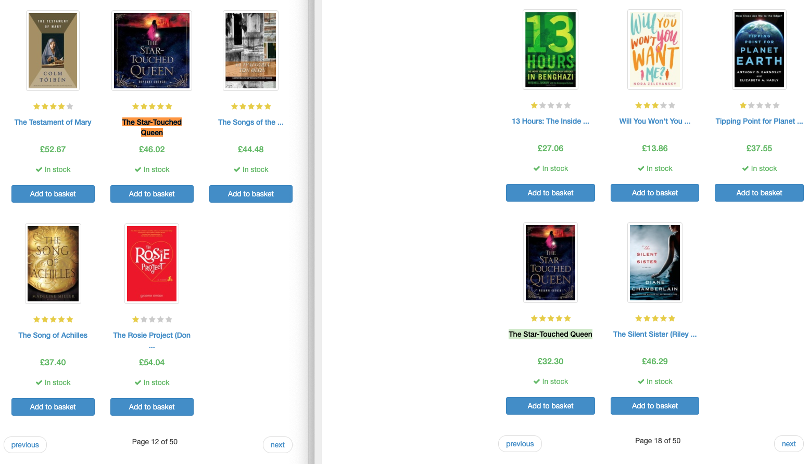

# 第7章　ScrapyとMySQL

## はじめに

ここではScrapyでスクレイピングした値をMySQLのテーブルに格納する方法についてまとめていきます。MongoDBのようなNoSQLデータベースが使われることも多いようですが、ここではMySQLを扱います。

### プロジェクトの作成

対象にするサイトは、チュートリアル2で使った架空のオンライン書店のサイトです。チュートリアル2のコードをベースにMySQLに連携できるように書き換えます。ではプロジェクトを作成します。

* [Books to scrape](http://books.toscrape.com/)

```text
$ scrapy startproject sample_books_mysql
$ cd sample_books_mysql
$ scrapy genspider books_spider_mysql books.toscrape.com
```

### アイテムの定義\(MySQL\)

Items.pyを定義していきます。これまで使ってきませんでしたが、Itemを定義する必要があります。Itemはスクレイピングしたデータを格納しておくためのオブジェクトで、ここに格納して、MySQLに保存するためのパイプラインにデータを流します。

また、Itemを定義することで、タイポによるカラム名の間違いがあればエラーを返すようになります。指定の仕方は「名前=scrapy.Field\(\)」で、タイトル、価格、URLを保存するようにします。

```python
import scrapy

class BooksMysqlItem(scrapy.Item):
        title = scrapy.Field()
        price = scrapy.Field()
        detail_page_url = scrapy.Field()
```

### クローラーの設計

Itemにあわせて、books\_spider\_mysql.pyの中の項目を削除しています。スクレイピングした情報はItemクラスのコンストラクタ`BooksMysqlItem`で初期化した後に、キーを指定して渡します。その他はこれまでと変わりません。

```python
from scrapy import Spider
from scrapy.http import Request
from sample_books_mysql.items import BooksMysqlItem　#忘れずにインポートする

class BooksSpiderMysqlSpider(Spider):
    name = 'books_spider_mysql'
    allowed_domains = ['books.toscrape.com']
    start_urls = ['http://books.toscrape.com']

    def parse(self, response):
        books = response.xpath('.//*[@class="product_pod"]')
        for book in books:
            item = BooksMysqlItem()

            item["title"] = book.xpath('.//h3/a/@title').get()
            item["price"] = book.xpath('.//*[@class="price_color"]/text()').get()
            img_url = book.xpath('.//*[@class="image_container"]/a/@href').get()
            item["detail_page_url"] = "http://books.toscrape.com/" + img_url

            yield item


        # If there is a next button on this page, move the crawler
        next_page_url = response.xpath('//a[text()="next"]/@href').get()
        abs_next_page_url = response.urljoin(next_page_url)
        if abs_next_page_url is not None:
            yield Request(abs_next_page_url, callback=self.parse)
```

### パイプラインの設計

Itemに保存されているデータをMySQLにインサートするためのパイプラインをpipelines.pyに記述していきます。ここでは、pymysqlを使用します。書き方はいろんな方法があると思いますが、ここでは「データベースにコネクションを作る関数」「データベースに重複チェックをしてインサートする関数」「データベースのコネクションをクローズする関数」に分けています。

「データベースに重複チェックをしてインサートする関数」では、Itemのタイトルを取り出して、データベースを検索をかけ、データベースにない値であれば、インサートするという仕組みにしています。定期的にクローラーを動かす際に、この重複チェックがないと、同じレコードがインサートされていき、いざ分析となった際に非常に面倒です。

ちなみに、このサイトでは書籍のタイトルが重複しているため、この関数のチェックに引っかかり、999件しかインサートされません。本当は、ユニークなIDなどで確認するべきです。でなければ、今回のようにタイトルは同じでも、金額やURLが異なるものが取得できません。

```python
import pymysql


class BooksMysqlPipeline:
    def open_spider(self, spider):
        self.connection = pymysql.connect(
            host="localhost",
            user="****", # DBにあわせて変更
            passwd="****", # DBにあわせて変更
            database="book_online",
            charset="utf8mb4"
        )
        self.cursor = self.connection.cursor()

    def process_item(self, item, spider):
        # duplication check
        check_title_id = item["title"]
        find_qry = "SELECT `title` FROM `books` WHERE `title` = %s"
        is_done = self.cursor.execute(find_qry, check_title_id)

        # if already a record exists in database, return 1
        if is_done == 0:
            insert_qry = "INSERT INTO `books` (`title`, `price`, `detail_page_url`) VALUES (%s, %s, %s)"
            self.cursor.execute(insert_qry, (item["title"], item["price"], item["detail_page_url"]))
            self.connection.commit()
        else:
            pass

        return item

    def close_spider(self, spider):
        self.connection.close()
```

The Star-Touched Queenが重複している書籍のタイトルです。



### 環境設定

パイプラインを有効にするために、settings.pyを有効にします。番号はデータベースへの格納なので、順序としては遅くても大丈夫なので、800としています。

```python
# Configure item pipelines
# See https://docs.scrapy.org/en/latest/topics/item-pipeline.html
ITEM_PIPELINES = {
    'sample_books_mysql.pipelines.BooksMysqlPipeline': 800,
}
```

### テーブルの定義\(MySQL\)

ここまで準備ができたら、MySQLにデータベース、テーブルを作成します。itemの内容に沿ってテーブルを作成します。

```python
mysql> CREATE DATABASE book_online;
mysql> USE book_online;
mysql> CREATE TABLE books(id INT NOT NULL AUTO_INCREMENT,
                          title TEXT,
                          price VARCHAR(50),
                          detail_page_url TEXT,
                          PRIMARY KEY(id));
```

### クローラーを実行する

すべての準備が整ったので、クローラーを実行します。

```text
$ scrapy crawl books_spider_mysql
```

MySQLの中身を確認しておきます。想定通り999件のデータが格納されていることがわかります。

```sql
mysql> select count(1) from books;
+----------+
| count(1) |
+----------+
|      999 |
+----------+

mysql> select * from books limit 5;
+----+---------------------------------------+---------+-----------------------------------------------------------------------------------------+
| id | title                                 | price   | detail_page_url                                                                         |
+----+---------------------------------------+---------+-----------------------------------------------------------------------------------------+
|  1 | A Light in the Attic                  | £51.77  | http://books.toscrape.com/catalogue/a-light-in-the-attic_1000/index.html                |
|  2 | Tipping the Velvet                    | £53.74  | http://books.toscrape.com/catalogue/tipping-the-velvet_999/index.html                   |
|  3 | Soumission                            | £50.10  | http://books.toscrape.com/catalogue/soumission_998/index.html                           |
|  4 | Sharp Objects                         | £47.82  | http://books.toscrape.com/catalogue/sharp-objects_997/index.html                        |
|  5 | Sapiens: A Brief History of Humankind | £54.23  | http://books.toscrape.com/catalogue/sapiens-a-brief-history-of-humankind_996/index.html |
+----+---------------------------------------+---------+-----------------------------------------------------------------------------------------+

mysql> select * from books order by id desc limit 5;
+-----+-----------------------------------------------------------+---------+----------------------------------------------------------------------------------------------+
| id  | title                                                     | price   | detail_page_url                                                                              |
+-----+-----------------------------------------------------------+---------+----------------------------------------------------------------------------------------------+
| 999 | 1,000 Places to See Before You Die                        | £26.08  | http://books.toscrape.com/1000-places-to-see-before-you-die_1/index.html                     |
| 998 | 1st to Die (Women's Murder Club #1)                       | £53.98  | http://books.toscrape.com/1st-to-die-womens-murder-club-1_2/index.html                       |
| 997 | A Spy's Devotion (The Regency Spies of London #1)         | £16.97  | http://books.toscrape.com/a-spys-devotion-the-regency-spies-of-london-1_3/index.html         |
| 996 | Ajin: Demi-Human, Volume 1 (Ajin: Demi-Human #1)          | £57.06  | http://books.toscrape.com/ajin-demi-human-volume-1-ajin-demi-human-1_4/index.html            |
| 995 | Alice in Wonderland (Alice's Adventures in Wonderland #1) | £55.53  | http://books.toscrape.com/alice-in-wonderland-alices-adventures-in-wonderland-1_5/index.html |
+-----+-----------------------------------------------------------+---------+----------------------------------------------------------------------------------------------+
```

### MySQLとお寿司問題

ここでは、おまけ程度にMySQLの消える🍣問題をまとめておきます。例えば、スクレイピングした際に、🍣という絵文字が含まれている場合、MySQLのテーブル定義次第では🍣が消えてなくなります。いわゆる、「MySQL寿司消える問題」です。

```sql
mysql> CREATE TABLE emoji (text varchar(255)) CHARSET utf8;
Query OK, 0 rows affected, 1 warning (0.02 sec)
```

🍣をインサートしてみます。MySQL8.0では、そもそも入らなくなってますね…MySQL5.6だと🍣絵文字以降が消えてしまいます。

```sql
mysql> INSERT INTO emoji VALUES( '鮨 の🍣はおいしい。');
ERROR 1366 (HY000): Incorrect string value: '\xF0\x9F\x8D\xA3\xE3\x81...' for column 'text' at row 1
```

この原因はCharsetのutf8です。MySQLのutf8は4バイト以上のU+1000以降の文字がありません。なので、不正な文字以降は認識されません。これに対応するためには、Charsetのutf8mb4に変更します。4バイトになるのは絵文字だけではなく、一部の漢字も含まれるので、日本語を扱うのであれば、utf8mb4が無難な選択肢といえるかと思います。

```sql
mysql> CREATE TABLE emoji2 (text varchar(255)) CHARSET utf8mb4;
Query OK, 0 rows affected (0.01 sec)

mysql> INSERT INTO emoji2 VALUES('鮨屋の🍣はおいしい。');
Query OK, 1 row affected (0.00 sec)

mysql> select * from emoji2;
+---------------------------------+
| text                            |
+---------------------------------+
| 鮨屋の🍣はおいしい。                 |
+---------------------------------+
1 row in set (0.00 sec)
```

その他にも、🍣と🍺が区別できない、「MySQL寿司ビール問題」があります。照合順序がutf8\_general\_ciの場合、区別ができなくなります。これはU+1000以降の4バイト文字が「�」として扱われるためです。これを避けるためには、utf8mb4\_binを使う必要があります。

```sql
mysql> CREATE TABLE emoji3 (emoji varchar(1), name varchar(10)) CHARSET utf8mb4;
Query OK, 0 rows affected (0.01 sec)

mysql> INSERT INTO emoji3 VALUES('🍣', 'すし'), ('🍺', 'ビール');
Query OK, 2 rows affected (0.00 sec)
Records: 2  Duplicates: 0  Warnings: 0

mysql> select * from emoji3 where emoji = '🍣';
+-------+--------+
| emoji | name   |
+-------+--------+
| 🍣      | すし   |
+-------+--------+

# これでもOK
mysql> select * from emoji3 where emoji = '🍣' COLLATE utf8mb4_bin;
+-------+--------+
| emoji | name   |
+-------+--------+
| 🍣      | すし   |
+-------+--------+
1 row in set (0.00 sec)

```

