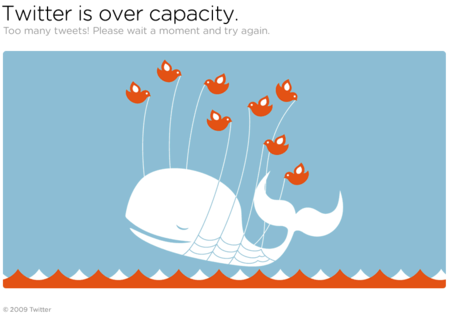
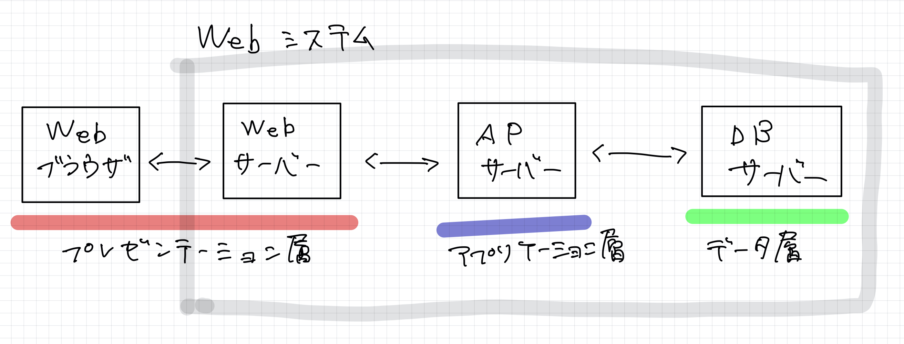

# 第8章　スクレイピングのアラカルト

## はじめに

ここではWebスクレイピングに必要なWebの知識をまとます。Webスクレイピングを行うためには、Scrapyの使い方やXpathでの値の指定の仕方以外に、多くのことを知っていないと効率よく、かつ、迷惑をかけずにスクレイピングすることはできないように思います。

### HTTPについて

HTTPは、WebブラウザがWebサーバーと通信するためのプロトコルです。HTTPは、TCP/IPにおけるアプリケーションがやり取りを行う層のプロトコルで、トランスポート層の中に位置します。TCP/IPのことよりも、HTTPについて理解を深めることが、スクレイピングには大切かと思いますので、これ以降はHTTPについてまとめていきます。

いつも何のことなく使っているWebブラウザからです。Webブラウザといえば、Google chrome、Internet Explorer、Firefoxなどが有名なWebブラウザとしてあげられますが、これ何でしょうか。そもそもWebとは、World Wide Webを略して表現したもので、そのWebの中に、Webページがあります。WebページははHTML\(HyperText Markup Language\)という言語で構成されています。そのWebページを閲覧するために使うのものがブラウザです。

[WikipediaのHTMLサンプル](https://ja.wikipedia.org/wiki/HyperText_Markup_Language)をお借りします。`<xxx>hoge</xxx>`という方法でテキストをマークアップしていくことでHTMLは構成されます。そのため、HTMLというのは、マークアップ言語とも呼ばれます。マークアップ言語は、人間が見やすいものではありません。

```markup
<!DOCTYPE html>
<html lang="ja">
 <head>
  <meta charset="UTF-8">
  <link rel="author" href="mailto:mail@example.com">
  <title lang="en">HyperText Markup Language - Wikipedia</title>
 </head>
 <body>
  <article>
   <h1 lang="en">HyperText Markup Language</h1>
   <p>HTMLは、<a href="http://ja.wikipedia.org/wiki/SGML">SGML</a>
      アプリケーションの一つで、ハイパーテキストを利用してワールド
      ワイドウェブ上で情報を発信するために作られ、
      ワールドワイドウェブの<strong>基幹的役割</strong>をなしている。
      情報を発信するための文書構造を定義するために使われ、
      ある程度機械が理解可能な言語で、
      写真の埋め込みや、フォームの作成、
      ハイパーテキストによるHTML間の連携が可能である。</p>
  </article>
 </body>
</html>
```

そのため、マークアップ言語を解釈して、表示し直してくれるのが、Webブラウザの機能です。そこで、ブラウザがWebサーバーから、HTMLを含め様々な情報を取得するために使う手段がHTTPです。

WebブラウザがHTTPというプロトコルに従って、Webサーバーに「リクエスト」を送ります。Webサーバーは、そのリクエストを受け取って、Webブラウザに「レスポンス」を返します。これがWebブラウザとWebサーバーの1つのやり取りで、その通信方法がHTTPです。

### HTTPの内容

HTTPが実際にどのような内容をWebサーバーに送っているのか確認してみます。ターミナルから`curl`コマンドを利用します。`curl`コマンドは、ファイルを送信または受信するためのコマンド。バージョンはこちら。

```http
$ curl --version
curl 7.64.1 (x86_64-apple-darwin19.0) libcurl/7.64.1 (SecureTransport) LibreSSL/2.8.3 zlib/1.2.11 nghttp2/1.39.2
Release-Date: 2019-03-27
Protocols: dict file ftp ftps gopher http https imap imaps ldap ldaps pop3 pop3s rtsp smb smbs smtp smtps telnet tftp 
Features: AsynchDNS GSS-API HTTP2 HTTPS-proxy IPv6 Kerberos Largefile libz MultiSSL NTLM NTLM_WB SPNEGO SSL UnixSockets
```

[http://example.com](http://example.com/)にリクエストを送ってみます。`>`の部分がリクエストで、`<`の部分がレスポンスの部分です。なにやら沢山出力されたので、リクエストとレスポンスを分けて、内容を見ていきます。

```http
$ curl --verbose http://example.com
*   Trying 93.184.216.34...
* TCP_NODELAY set
* Connected to example.com (93.184.216.34) port 80 (#0)
> GET / HTTP/1.1
> Host: example.com
> User-Agent: curl/7.64.1
> Accept: */*
> 
< HTTP/1.1 200 OK
< Age: 532987
< Cache-Control: max-age=604800
< Content-Type: text/html; charset=UTF-8
< Date: Thu, 28 May 2020 08:36:36 GMT
< Etag: "3147526947+ident"
< Expires: Thu, 04 Jun 2020 08:36:36 GMT
< Last-Modified: Thu, 17 Oct 2019 07:18:26 GMT
< Server: ECS (oxr/832B)
< Vary: Accept-Encoding
< X-Cache: HIT
< Content-Length: 1256
< 
<!doctype html>
<html>
<head>
    <title>Example Domain</title>

    <meta charset="utf-8" />
    <meta http-equiv="Content-type" content="text/html; charset=utf-8" />
    <meta name="viewport" content="width=device-width, initial-scale=1" />
    <style type="text/css">
    body {
        background-color: #f0f0f2;
        margin: 0;
        padding: 0;
        font-family: -apple-system, system-ui, BlinkMacSystemFont, "Segoe UI", "Open Sans", "Helvetica Neue", Helvetica, Arial, sans-serif;
        
    }
    div {
        width: 600px;
        margin: 5em auto;
        padding: 2em;
        background-color: #fdfdff;
        border-radius: 0.5em;
        box-shadow: 2px 3px 7px 2px rgba(0,0,0,0.02);
    }
    a:link, a:visited {
        color: #38488f;
        text-decoration: none;
    }
    @media (max-width: 700px) {
        div {
            margin: 0 auto;
            width: auto;
        }
    }
    </style>    
</head>

<body>
<div>
    <h1>Example Domain</h1>
    <p>This domain is for use in illustrative examples in documents. You may use this
    domain in literature without prior coordination or asking for permission.</p>
    <p><a href="https://www.iana.org/domains/example">More information...</a></p>
</div>
</body>
</html>
* Connection #0 to host example.com left intact
* Closing connection 0
```

### HTTPリクエスト

まずはリクエストの部分です。4行目が「リクエスト行」で、5~7行目は「HTTPヘッダー」、8行目は「空白行」でヘッダーの終わりを意味し、POSTであれば、その下にwebサーバーにデータを送るための「メッセージボディ」が配置されます。

example.comに80番ポートから、GETというリクエストメソッドで接続を試みていることがわかります。HTTP1.1というのはHTTPのバージョンです。User-Agentというのは後で詳しく扱いますが、誰がしているのかを示します。ここでは、`curl`コマンドで行っていることがわかります。

```http
*   Trying 93.184.216.34...
* TCP_NODELAY set
* Connected to example.com (93.184.216.34) port 80 (#0)
> GET / HTTP/1.1
> Host: example.com
> User-Agent: curl/7.64.1
> Accept: */*
>
```

リクエストメソッドはGET以外にもよく使われるものとしてPOST、PUTなどがあります。コンテンツを取得する際に利用するものとして、GETとPOSTがありますが、GETはURLの後ろに情報を加える一方で、POSTはメッセージボディに情報を加えて通信します。基本的に見られて困る情報はPOSTで送ります。

| メソッド | 内容 |
| :--- | :--- |
| GET | 指定したURLのリソースをリクエスト。  |
| HEAD | GETリクエストと同じレスポンスを求めますが、レスポンス本文はなく、ヘッダのみ。 |
| POST | 指定したリソースに情報を送信するためのメソッド。 |
| PUT | 指定したURLにリソースを保存。 |
| DELETE | 指定したURLのリソースを削除。 |
| OPTIONS | 指定したURLの通信オプションを示すために使用。 |
| TRACE | サーバまでのネットワーク経路をチェック。 |
| PATCH | リソースを部分的に変更。 |
| CONNECT | TCPトンネルを接続する。暗号化したメッセージをプロキシサーバを経由して転送する際に用いる。 |

リクエストメソッドのPOST\(Create\)、GET\(Read\)、PUT\(Update\)、DELETE\(Delete\)の操作をまとめてCRUD操作として考えることをRESTアーキテクチャと呼びます。

### HTTPレスポンス

次はHTTPレスポンスの中身を見ていきます。1行目が「ステータス行」で、2〜12行目が「HTTPヘッダー」で、13行目が「空白行」でヘッダーの終わりを示す。14行目が「メッセージボディ」でHTMLが返されます。

ステータスコードが200で成功したことを意味し、コンテンツの内容はHTMLで、キャラセットはutf8ということがわかります。日付、キャッシュ、コンテンツの長さなどが書かれています。

```http
< HTTP/1.1 200 OK
< Age: 532987
< Cache-Control: max-age=604800
< Content-Type: text/html; charset=UTF-8
< Date: Thu, 28 May 2020 08:36:36 GMT
< Etag: "3147526947+ident"
< Expires: Thu, 04 Jun 2020 08:36:36 GMT
< Last-Modified: Thu, 17 Oct 2019 07:18:26 GMT
< Server: ECS (oxr/832B)
< Vary: Accept-Encoding
< X-Cache: HIT
< Content-Length: 1256
< 
<!doctype html>
<html>
<head>
【略】
</head>

<body>
【略】
</body>
</html>
* Connection #0 to host example.com left intact
* Closing connection 0
```

HTMLのデータを受け取り、Webブラウザは解析を行い、人間が見やすい形で表示します。その中に更に取得しなければ行けない情報\(画像など\)があると、再度、HTTPリクエストを送り、取得するように動きます。このHTTPリクエストとHTTPレスポンスを何度も行い、Webページを整えます。

### HTTPステータスコード

HTTPレスポンスにはステータスコードが含まれます。先程の例では200が返されましたが、その他にも多くのステータスコードがあります。100番台から500番台までが使われます。

| コード | メッセージ | 内容 |
| :--- | :--- | :--- |
| 100 | Continue | リクエストを継続している |
| 200 | Ok | リクエストが正常に完了 |
| 301 | Moved Permanently | リクエストされたコンテンツが移動 |
| 302 | Found | リクエストされたコンテンツが一時的に移動 |
| 304 | Not Modified | リクエストされたコンテンツが未更新。Webブラウザに一時的に保存されたコンテンツが表示される。 |
| 400 | Bad Request | リクエストが不正 |
| 404 | Not Found | リクエストされたコンテンツがない |
| 500 | Internal Server Error | リクエスト中にサーバーでエラーが発生 |
| 503 | Service Unavailable | リクエストしたサーバーが一時的に停止している |

Twitterの503はよく目にするけど、それを通知する画像がかわいい。



### HTTPヘッダー

HTTPリクエスト、HTTPレスポンスのいずれもHTTPヘッダーを持ちます。ここには、詳細な情報をもたせることが可能です。1行の情報を「ヘッダーフィールド」と呼び、「フィールド名」と「フィールド値」で構成されます。

HTTPヘッダーは大きく4つのブロックで構成されます。「一般ヘッダー」「リクエストヘッダー」「レスポンスヘッダー」「エンティティヘッダー」です。詳細は[MDNのサイト](https://developer.mozilla.org/ja/docs/Web/HTTP/Headers)を参照。

まずは一般ヘッダーです。

| 項目 | 内容 |
| :--- | :--- |
| Connection | リクエスト後のTCPコネクションの接続状態に関する通知 |
| Date | HTTPメッセージが作成された日 |
| Upgrade | HTTPのバージョンをアップデートするように通知 |

次は、リクエストヘッダーです。

| 項目 | 内容 |
| :--- | :--- |
| Host | リクエスト先のサーバー |
| Referer | 直前にリンクしていたURL |
| User-Agent | Webブラウザの情報 |

レスポンスヘッダーは下記のとおりです。

| 項目 | 内容 |
| :--- | :--- |
| Location | リダイレクト先のWebページの情報 |
| Server | Webサーバーの情報 |
| Set-Cookie | クックーの情報 |

最後にエンティティヘッダーです。

| 項目 | 内容 |
| :--- | :--- |
| Allow | 利用可能なHTTPメソッドの情報 |
| Content-Encoding | コンテンツのエンコード方式 |
| Content-Language | コンテンツの言語 |
| Content-Length | コンテンツのサイズ |
| Content-Type | コンテンツの種類 |
| Expired | コンテンツの有効期限 |
| Last-Modified | コンテンツの最終更新時刻 |

### HTTPコネクション

「クライアントであるブラウザがリクエストを送り、サーバーがレスポンスを返す」というこのHTTPの一連のやり取りは、TCPが「コネクション」と呼ばれる通信経路を確立して行います。

HTTPのバージョンによって、コネクションの方法は異なります。HTTP/1.0以前は、WebブラウザがHTTPリクエストを送信するためにコネクションを確立していましたが、HTTP/1.1以降はHTTP KeepAlive方式が採用されており、リクエストごとにコネクションを確立する必要がなくなりました。

HTTP KeepAlive方式でない場合、HTMLの中に画像があった場合、HTTPリクエストを一度送り、コネクションを確立し、レスポンスを受け取って、コネクションを閉じて、画像を受け取るために再度コネクションを確立するという方法になります。

一方でHTTP KeepAlive方式だと、一度リクエストを送れば、コネクションを閉じずとも、HTTPリクエストとHTTPレスポンスのやり取りを行うことが可能なため、無駄な時間が発生しません。また、HTTPパイプラインという技術のおかげで、「コネクションの確立→リクエスト1→レスポンス1→リクエスト2→レスポンス2→コネクションの切断」というやり取りではなく、「コネクションの確立→リクエスト1→リクエスト2→レスポンス1→レスポンス2→コネクションの切断」といように、HTTPレスポンスを待たずともHTTPリクエストを送れるようになっています。

HTTP自体は非常にシンプルな通信プロトコルですが、弱点があります。それは「ステートレス」なやりとりであるということです。これは文字通り、「状態を保持しない」通信ということで、ブラウザとのHTTP通信を考えると、サーバー側は毎回別人としてクライアントを扱うことになります。

一方で、「ステートフル」なやりとりを行うことも可能です。この場合、言葉の通り、「状態を保持する」通信であるため、ブラウザとのHTTP通信を考えると、サーバー側はクライアントが誰なのかを識別して、通信を行うことになります。この仕組みであれば、ECサイトでは、買い物かごに商品を入れてから離脱して再度、ECサイトに戻ってきた場合でも、買い物かごにいれた商品は、そのまま買い物かごに入ったままの状態を保つことが可能です。

HTTPはステートレスなプロトコルであるため、ステートフルなやりとりを実現するためにHTTP cookieというデータを用いて通信しています。

### HTTP Cookie

HTTP CookieはどのようにHTTP通信に関わってくるのかを見ていきます。WebブラウザからHTTPリクエストを送った際に、サーバーはHTTPレスポンスと合わせて、ブラウザに保存してほしい情報としてHTTP Cookieも送ります。

ECサイトであれば、HTTPリクエストを送った際に、HTTPレスポンスをブラウザを識別するためにブラウザにHTTP Cookieも送ります。その後、ブラウザがそのECサイトにアクセスする際に、保存しているHTTP Cookieを送ることで、サーバー側では、誰がアクセスしてきたのかを識別します。

実際の通信では、HTTPヘッダーに、HTTPレスポンスをブラウザに送る時は、Set-CookieヘッダーにHTTP Cookieの情報を付与します。HTTPリクエスト側は、Cookieヘッダーに情報を含めることになります。ECサイトなどでは有効期限を定めたセッションCookieが一般的に用いられます。ちなみに`curl`コマンドのヘッダーオプション`-H`を使うことで、Cookieを送信できます。

```http
$ curl --verbose -H 'Cookie: name=scrapy; ver=111' http://example.com
*   Trying 93.184.216.34...
* TCP_NODELAY set
* Connected to example.com (93.184.216.34) port 80 (#0)
> GET / HTTP/1.1
> Host: example.com
> User-Agent: curl/7.64.1
> Accept: */*
> Cookie: name=scrapy; ver=111
```

HTTP Cookieと関連して、Webブラウザとサーバーの一連のやり取りの流れを「セッション」と呼びます。セッション管理のために、WebサーバーはHTTP CookieにセッションIDを付与することでセッション管理を行います。そのため、リクエストを送る際にセッションIDも送ることで、サーバー側は「セッション」を識別していきます。

### HTTPとWebアプリケーション

Webブラウザ上で機能するアプリケーションのことをWebアプリケーションと呼びます。Webアプリケーションについても、少しばかり裏側の仕組みおさらいしておきます。

Webアプリケーションは3層アーキテクチャと呼ばれる構造になっています。3層とは、「プレゼンテーション層」「アプリケーション層」「データ層」の3つです。

プレゼンテーション層は、ユーザーのインターフェースを担い操作などを受けつけ、WebブラウザとWebサーバーが裏側で機能します。

アプリケーション層は、業務的な処理を担い、プレゼンテーション層からの操作を処理します。裏側ではアプリケーションサーバーが機能します。

データ層は、アプリケーションサーバーからのデータに関する処理を担います。裏側では、データベースサーバーが機能します。




