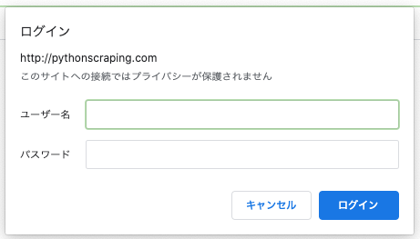
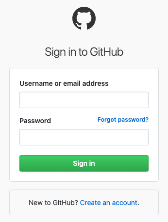
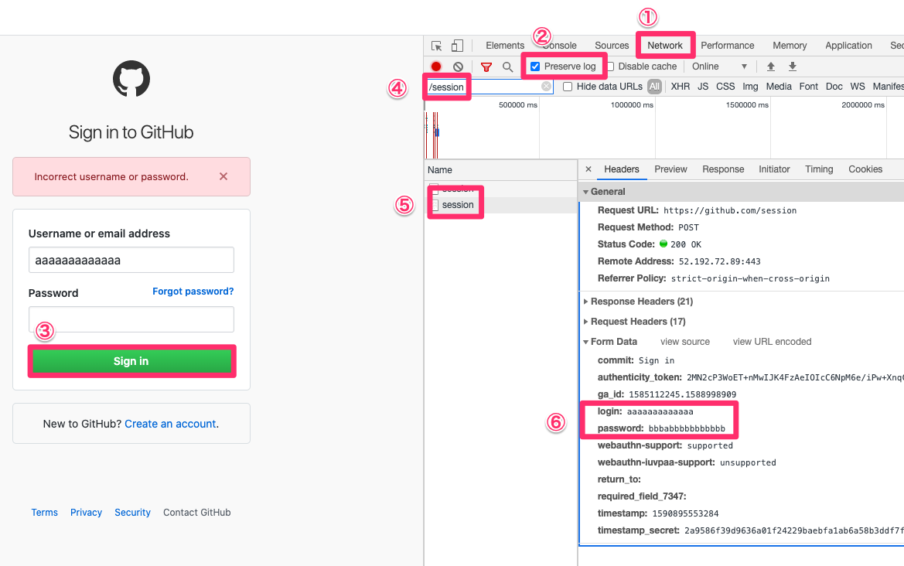
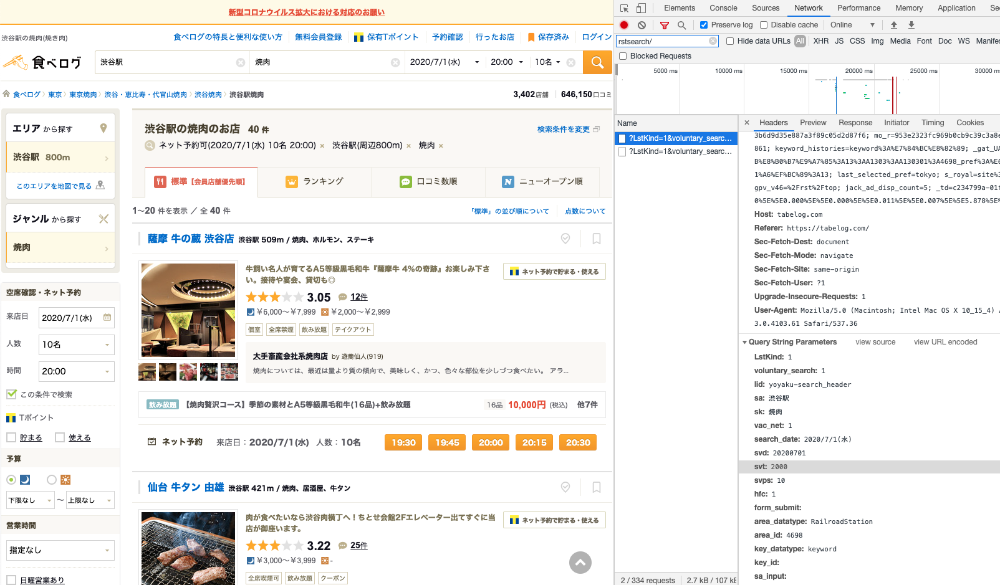
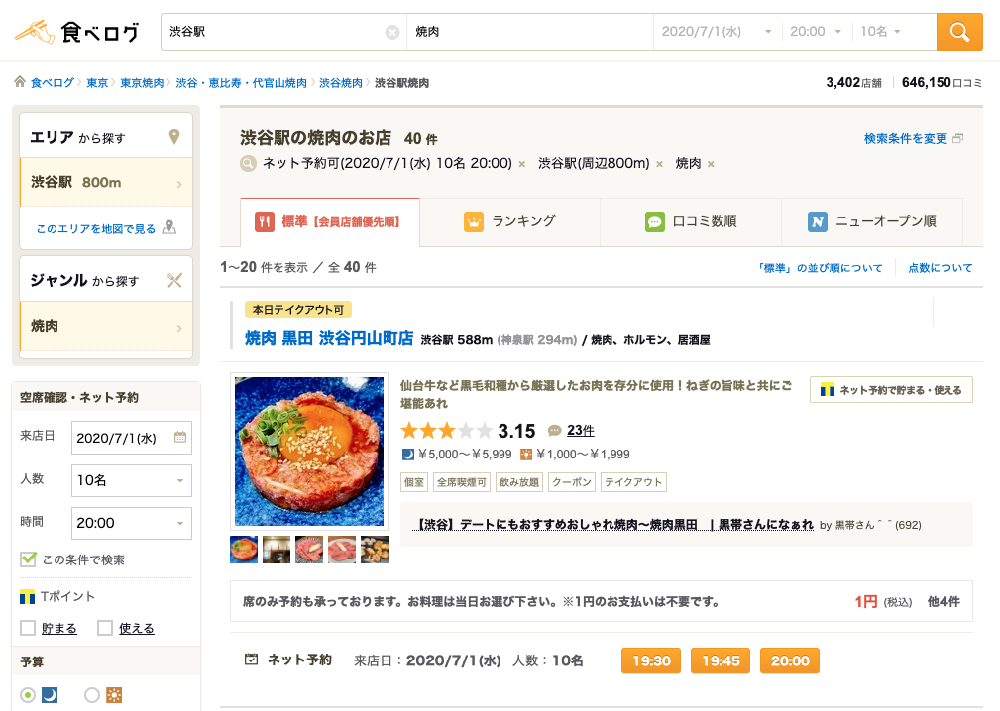

# 第8章　ScrapyとHTTP

## はじめに

ここではWebスクレイピングに必要なWebの知識をまとます。Webスクレイピングを行うためには、Scrapyの使い方やXpathでの値の指定の仕方以外に、多くのことを知っていないと効率よく、かつ、迷惑をかけずにスクレイピングすることはできないように思います。

### HTTPについて

HTTPは、WebブラウザがWebサーバーと通信するためのプロトコルです。HTTPは、TCP/IPにおけるアプリケーションがやり取りを行う層のプロトコルで、トランスポート層の中に位置します。TCP/IPのことよりも、HTTPについて理解を深めることが、スクレイピングには大切かと思いますので、これ以降はHTTPについてまとめていきます。

いつも何のことなく使っているWebブラウザからです。Webブラウザといえば、Google chrome、Internet Explorer、Firefoxなどが有名なWebブラウザとしてあげられますが、これ何でしょうか。そもそもWebとは、World Wide Webを略して表現したもので、そのWebの中に、Webページがあります。WebページははHTML\(HyperText Markup Language\)という言語で構成されています。そのWebページを閲覧するために使うのものがブラウザです。

[WikipediaのHTMLサンプル](https://ja.wikipedia.org/wiki/HyperText_Markup_Language)をお借りします。`<xxx>hoge</xxx>`という方法でテキストをマークアップしていくことでHTMLは構成されます。そのため、HTMLというのは、マークアップ言語とも呼ばれます。マークアップ言語は、人間が見やすいものではありません。

```markup
<!DOCTYPE html>
<html lang="ja">
 <head>
  <meta charset="UTF-8">
  <link rel="author" href="mailto:mail@example.com">
  <title lang="en">HyperText Markup Language - Wikipedia</title>
 </head>
 <body>
  <article>
   <h1 lang="en">HyperText Markup Language</h1>
   <p>HTMLは、<a href="http://ja.wikipedia.org/wiki/SGML">SGML</a>
      アプリケーションの一つで、ハイパーテキストを利用してワールド
      ワイドウェブ上で情報を発信するために作られ、
      ワールドワイドウェブの<strong>基幹的役割</strong>をなしている。
      情報を発信するための文書構造を定義するために使われ、
      ある程度機械が理解可能な言語で、
      写真の埋め込みや、フォームの作成、
      ハイパーテキストによるHTML間の連携が可能である。</p>
  </article>
 </body>
</html>
```

そのため、マークアップ言語を解釈して、表示し直してくれるのが、Webブラウザの機能です。そこで、ブラウザがWebサーバーから、HTMLを含め様々な情報を取得するために使う手段がHTTPです。

WebブラウザがHTTPというプロトコルに従って、Webサーバーに「リクエスト」を送ります。Webサーバーは、そのリクエストを受け取って、Webブラウザに「レスポンス」を返します。これがWebブラウザとWebサーバーの1つのやり取りで、その通信方法がHTTPです。

### HTTPの内容

HTTPが実際にどのような内容をWebサーバーに送っているのか確認してみます。ターミナルから`curl`コマンドを利用します。`curl`コマンドは、ファイルを送信または受信するためのコマンド。バージョンはこちら。

```http
$ curl --version
curl 7.64.1 (x86_64-apple-darwin19.0) libcurl/7.64.1 (SecureTransport) LibreSSL/2.8.3 zlib/1.2.11 nghttp2/1.39.2
Release-Date: 2019-03-27
Protocols: dict file ftp ftps gopher http https imap imaps ldap ldaps pop3 pop3s rtsp smb smbs smtp smtps telnet tftp 
Features: AsynchDNS GSS-API HTTP2 HTTPS-proxy IPv6 Kerberos Largefile libz MultiSSL NTLM NTLM_WB SPNEGO SSL UnixSockets
```

[http://example.com](http://example.com/)にリクエストを送ってみます。`>`の部分がリクエストで、`<`の部分がレスポンスの部分です。なにやら沢山出力されたので、リクエストとレスポンスを分けて、内容を見ていきます。

```http
$ curl --verbose http://example.com
*   Trying 93.184.216.34...
* TCP_NODELAY set
* Connected to example.com (93.184.216.34) port 80 (#0)
> GET / HTTP/1.1
> Host: example.com
> User-Agent: curl/7.64.1
> Accept: */*
> 
< HTTP/1.1 200 OK
< Age: 532987
< Cache-Control: max-age=604800
< Content-Type: text/html; charset=UTF-8
< Date: Thu, 28 May 2020 08:36:36 GMT
< Etag: "3147526947+ident"
< Expires: Thu, 04 Jun 2020 08:36:36 GMT
< Last-Modified: Thu, 17 Oct 2019 07:18:26 GMT
< Server: ECS (oxr/832B)
< Vary: Accept-Encoding
< X-Cache: HIT
< Content-Length: 1256
< 
<!doctype html>
<html>
<head>
    <title>Example Domain</title>

    <meta charset="utf-8" />
    <meta http-equiv="Content-type" content="text/html; charset=utf-8" />
    <meta name="viewport" content="width=device-width, initial-scale=1" />
    <style type="text/css">
    body {
        background-color: #f0f0f2;
        margin: 0;
        padding: 0;
        font-family: -apple-system, system-ui, BlinkMacSystemFont, "Segoe UI", "Open Sans", "Helvetica Neue", Helvetica, Arial, sans-serif;
        
    }
    div {
        width: 600px;
        margin: 5em auto;
        padding: 2em;
        background-color: #fdfdff;
        border-radius: 0.5em;
        box-shadow: 2px 3px 7px 2px rgba(0,0,0,0.02);
    }
    a:link, a:visited {
        color: #38488f;
        text-decoration: none;
    }
    @media (max-width: 700px) {
        div {
            margin: 0 auto;
            width: auto;
        }
    }
    </style>    
</head>

<body>
<div>
    <h1>Example Domain</h1>
    <p>This domain is for use in illustrative examples in documents. You may use this
    domain in literature without prior coordination or asking for permission.</p>
    <p><a href="https://www.iana.org/domains/example">More information...</a></p>
</div>
</body>
</html>
* Connection #0 to host example.com left intact
* Closing connection 0
```

### HTTPリクエスト

まずはリクエストの部分です。4行目が「リクエスト行」で、5~7行目は「HTTPヘッダー」、8行目は「空白行」でヘッダーの終わりを意味し、POSTであれば、その下にwebサーバーにデータを送るための「メッセージボディ」が配置されます。

example.comに80番ポートから、GETというリクエストメソッドで接続を試みていることがわかります。HTTP1.1というのはHTTPのバージョンです。User-Agentというのは後で詳しく扱いますが、誰がしているのかを示します。ここでは、`curl`コマンドで行っていることがわかります。

```http
*   Trying 93.184.216.34...
* TCP_NODELAY set
* Connected to example.com (93.184.216.34) port 80 (#0)
> GET / HTTP/1.1
> Host: example.com
> User-Agent: curl/7.64.1
> Accept: */*
>
```

リクエストメソッドはGET以外にもよく使われるものとしてPOST、PUTなどがあります。コンテンツを取得する際に利用するものとして、GETとPOSTがありますが、GETはURLの後ろに情報を加える一方で、POSTはメッセージボディに情報を加えて通信します。基本的に見られて困る情報はPOSTで送ります。

| メソッド | 内容 |
| :--- | :--- |
| GET | 指定したURLのリソースをリクエスト。  |
| HEAD | GETリクエストと同じレスポンスを求めますが、レスポンス本文はなく、ヘッダのみ。 |
| POST | 指定したリソースに情報を送信するためのメソッド。 |
| PUT | 指定したURLにリソースを保存。 |
| DELETE | 指定したURLのリソースを削除。 |
| OPTIONS | 指定したURLの通信オプションを示すために使用。 |
| TRACE | サーバまでのネットワーク経路をチェック。 |
| PATCH | リソースを部分的に変更。 |
| CONNECT | TCPトンネルを接続する。暗号化したメッセージをプロキシサーバを経由して転送する際に用いる。 |

リクエストメソッドのPOST\(Create\)、GET\(Read\)、PUT\(Update\)、DELETE\(Delete\)の操作をまとめてCRUD操作として考えることをRESTアーキテクチャと呼びます。

### HTTPレスポンス

次はHTTPレスポンスの中身を見ていきます。1行目が「ステータス行」で、2〜12行目が「HTTPヘッダー」で、13行目が「空白行」でヘッダーの終わりを示す。14行目が「メッセージボディ」でHTMLが返されます。

ステータスコードが200で成功したことを意味し、コンテンツの内容はHTMLで、キャラセットはutf8ということがわかります。日付、キャッシュ、コンテンツの長さなどが書かれています。

```http
< HTTP/1.1 200 OK
< Age: 532987
< Cache-Control: max-age=604800
< Content-Type: text/html; charset=UTF-8
< Date: Thu, 28 May 2020 08:36:36 GMT
< Etag: "3147526947+ident"
< Expires: Thu, 04 Jun 2020 08:36:36 GMT
< Last-Modified: Thu, 17 Oct 2019 07:18:26 GMT
< Server: ECS (oxr/832B)
< Vary: Accept-Encoding
< X-Cache: HIT
< Content-Length: 1256
< 
<!doctype html>
<html>
<head>
【略】
</head>

<body>
【略】
</body>
</html>
* Connection #0 to host example.com left intact
* Closing connection 0
```

HTMLのデータを受け取り、Webブラウザは解析を行い、人間が見やすい形で表示します。その中に更に取得しなければ行けない情報\(画像など\)があると、再度、HTTPリクエストを送り、取得するように動きます。このHTTPリクエストとHTTPレスポンスを何度も行い、Webページを整えます。

このように、HTTPリクエストを受けつけ、HTTPレスポンスを返すことで、コンテンツを表示します。このように交互に通信を行うことを「同期通信」と呼びます。同期通信の欠点は、サーバーが処理している間は、待つしかなく、ページを更新するのに時間がかかります。これを解決するのがAjaxです。

Ajax\(Asynchronous JavaScript + XML\)は、Webブラウザ上で動作するjavascriptが直接Webサーバーと通信を行い、表示するHTMLを更新する仕組みです。この仕組を使うことで、HTTPレスポンスを待つ間に、レスポンスと関係ないところはjavascriptが更新する事ができるため、「非同期通信」が可能になり、ページの更新が速くなります。

### HTTPステータスコード

HTTPレスポンスにはステータスコードが含まれます。先程の例では200が返されましたが、その他にも多くのステータスコードがあります。100番台から500番台までが使われます。

| コード | メッセージ | 内容 |
| :--- | :--- | :--- |
| 100 | Continue | リクエストを継続していることを意味するステータス |
| 200 | Ok | リクエストが正常に完了していることを意味するステータス |
| 301 | Moved Permanently | リクエストされたコンテンツが移動してことを意味するステータス |
| 302 | Found | リクエストされたコンテンツが一時的に移動していることを意味するステータス |
| 304 | Not Modified | リクエストされたコンテンツが未更新。Webブラウザに一時的に保存されたコンテンツが表示される。 |
| 400 | Bad Request | リクエストが不正であることを意味するステータス |
| 401 | Unauthorized | アクセス認証が必要な場合のステータス |
| 403 | Forbidden | アクセス禁止を意味するステータス |
| 404 | Not Found | リクエストされたコンテンツがないことを意味するステータス |
| 405 | Method Not Allowed | そのメソッドでのリクエストが許可されていないことを意味するステータス |
| 406 | Not Acceptable | ヘッダーで指定した言語でレスポンスができないことを意味するステータス |
| 408 | Request Timeout | クライアントとサーバー間の通信時間が設定時間をオーバーしたことを意味するステータス |
| 500 | Internal Server Error | リクエスト中にサーバーでエラーが発生していることを意味するステータス |
| 501 | Not Implemented | そのメソッドがサーバーでサポートされていないことを意味するステータス |
| 502 | Bad Gateway | ゲートウェイやプロキシとして動作しているサーバーが上位のサーバーから不正なレスポンスを受け取ったことを意味するステータス。 |
| 503 | Service Unavailable | リクエストしたサーバーが一時的に停止していることを意味するステータス |

Twitterの503はよく目にするけど、それを通知する画像がかわいい。


### HTTPヘッダー

HTTPリクエスト、HTTPレスポンスのいずれもHTTPヘッダーを持ちます。ここには、詳細な情報をもたせることが可能です。1行の情報を「ヘッダーフィールド」と呼び、「フィールド名」と「フィールド値」で構成されます。

HTTPヘッダーは大きく4つのブロックで構成されます。「一般ヘッダー」「リクエストヘッダー」「レスポンスヘッダー」「エンティティヘッダー」です。詳細は[MDNのサイト](https://developer.mozilla.org/ja/docs/Web/HTTP/Headers)を参照。

まずは一般ヘッダーです。

| 項目 | 内容 |
| :--- | :--- |
| Connection | リクエスト後のTCPコネクションの接続状態に関する通知 |
| Date | HTTPメッセージが作成された日 |
| Upgrade | HTTPのバージョンをアップデートするように通知 |
| Cashe - Control | キャッシュの動作を指定 |
| Pragma | データのキャッシュなどの追加情報 |
| Transfer - Encoding | ボディで送るデータのエンコード方式 |

次は、リクエストヘッダーです。

| 項目 | 内容 |
| :--- | :--- |
| Accept | クライアントの受け入れ可能なコンテンツ |
| Accept - Charset | クライアントの受け入れ可能な文字セット |
| Accept - Encoding | クライアントの受け入れ可能な文字エンコード |
| Accept - Language | クライアントの受け入れ可能な言語 |
| Cookie | Cookieをサーバーに送信する |
| From | リクエスト者のメールアドレス |
| Host | リクエスト先のサーバー |
| Referer | 直前にリンクしていたURL |
| User - Agent | Webブラウザの情報 |
| Proxy - Authorization | プロキシに対する認証情報 |

レスポンスヘッダーは下記のとおりです。

| 項目 | 内容 |
| :--- | :--- |
| Age | ボディで送信するデータの経過秒数 |
| Allow | URLに対して使用可能なメソッド |
| Proxy - Authenticate | プロキシでの認証が必要なことを意味する |
| Retry - After | 次のリクエストを送るまでの待機時間 |
| Location | リダイレクト先のWebページの情報 |
| Server | Webサーバーの情報 |
| Set-Cookie | クックーの情報 |

最後にエンティティヘッダーです。

| 項目 | 内容 |
| :--- | :--- |
| Allow | 利用可能なHTTPメソッドの情報 |
| Content-Encoding | コンテンツのエンコード方式 |
| Content-Language | コンテンツの言語 |
| Content-Length | コンテンツのサイズ |
| Content-Type | コンテンツの種類 |
| Expired | コンテンツの有効期限 |
| Last-Modified | コンテンツの最終更新時刻 |

User-Agentについて、少し触れておきます。User-Agentはアクセスしているブラウザのバージョンや種類を示すもので、Scrapyでスクレイピングしている際に、同じUser-Agentだとアクセスできなくなることがります。そのような場合に、User-Agentを切り替える\(偽造\)してアクセスする必要があります。偽造という表現が良くないですが、問題のある行為ではありません。

例えば、Google Chromeの場合、下記のようなUser-Agentになります。[What is my User Agent?](https://www.whatismybrowser.com/detect/what-is-my-user-agent)で調べることができます。ちなみにグローバルIPアドレスは[What is my ip?](https://whatismyipaddress.com/)で調べることができます。

```http
Mozilla/5.0 (Macintosh; Intel Mac OS X 10_15_4) AppleWebKit/537.36 (KHTML, like Gecko) Chrome/83.0.4103.61 Safari/537.36
```

Safariなどは下記のようになります。

```http
Mozilla/5.0 (Macintosh; Intel Mac OS X 10_15_4) AppleWebKit/605.1.15 (KHTML, like Gecko) Version/13.1 Safari/605.1.15
```

### HTTPコネクション

「クライアントであるブラウザがリクエストを送り、サーバーがレスポンスを返す」というこのHTTPの一連のやり取りは、TCPが「コネクション」と呼ばれる通信経路を確立して行います。

HTTPのバージョンによって、コネクションの方法は異なります。HTTP/1.0以前は、WebブラウザがHTTPリクエストを送信するためにコネクションを確立していましたが、HTTP/1.1以降はHTTP KeepAlive方式が採用されており、リクエストごとにコネクションを確立する必要がなくなりました。

HTTP KeepAlive方式でない場合、HTMLの中に画像があった場合、HTTPリクエストを一度送り、コネクションを確立し、レスポンスを受け取って、コネクションを閉じて、画像を受け取るために再度コネクションを確立するという方法になります。

一方でHTTP KeepAlive方式だと、一度リクエストを送れば、コネクションを閉じずとも、HTTPリクエストとHTTPレスポンスのやり取りを行うことが可能なため、無駄な時間が発生しません。また、HTTPパイプラインという技術のおかげで、「コネクションの確立→リクエスト1→レスポンス1→リクエスト2→レスポンス2→コネクションの切断」というやり取りではなく、「コネクションの確立→リクエスト1→リクエスト2→レスポンス1→レスポンス2→コネクションの切断」といように、HTTPレスポンスを待たずともHTTPリクエストを送れるようになっています。

HTTP自体は非常にシンプルな通信プロトコルですが、弱点があります。それは「ステートレス」なやりとりであるということです。これは文字通り、「状態を保持しない」通信ということで、ブラウザとのHTTP通信を考えると、サーバー側は毎回別人としてクライアントを扱うことになります。

一方で、「ステートフル」なやりとりを行うことも可能です。この場合、言葉の通り、「状態を保持する」通信であるため、ブラウザとのHTTP通信を考えると、サーバー側はクライアントが誰なのかを識別して、通信を行うことになります。この仕組みであれば、ECサイトでは、買い物かごに商品を入れてから離脱して再度、ECサイトに戻ってきた場合でも、買い物かごにいれた商品は、そのまま買い物かごに入ったままの状態を保つことが可能です。

HTTPはステートレスなプロトコルであるため、ステートフルなやりとりを実現するためにHTTP cookieというデータを用いて通信しています。

### HTTP Cookie

HTTP CookieはどのようにHTTP通信に関わってくるのかを見ていきます。WebブラウザからHTTPリクエストを送った際に、サーバーはHTTPレスポンスと合わせて、ブラウザに保存してほしい情報としてHTTP Cookieも送ります。

ECサイトであれば、HTTPリクエストを送った際に、HTTPレスポンスをブラウザを識別するためにブラウザにHTTP Cookieも送ります。その後、ブラウザがそのECサイトにアクセスする際に、保存しているHTTP Cookieを送ることで、サーバー側では、誰がアクセスしてきたのかを識別します。

実際の通信では、HTTPヘッダーに、HTTPレスポンスをブラウザに送る時は、Set-CookieヘッダーにHTTP Cookieの情報を付与します。HTTPリクエスト側は、Cookieヘッダーに情報を含めることになります。ECサイトなどでは有効期限を定めたセッションCookieが一般的に用いられます。ちなみに`curl`コマンドのヘッダーオプション`-H`を使うことで、Cookieを送信できます。

```http
$ curl --verbose -H 'Cookie: name=scrapy; ver=111' http://example.com
*   Trying 93.184.216.34...
* TCP_NODELAY set
* Connected to example.com (93.184.216.34) port 80 (#0)
> GET / HTTP/1.1
> Host: example.com
> User-Agent: curl/7.64.1
> Accept: */*
> Cookie: name=scrapy; ver=111
```

HTTP Cookieと関連して、Webブラウザとサーバーの一連のやり取りの流れを「セッション」と呼びます。セッション管理のために、WebサーバーはHTTP CookieにセッションIDを付与することでセッション管理を行います。そのため、リクエストを送る際にセッションIDも送ることで、サーバー側は「セッション」を識別していきます。またセッションにおける最小粒度のアクションを「トランザクション」と呼びます。複数のトランザクションが時系列的に集まったものがセッションと言えるかもしれません。

### HTTPとWebアプリケーション

Webブラウザ上で機能するアプリケーションのことをWebアプリケーションと呼びます。Webアプリケーションについても、少しばかり裏側の仕組みおさらいしておきます。

Webアプリケーションは3層アーキテクチャと呼ばれる構造になっています。3層とは、「プレゼンテーション層」「アプリケーション層」「データ層」の3つです。

プレゼンテーション層は、ユーザーのインターフェースを担い操作などを受けつけ、Webサーバーが裏側で機能します。WebサーバーはWebブラウザからHTTPリクエストを受け取ると、静的コンテンツや動的コンテンツをHTTPレスポンスとして返します。このサーバーがダウンすると、HTTPリクエストを受け付けるサーバーがなくなるので、サービスが停止します。そうならなように、冗長化という構成をとります。冗長化は、Webサーバーを複数起動し、HTTPリクエストをさばく仕組みです。

アプリケーション層は、業務的な処理を担い、プレゼンテーション層からの操作を処理します。裏側ではアプリケーションサーバーが機能します。アプリケーションサーバーは、Webサーバーからの指示をデータベースサーバーに問い合わせて、データを返す役割です。先程でてきたセッションIDの管理もアプリケーションサーバーの役割です。

データ層は、アプリケーションサーバーからのデータに関する処理を担います。裏側では、データベースサーバーが機能します。データベースサーバーはアプリケーションサーバからの依頼に基づいてデータベースから情報を返します。Webサーバーと同じく、冗長化構成を取ります。冗長化の方法としては、「ミラーリング」、「レプリケーション」「シェアードディスク」があります。「ミラーリング」、「レプリケーション」もマスターサーバーがあり、そこでの更新をミラーサーバーないしスレーブサーバー転送します。ミラーリングは即時更新しますが、レプリケーションは任意のタイミングで更新します。


このような構成でWebアプリケーションは機能しますが、各サーバーへの負荷を下げる仕組みとして、「キャッシュサーバー」というものがあります。キャッシュとは「HTTPリクエストに対するHTTPレスポンスを記憶する」ことです。キャッシュにも種類があり、コンテンツをキャッシュするものは「コンテンツキャッシュ」と呼ばれ、DBサーバーへの検索クエリをキャッシュするものは「クエリキャッシュ」と呼ばれます。

コンテンツキャッシュサーバーは、WebブラウザとWebサーバーとの間に配置され、エリキャッシュサーバーはアプリケーションサーバーとデータベース・サーバーとの間に配置されます。

他にもサーバーへの負荷を下げる手段として、ファイアウォールがあります。ファイアウォールはどちらかというセキュリティの観点から説明されることが多いですが、通信を遮断するものなので、ここで合わせてまとめておきます。

一般的に用いられているのは、パケットフィルタ型のファイアウォールです。これはIPアドレスとポート番号をチェックし、通信の遮断・許可を行います。誰でも使用できるWebシステムであれば、WebサーバーアクセスにするIPアドレスを限定することは難しいので、HTTPの80番ポートとHTTPSの443番ポートだけを許可することになります。 

MySQLなどのデータベースサーバーであれば、ポート番号は3306で、アクセスするIPアドレスを限定することで、アクセスできる人を限定したりすることが多いのかもしれません。

### HTTPと認証

ここでは、基本的な認証の種類についてまとめていきます。認証がかかっているサイトはクローラーを走らせるのは好ましくないように思えます。認証がかかるということは、その先にあるのは個人情報や秘密情報であるためです。そのため、アカウントアグリゲーションサービスかなんかを作るとかになると、規約の範囲内で行うことになるかと思います。

Webページにアクセスすると、ポップアップと同時にアカウントとパスワードが求められる認証方式がHTTP認証です。HTTP認証の中でも広く使われる方法が、ベーシック認証です。ベーシック認証がかかっているURLにリクエストを送ると、401が返ってきます。



```text
# -I:HTTPレスポンスヘッダーの取得
$ curl -I http://pythonscraping.com/pages/auth/login.php 
HTTP/1.1 401 Unauthorized
Date: Sun, 31 May 2020 03:08:50 GMT
Server: Apache
WWW-Authenticate: Basic realm="My Realm"
Content-Type: text/html; charset=UTF-8
```

ベーシック認証のアカウントとパスワードを送信する方法は`-u id:pass`でおくります。ログインできているようです。

```text
➜ curl -u 'tabaka:awsedrft' http://pythonscraping.com/pages/auth/login.php 
<p>Hello tabaka.</p><p>You entered awsedrft as your password.</p>~ 
```

他にもフォームベース認証というものがあります。これは、名前の通りで、ログインフォームからIDとパスを認証する方法です。例えば、Githubはフォーム認証です。



フォームに該当する部分のHTMLを抜き出すと、このようになっています。1行目のform要素のaction属性、method属性を確認すると、`method="post"`で`action="/session"`というパスに情報を送ることがわかります。

```markup
<form action="/session" accept-charset="UTF-8" method="post"><input type="hidden" data-csrf="true" name="authenticity_token" value="****************==" />      <input type="hidden" name="ga_id" class="js-octo-ga-id-input">
      <div class="auth-form-header p-0">
        <h1>Sign in to GitHub</h1>
      </div>


      <div id="js-flash-container">


  <template class="js-flash-template">
    <div class="flash flash-full  js-flash-template-container">
  <div class="container-lg px-2" >
    <button class="flash-close js-flash-close" type="button" aria-label="Dismiss this message">
      <svg class="octicon octicon-x" viewBox="0 0 12 16" version="1.1" width="12" height="16" aria-hidden="true"><path fill-rule="evenodd" d="M7.48 8l3.75 3.75-1.48 1.48L6 9.48l-3.75 3.75-1.48-1.48L4.52 8 .77 4.25l1.48-1.48L6 6.52l3.75-3.75 1.48 1.48L7.48 8z"></path></svg>
    </button>
    
      <div class="js-flash-template-message"></div>

  </div>
</div>
  </template>
</div>


      <div class="flash js-transform-notice" hidden>
        <button class="flash-close js-flash-close" type="button" aria-label="Dismiss this message">
          <svg class="octicon octicon-x" viewBox="0 0 12 16" version="1.1" width="12" height="16" aria-hidden="true"><path fill-rule="evenodd" d="M7.48 8l3.75 3.75-1.48 1.48L6 9.48l-3.75 3.75-1.48-1.48L4.52 8 .77 4.25l1.48-1.48L6 6.52l3.75-3.75 1.48 1.48L7.48 8z"></path></svg>
        </button>
      </div>

      <div class="auth-form-body mt-3">

        <label for="login_field">
          Username or email address
        </label>
        <input type="text" name="login" id="login_field" class="form-control input-block" tabindex="1" autocapitalize="off" autocorrect="off" autocomplete="username" autofocus="autofocus" />

        <label for="password">
          Password <a class="label-link" href="/password_reset">Forgot password?</a>
        </label>
        <input type="password" name="password" id="password" class="form-control form-control input-block" tabindex="2" autocomplete="current-password" />
        <input type="hidden" class="js-webauthn-support" name="webauthn-support" value="unknown">
        <input type="hidden" class="js-webauthn-iuvpaa-support" name="webauthn-iuvpaa-support" value="unknown">
        <input type="hidden" name="return_to" id="return_to" class="form-control" />
        <input class="form-control" type="text" name="required_field_2cad" hidden="hidden" />
<input class="form-control" type="hidden" name="timestamp" value="1590894924840" />
<input class="form-control" type="hidden" name="timestamp_secret" value="35403dd16a13de0a200b8bedb46b64b4309326083002f2b7b73c3f5bfd96ce33" />

        <input type="submit" name="commit" value="Sign in" tabindex="3" class="btn btn-primary btn-block" data-disable-with="Signing in…" />
      </div>
</form>
```

Chromeの検証ツールを使うと`name="login"`と`name="password"`で値を送っていることがわかります。また、`authenticity_token`は毎回更新する度に変更されるので、クローラーを走らせるには、この値を毎回スクレイピングしてから、ログインIDとパスワードを送って認証する必要があります。



Scrapyでやってみます。ここでは、食べログのサイトを参考にしてみます。scrapy shellでサイトにアクセスします。

```markup
$ scrapy shell "https://tabelog.com/"

In [1]: from scrapy.http import FormRequest, Request当たり前ですが、トップページがそのまま返ってきます。なので、検索条件を指定してフォームリクエストを行うことで、自分がほしいページが返ってくるようにします。まずは、どのような値でリクエストを送ればよいのか調べます。ここでは、「東京（すべて）」「焼肉」「2020年5月31日」「19:00」「2名」という条件のレスポンスがほしいので、これを指定して、「検索」ボタンをおして、検証ツールからどのような値が必要なのか調べます。
```

当たり前ですが、トップページがそのまま返ってきます。なので、検索条件を指定してフォームリクエストを行うことで、自分がほしいページが返ってくるようにします。まずは、どのような値でリクエストを送ればよいのか調べます。ここでは、「渋谷駅」「焼肉」「2020年7月1日」「20:00」「10名」という条件のレスポンスがほしいので、これを指定して、「検索」ボタンをおして、検証ツールからどのような値が必要なのか調べます。



画像を見る限り、`LstKind`から`key_datatype`まで様々な値を送っていることがわかります。なので、これを丸ごとコピーして辞書に直し、`FormRequest()`でリクエストします。そうすることで、検索条件を指定したあとのページをレスポンスとして受け取ることが可能です。検索ボタンのアクションは`action="https://tabelog.com/rst/rstsearch/"`となっているので、それをフォームリクエストでは使用します。

```markup
scrapy shell "https://tabelog.com/"

from scrapy.http import FormRequest, Request

data = {
    "LstKind": "1",
    "voluntary_search": "1",
    "lid": "yoyaku-search_header",
    "sa": "渋谷駅",
    "sk": "焼肉",
    "vac_net": "1",
    "search_date": "2020/7/1(水)",
    "svd": "20200701",
    "svt": "2000",
    "svps": "10",
    "hfc": "1",
    "area_datatype": "RailroadStation",
    "area_id": "4698",
    "key_datatype": "keyword",
}

page = FormRequest('https://tabelog.com/rst/rstsearch/',
                   formdata = data)


fetch(page)        
view(response)
```

画像は`view(response)`の結果です。指定した条件でページを取得できています。食べログにはありませんでしたが、フォームリクエストでは、不正な攻撃を避けるために、Githubにあったような更新のたびに変更される値も必要になる場合があるので、それも必要であれば、スクレイピングして更新のたびに最新の値がとれるようにして、`FormRequest()`でリクエストします。



