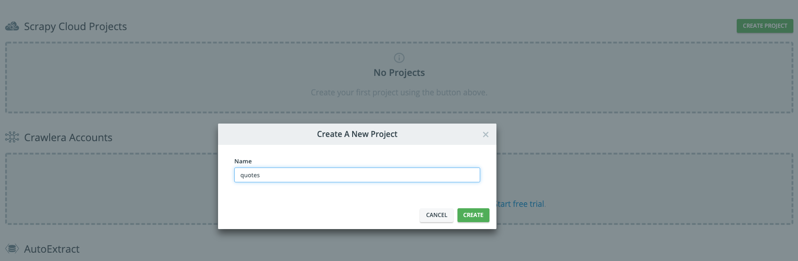
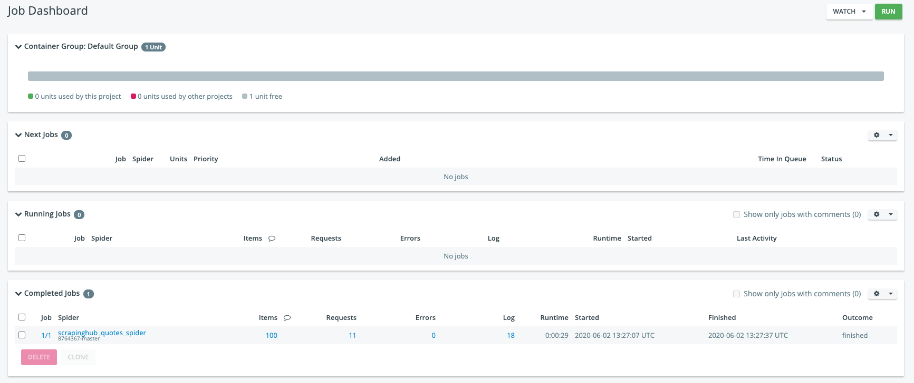
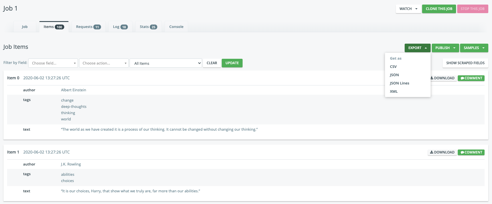
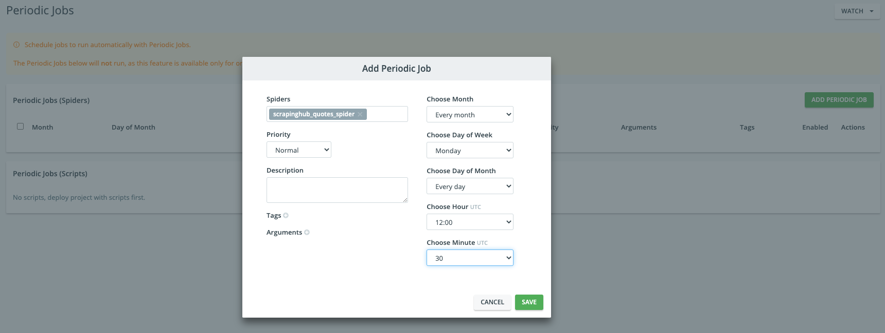

# 第9章　Scrapyのスケジュール・・・修正

## はじめに

ここではScrapyで作ったクローラーを定期的に実行する方法として、cronの設定やScrapingHubの使い方をまとめておきます。

### cron

cronはUNIX系のシステムに常駐するデーモンプログラムの1つ。デーモンとは、メインメモリ上に常駐して機能を提供するバックグラウンドプロセスの一種で、あらかじめ指定した時間に処理を実行したりするもの、とのこと。

cronの設定は下記のコマンドから行うが、jobがない場合、このように行う。

```text
$ crontab -l
crontab: no crontab for <user name>
```

そのため、初めてcronを利用する場合は`-e`で実行する。標準環境ではviが起動するので、`[i]`でインサートモードに変更して記入していく。曜日は日曜日の0始まり。

```text
$ crontab -e
```

jobの指定方法は、左から「分 時 日 月 曜日 コマンド」となる。下記の設定であれば、23時45分、日、月、曜日はなんでも良いということになるので、毎日23時45分に下記のhello.pyが実行されることになります。ログファイルが必要なければ、`>>`は不要です。cronのjobの登録方法は他にもあるみたいなので、調べてください。

```text
45 23 * * * [Python3のパス] [実行ファイルのパス] >> [実行結果やエラーログのパス] 2>&1
```

python3のフルパスは`which python3`で見つかります。

```text
$ which python3
/Library/Frameworks/Python.framework/Versions/3.8/bin/python3

# hello.pyの中身
import sys
import datetime
print('Python:' + sys.version)
print(datetime.datetime.now())
print('----------')
```

`>>`はリダイレクトという機能と関わってきます。ターミナルに出力される「標準出力」をファイルへ出力することをリダイレクトといいます。要するに、「画面出力された文字をファイルに保存する」と考えればわかりやすいのかもしれません。組み合わ次第でいろんな事ができるので下記にまとめておきます。

| 形式 | 内容 |
| :--- | :--- |
| コマンド &gt; ファイル | コマンドの結果をファイルへ書き込む |
| コマンド &lt; ファイル | ファイルの中身をコマンドの標準入力へ |
| コマンド &gt;&gt; ファイル | コマンドの出力結果をファイルへ追加 |
| コマンド 2&gt; ファイル | エラー出力をファイルへ書き込む |
| コマンド 2&gt;&gt; ファイル | ファイルにエラー出力を追加 |
| コマンド &gt; ファイル 2&gt;&1 | ファイルに標準出力と標準エラー出力を書き込む |
| コマンド &gt;&gt; ファイル 2&gt;&1 | ファイルに標準出力と標準エラー出力を追加 |

下記のjob\(1分ごとに実行\)であれば、数分後にはログファイル内に追記しているので、こうなります。

```text
$ crontab -l
*/1 * * * * /Library/Frameworks/Python.framework/Versions/3.8/bin/python3 /Users/aki/Desktop/hello.py >> /Users/aki/Desktop/exec-error.log 2>&1

$ cat /Users/aki/Desktop/exec-error.log

Python:3.8.2 (v3.8.2:7b3ab5921f, Feb 24 2020, 17:52:18) 
[Clang 6.0 (clang-600.0.57)]
2020-06-02 00:55:00.739637
----------
Python:3.8.2 (v3.8.2:7b3ab5921f, Feb 24 2020, 17:52:18) 
[Clang 6.0 (clang-600.0.57)]
2020-06-02 00:56:00.862855
----------
Python:3.8.2 (v3.8.2:7b3ab5921f, Feb 24 2020, 17:52:18) 
[Clang 6.0 (clang-600.0.57)]
2020-06-02 00:57:00.985099
----------
```

他にもいろんな指定ができるので、下記の通りまとめておきます。

```text
# 毎時10分にプログラムを実行する
10 * * * * python 

# 毎日6時にプログラムを実行する
0 6 * * * python 

# 25日の12時00分にプログラムを実行する
0 12 25 * * python 

# 9月26日の24時にプログラムを実行する
0 24 36 9 * python

# 日曜日の13時00分にプログラムを実行する
0 13 * * 0 python
 
# 1分毎にプログラムを実行する
*/1 * * * * python 
  
# 毎月20日10:00にプログラムを実行する
0 10 20 * * python 
  
# 毎週月曜日10:00にプログラムを実行する
0 10 * * 1 python

# 10分と20分と30分にプログラムを実行する
10,20,30 * * * * python
 
# 15日から20日の間、13時にプログラムを実行する
0 13 15-20 * * python
 
# 1,5,10,15~20日の間、13時にプログラムを実行する
0 13 1,5,10,15-20 * * python
 
# １時間毎にプログラムを実行する
* */1 * * * python
```

また、特に設定しない限り`/var/mail/user name`にログが残り続けるので、下記を書き込んでおきます。

```text
MAILTO=""
```

scrapyの場合、`scrapy crawl hoge`みたいな感じで毎回動かすのはcronではどのように設定すればよいのでしょうか。調べれば出てくるのですが、下記のように書けば定期的に実行できます。

```text
* * * * * [scrapyのフォルダ] && [python3のscrapyのパス] crawl [spider_name]  >> [標準出力/標準エラー出力のパス]
```

実際にはこのような感じです。クローラーを作ったフォルダに移動し、scrapyへのパスを使って、クローラーを実行するという感じです。

```text
* * * * * cd ~/Documents/scrapy/quotes_spider && /Library/Frameworks/Python.framework/Versions/3.8/bin/scrapy crawl quotes -o test.json >> ~/Documents/scrapy/quotes_spider/exec-error.log 2>&1
```

時間になってcronjobが実行されると、出力内容とエクスポートしたjsonが出力されます。

```text
$ ls
exec-error.log	quotes_spider	scrapy.cfg	test.json
```

cronでscrapyを定期的に実行する方法は他にも色々あるみたいなので、自分で検索してみてください。

### Scraping Hub


ここからScrapyの開発元でもあるScrapinghub Ltd.が提供するScrapingHubでクローラーを定期実行する方法をまとめておきます。ScrapingHubにデプロイする用のクローラーを作ります。無料枠であれば1つのクローラーを登録して実行できます。対象サイトは何度も登場している偉人の名言サイトです。

```text
$ scrapy startproject scrapinghub_quotes

You can start your first spider with:
    cd scrapinghub_quotes
    scrapy genspider example example.com

$ cd scrapinghub_quotes
$ scrapy genspider scrapinghub_quotes_spider quotes.toscrape.com
```

`scrapinghub_quotes_spider.py`の中身はこちらです。

```python
# -*- coding: utf-8 -*-
from scrapy import Spider
from scrapy import Request


class ScrapinghubQuotesSpiderSpider(Spider):
    name = 'scrapinghub_quotes_spider'
    allowed_domains = ['quotes.toscrape.com']
    start_urls = ['http://quotes.toscrape.com/']

    def parse(self, response):
        quotes = response.xpath('//*[@class="quote"]')

        for quote in quotes:
            text = quote.xpath('.//*[@class="text"]/text()').get()
            author = quote.xpath('.//*[@class="author"]/text()').get()
            tags = quote.xpath('.//*[@class="tag"]/text()').getall()

            yield {
                "text": text,
                "author": author,
                "tags": tags
            }

        next_page_url = response.xpath('//*[@class="next"]/a/@href').get()
        abs_next_page_url = response.urljoin(next_page_url)
        if abs_next_page_url is not None:
            yield Request(abs_next_page_url, callback=self.parse)
```

アカウントを作成し、ScrapingHubにログインして、右上のCREATE PROJECTからプロジェクトを作成します。ここでは、プロジェクト名はquotesにします。



プロジェクトを作成すると、コードをデプロイする方法が表示されます。ここではコマンドラインから支持に従って、デプロイします。

```text
# ScrapingHubの画面表示
$ pip install shub
$ shub login
Enter your API key: ***************************
$ shub deploy 111111

shub deploy 111111
Packing version 8764367-master
Deploying to Scrapy Cloud project "111111"
{"status": "ok", "project": 111111, "version": "8764367-master", "spiders": 1}
Run your spiders at: https://app.scrapinghub.com/p/111111/
```

デプロイが完了すると、下記のように表示がかわります。これでデプロイは完了です。


画面左端のjobからDashboardをクリックし、右上のRunを押すとポップアップが表示されるので、さきほどデプロイしたクローラーの名前を指定します。Runをクリックするとスクレイピングが実行されます。


Running jobにステータスが表示され、クローラーが走り終えると、Complete Jobに情報が移ります。ここでは100件の名言が取得され、リクエストはrobots.txtとページが10枚の合計11枚でエラーはなし、など情報が表示されます。



Itemsの100をクリックすると、下記のようにスクレイピングしたアイテムの情報一覧のページに移ります。その画面の右上のExportからはcsv、json、json Lines、XMLなどからエクスポートできます。その他にも、RequestsページであればHTTPリクエストの一覧がみれますし、LogやStatでは、通常ターミナルに出力される内容が表示されています。



これでクローラーを走らせる方法はわかったので、定期的に実行できるように、設定していきます。画面左端のDashboardの下にPeriodic Jobsがあるので、これをクリックします。そして、遷移先のページの右端の緑ボタンAdd Periodic Jobをクリックし、スケジュール設定を行い、SAVEボタンで保存します。これでスケジュール設定は完了です。



