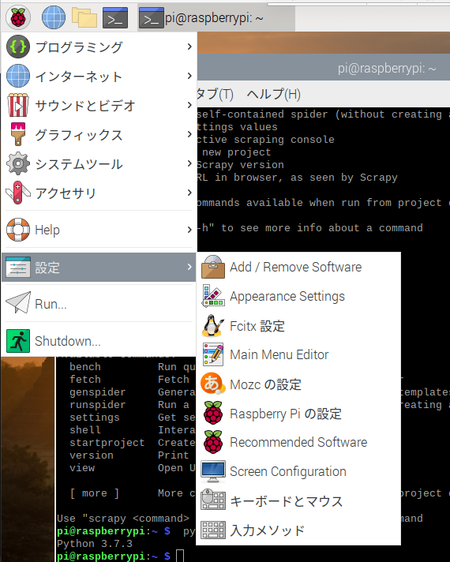
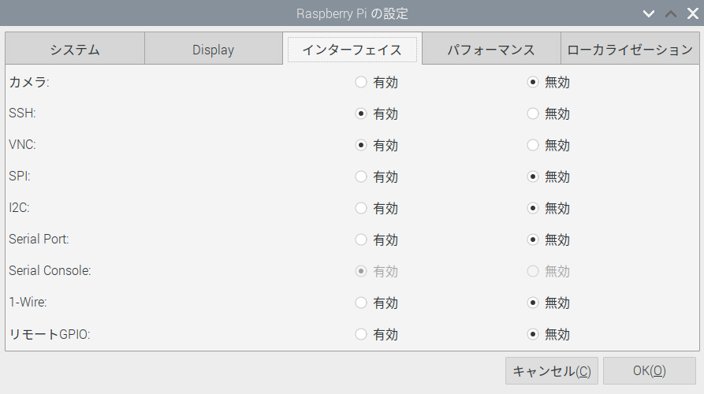
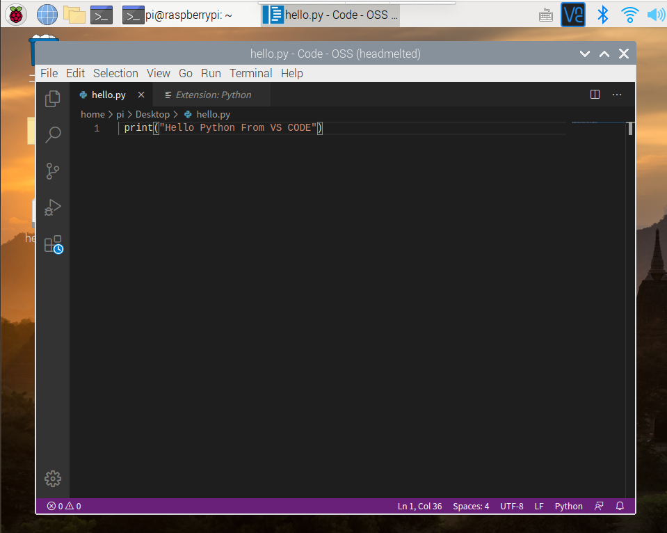
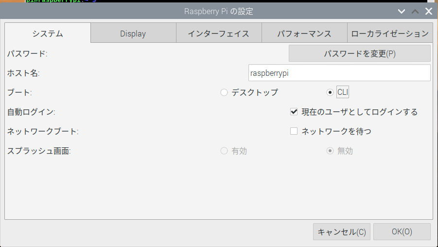

# 第10章 ScrapyとRaspberry Pi

## はじめに

ここでは、Raspberry Piのセットアップ、Scrapyのインストール、MariDBのインストール、IPアドレスの固定、SSHとVNCでの接続、VS CODEのインストールの作業をはじめに行います。そして、実際に、Scrapyで作ったクローラーをRaspberry Piで定期的に実行する方法をまとめておきます。

Raspberry Pi、Python3、Scrapyのバージョンは下記の通りです。

```text
pi@raspberrypi:~ $ cat /etc/issue
Raspbian GNU/Linux 10

pi@raspberrypi:~ $  python3 -V
Python 3.7.3

pi@raspberrypi:~ $ scrapy -V
Scrapy 1.5.1 - no active project
```

### Raspberry Piのセットアップ

ここで書く必要も無いかもしれませんが、まとめておきます。まずは購入したRaspberry Piにフォーマット済みのSDカードとRaspberry Pi Imagerを使って、Raspbianをインストールしていきます。RaspbianはLinuxのディストリビューションであるDebianをベースにしているOSなので、似たような操作感で操作ができます。

* [Raspberry Pi Kit](https://www.amazon.co.jp/gp/product/B082VVJCPT/ref=ppx_yo_dt_b_asin_title_o01_s00?ie=UTF8&psc=1)
* [SDメモリカードフォーマッター](https://www.sdcard.org/jp/downloads/formatter/eula_mac/index.html)
* [Raspberry Pi Imager](https://www.raspberrypi.org/downloads/)

SDカードをRaspberry Piに差し込み、電源を起動すると、Raspberry Piが起動します。設定ウィザードが表示されるので、順に従って設定します。

1. Set Countryでは、「日本」を設定しておきます。
2. Change Passwordでは、パスワードは初期設定のままだと「pi / raspberry」になっているので、よしなに修正します。
3. Set Up Screenが表示されるので、スクリーンの端に黒い線が表示されているのであればチェックボックスにチェックをいれます。
4. Select WiFi NetWorkでは、WiFiのネットワークを設定します。
5. Update Softwareでは、アップデートしておきます。
6. 再起動します。

再起動後、「Raspberry Piマーク &gt; 設定 &gt; Raspberry Piの設定」と進み、



「インターフェース」のSSH、VNCを有効にします。これでSSHとVNCでアクセスができます。



ここからはScrapyとMySQLをインストールしていきます。Raspberry PiにはPython3がすでにインストールされているので、Scrapyをインストールします。あわせてPyMySQLをインストールしておきます。

```text
pi@raspberrypi:~ $ sudo apt-get update
pi@raspberrypi:~ $ sudo apt-get upgrade
pi@raspberrypi:~ $ sudo apt-get install python-scrapy

~~~~~~
略
~~~~~~

pi@raspberrypi:~ $ pip3 install PyMySQL

Looking in indexes: https://pypi.org/simple, https://www.piwheels.org/simple
Collecting PyMySQL
  Using cached https://files.pythonhosted.org/packages/ed/39/15045ae46f2a123019aa968dfcba0396c161c20f855f11dea6796bcaae95/PyMySQL-0.9.3-py2.py3-none-any.whl
Installing collected packages: PyMySQL
Successfully installed PyMySQL-0.9.3
```

次はMySQLです。正確にはMariaDBですが、MariaDBはMySQLから派生したもので、非常に互換性も高く、細かい部分を除けばMySQLと同じような操作感で使用できます。

```text
$ sudo apt-get install mariadb-server
$ sudo mysql_secure_installation

~~~~~
設定内容は省略
~~~~~
```

とりあえずテスト用のDB`test_db`とテスト用のユーザー`user01`を作成します。

```text
$ sudo mysql -u root -p
password : ******

MariaDB [(none)]> CREATE DATABASE test_db;
MariaDB [(none)]> CREATE USER 'user01'@'localhost' IDENTIFIED BY 'user01';
MariaDB [(none)]> GRANT ALL PRIVILEGES ON test_db.* TO 'user01'@'localhost';
MariaDB [(none)]> FLUSH PRIVILEGES;

MariaDB [(none)]> show databases;
+--------------------+
| Database           |
+--------------------+
| information_schema |
| mysql              |
| performance_schema |
| test_db            |
+--------------------+
4 rows in set (0.001 sec)

MariaDB [(none)]> USE mysql;
MariaDB [mysql]> SELECT USER, HOST FROM mysql.user;
+--------+-----------+
| USER   | HOST      |
+--------+-----------+
| root   | localhost |
| user01 | localhost |
+--------+-----------+
2 rows in set (0.001 sec)
```

cronの設定を行います。下記コンフィグファイルを開き、cronがコメントアウトされているので、`#`を削除してcronを使えるようにします。

```text
pi@raspberrypi:~ $ sudo apt-get install vim
pi@raspberrypi:~ $ sudo vim /etc/rsyslog.conf

###############
#### RULES ####
###############
#
# First some standard log files.  Log by facility.
#
auth,authpriv.*         /var/log/auth.log
*.*;auth,authpriv.none      -/var/log/syslog
#cron.*             /var/log/cron.log
daemon.*            -/var/log/daemon.log
kern.*              -/var/log/kern.log
lpr.*               -/var/log/lpr.log
mail.*              -/var/log/mail.log
user.*              -/var/log/user.log
```

テキストエディタとしてVS CODEを入れておきます。

```text
pi@raspberrypi:~ $ sudo -s
root@raspberrypi:/home/pi# . <( wget -O - https://code.headmelted.com/installers/apt.sh )
root@raspberrypi:~# su pi
```

下記のコマンドでVS CODEを起動できます。

```text
pi@raspberrypi:~ $ code-oss
```



試しにデスクトップに`hello.py`を作成して実行してみます。

```text
pi@raspberrypi:~ $ python3 ~/Desktop/hello.py
Hello Python From VS CODE
```

最後にSSHでログインできるか確認しておきます。まずは、下記の`ip addr`コマンドでipアドレスを調べ、ipアドレスが定期的に変動しないようにを固定します。

```text
pi@raspberrypi:~ $ ip addr | grep 192
    inet ***.***.*.**/24 brd ***.***.*.** scope global dynamic noprefixroute wlan0
```

`ip_address`の部分は固定した番号に変更してください。

```text
pi@raspberrypi:~ sudo vim /etc/dhcpcd.conf

# 下記を末尾に追加します。
interface wlan0
static ip_address=192.168.*.**/24
static routers=192.168.1.1
static domain_name_servers=192.168.1.1
```

再起動して、ipアドレスを確認します。固定した番号が表示されるはずです。

```text
pi@raspberrypi:~ $ ip addr | grep 192
    inet ***.***.*.**/** brd ***.***.*.*** scope global noprefixroute wlan0
```

SSHでターミナルからログインします。

```text
$ ssh pi@***.***.*.**
pi@***.***.*.**'s password: 
Linux raspberrypi 4.19.118-v7l+ #1311 SMP Mon Apr 27 14:26:42 BST 2020 armv7l

The programs included with the Debian GNU/Linux system are free software;
the exact distribution terms for each program are described in the
individual files in /usr/share/doc/*/copyright.

Debian GNU/Linux comes with ABSOLUTELY NO WARRANTY, to the extent
permitted by applicable law.
Last login: Mon Jun  8 16:55:34 2020 from ***.***.*.**


pi@raspberrypi:~ $ cat /etc/issue
Raspbian GNU/Linux 10
```

問題なくSSHでもアクセスできるようになったので、これ以降は環境にあわせて、Raspberry Piを設定してください。GUIからCUIに変更するには、「Raspberry Piマーク &gt; 設定 &gt; Raspberry Piの設定」と進み、「システム」からブートをCLIにしてから再起動します。



再起動後はCLIになります。戻すためには下記の通り設定します。

```text
$ sudo raspi-config

3 Boot Options
→ B1 Desktop / CLI
→→ B4 Desktop Autologin Desktop GUI, automatically logged in as 'pi' user

5 Interfacing Options
→ P3 VNC ⇒　Enable　

7 Advanced Options
→ A5 Resolution
→→ モニタの解像度の設定
```

### データベースへのテストインサート

データベースにテストでインサートできるかを確認しておく。まずはデータベースにログインし、下記の通り、テスト用のテーブルを先程作成した`test_db`の中に作成します。

```text
pi@raspberrypi:~ $ mysql -u user01 -p
Enter password: ****

MariaDB [(none)]> use test_db;
Database changed

MariaDB [test_db]> CREATE TABLE test (
    ->   id int(11) NOT NULL AUTO_INCREMENT,
    ->   name varchar(50) NOT NULL,
    ->   value double NOT NULL,
    ->   text text NOT NULL,
    ->   PRIMARY KEY (id)
    -> )  ENGINE = INNODB DEFAULT CHARSET = UTF8
    -> ;
Query OK, 0 rows affected (0.038 sec)

MariaDB [test_db]> show tables;
+-------------------+
| Tables_in_test_db |
+-------------------+
| test              |
+-------------------+
1 row in set (0.001 sec)
```

下記のテストインサート用のコード`test_insert.py`を利用します。`pymysql`でMariaDBは操作できるので、これまでの内容と合わせるために、`pymysql`を利用します。

```text
import datetime
import pymysql

connection = pymysql.connect(user="user01",
                             password="user01 passwaord",
                             host="localhost",
                             database="test_db",
                             charset="utf8")

def main():
    datum = data_generator()
    start_time = datetime.datetime.now()
    insert_data(datum)
    end_time = datetime.datetime.now()
    diff_time = end_time - start_time
    print("Elapsed Time:" + str(diff_time))

def data_generator():
    values = []
    for i in range(10):
        name = "name_{}".format(i)
        value = i
        text = "text_{}".format(i)
        values.append([name, value, text])

    return values

def insert_data(values):
    insert_sql = "INSERT INTO `test` (`name`, `value`, `text`) VALUES (%s, %s, %s)"

    cursor = connection.cursor()
    for value in values:
        cursor.execute(insert_sql, value)

    connection.commit()
    connection.close()

if __name__ == "__main__":
    main()
```

とりあえずデスクトップに保存し、インサートを実行します。問題なく`test`テーブルにインサートが行われています。

```text
pi@raspberrypi:~ $ python3 ~/Desktop/test_insert.py
Elapsed Time:0:00:00.009876

MariaDB [test_db]>  select * from test;
+----+--------+-------+--------+
| id | name   | value | text   |
+----+--------+-------+--------+
|  1 | name_0 |     0 | text_0 |
|  2 | name_1 |     1 | text_1 |
|  3 | name_2 |     2 | text_2 |
|  4 | name_3 |     3 | text_3 |
|  5 | name_4 |     4 | text_4 |
|  6 | name_5 |     5 | text_5 |
|  7 | name_6 |     6 | text_6 |
|  8 | name_7 |     7 | text_7 |
|  9 | name_8 |     8 | text_8 |
| 10 | name_9 |     9 | text_9 |
+----+--------+-------+--------+
10 rows in set (0.001 sec)
```

### cronのテスト

次はcronが実際に動かうかどうか、動作テストをしていきます。下記のようなバッシュスクリプトを作成します。これはRaspberry Piの温度を表示してくれるものです。

```bash
#!/bin/bash
 
date=(`date +"%m/%d"`)
time=(`date +"%H:%M"`)
temp=(`vcgencmd measure_temp`)
str=$date" "$time" "$temp
echo $str
```

次はcronの設定です。ここではデスクトップにファイルを保存して、1分毎にログを出力するようにします。

```text
pi@raspberrypi:~ $ crontab -l
*/1 * * * * bash ~/Desktop/heat.sh >> ~/Desktop/execute.log 2>&1
```

数分ほど放置しておいたあとでログファイルを見てみると、cronは問題なく動いていることがわかります。

```text
pi@raspberrypi:~ $ cat ~/Desktop/execute.log 
06/09 11:44 temp=45.0'C
06/09 11:45 temp=44.0'C
06/09 11:46 temp=45.0'C
06/09 11:47 temp=45.0'C
06/09 11:48 temp=44.0'C
06/09 11:49 temp=45.0'C
06/09 11:50 temp=45.0'C
06/09 11:51 temp=44.0'C
06/09 11:52 temp=44.0'C
06/09 11:53 temp=43.0'C
06/09 11:54 temp=42.0'C
06/09 11:55 temp=41.0'C
06/09 11:56 temp=40.0'C
```

これでRaspberry PiでScrapyを定期的に実行し、データベースに保存する準備が整いました。

### Scrapyを実行する

