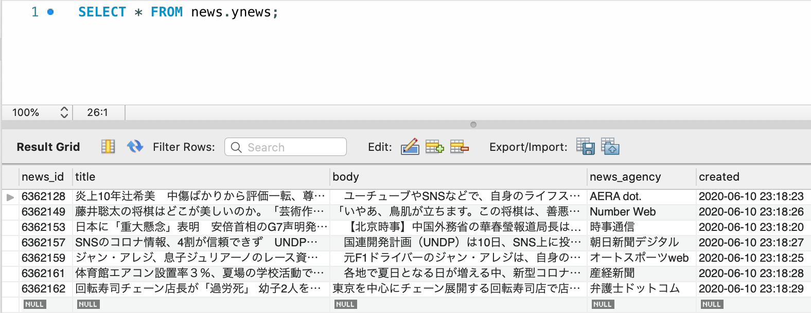

# 第10章 ScrapyとRaspberry Pi

## はじめに

ここでは、Raspberry Piのセットアップ、Scrapyのインストール、MariDBのインストール、IPアドレスの固定、SSHとVNCでの接続、VS CODEのインストールの作業をはじめに行います。そして、実際に、Scrapyで作ったクローラーをRaspberry Piで定期的に実行する方法をまとめておきます。

Raspberry Pi、Python3、Scrapyのバージョンは下記の通りです。

```text
pi@raspberrypi:~ $ cat /etc/issue
Raspbian GNU/Linux 10

pi@raspberrypi:~ $  python3 -V
Python 3.7.3

pi@raspberrypi:~ $ scrapy -V
Scrapy 1.5.1 - no active project
```

### Raspberry Piのセットアップ

ここで書く必要も無いかもしれませんが、まとめておきます。まずは購入したRaspberry Piにフォーマット済みのSDカードとRaspberry Pi Imagerを使って、Raspbianをインストールしていきます。RaspbianはLinuxのディストリビューションであるDebianをベースにしているOSなので、似たような操作感で操作ができます。

* [Raspberry Pi Kit](https://www.amazon.co.jp/gp/product/B082VVJCPT/ref=ppx_yo_dt_b_asin_title_o01_s00?ie=UTF8&psc=1)
* [SDメモリカードフォーマッター](https://www.sdcard.org/jp/downloads/formatter/eula_mac/index.html)
* [Raspberry Pi Imager](https://www.raspberrypi.org/downloads/)

SDカードをRaspberry Piに差し込み、電源を起動すると、Raspberry Piが起動します。設定ウィザードが表示されるので、順に従って設定します。

1. Set Countryでは、「日本」を設定しておきます。
2. Change Passwordでは、パスワードは初期設定のままだと「pi / raspberry」になっているので、よしなに修正します。
3. Set Up Screenが表示されるので、スクリーンの端に黒い線が表示されているのであればチェックボックスにチェックをいれます。
4. Select WiFi NetWorkでは、WiFiのネットワークを設定します。
5. Update Softwareでは、アップデートしておきます。
6. 再起動します。

再起動後、「Raspberry Piマーク &gt; 設定 &gt; Raspberry Piの設定」と進み、


「インターフェース」のSSH、VNCを有効にします。これでSSHとVNCでアクセスができます。


ここからはScrapyとMySQLをインストールしていきます。Raspberry PiにはPython3がすでにインストールされているので、Scrapyをインストールします。あわせてPyMySQLをインストールしておきます。

```text
pi@raspberrypi:~ $ sudo apt-get update
pi@raspberrypi:~ $ sudo apt-get upgrade
pi@raspberrypi:~ $ sudo apt-get install python-scrapy

~~~~~~
略
~~~~~~

pi@raspberrypi:~ $ pip3 install PyMySQL

Looking in indexes: https://pypi.org/simple, https://www.piwheels.org/simple
Collecting PyMySQL
  Using cached https://files.pythonhosted.org/packages/ed/39/15045ae46f2a123019aa968dfcba0396c161c20f855f11dea6796bcaae95/PyMySQL-0.9.3-py2.py3-none-any.whl
Installing collected packages: PyMySQL
Successfully installed PyMySQL-0.9.3
```

次はMySQLです。正確にはMariaDBですが、MariaDBはMySQLから派生したもので、非常に互換性も高く、細かい部分を除けばMySQLと同じような操作感で使用できます。

```text
$ sudo apt-get install mariadb-server
$ sudo mysql_secure_installation

~~~~~
設定内容は省略
~~~~~
```

とりあえずテスト用のDB`test_db`とテスト用のユーザー`user01`を作成します。

```text
$ sudo mysql -u root -p
password : ******

MariaDB [(none)]> CREATE DATABASE test_db;
MariaDB [(none)]> CREATE USER 'user01'@'localhost' IDENTIFIED BY 'user01';
MariaDB [(none)]> GRANT ALL PRIVILEGES ON test_db.* TO 'user01'@'localhost';
MariaDB [(none)]> FLUSH PRIVILEGES;

MariaDB [(none)]> show databases;
+--------------------+
| Database           |
+--------------------+
| information_schema |
| mysql              |
| performance_schema |
| test_db            |
+--------------------+
4 rows in set (0.001 sec)

MariaDB [(none)]> USE mysql;
MariaDB [mysql]> SELECT USER, HOST FROM mysql.user;
+--------+-----------+
| USER   | HOST      |
+--------+-----------+
| root   | localhost |
| user01 | localhost |
+--------+-----------+
2 rows in set (0.001 sec)
```

cronの設定を行います。下記コンフィグファイルを開き、cronがコメントアウトされているので、`#`を削除してcronを使えるようにします。

```text
pi@raspberrypi:~ $ sudo apt-get install vim
pi@raspberrypi:~ $ sudo vim /etc/rsyslog.conf

###############
#### RULES ####
###############
#
# First some standard log files.  Log by facility.
#
auth,authpriv.*         /var/log/auth.log
*.*;auth,authpriv.none      -/var/log/syslog
#cron.*             /var/log/cron.log
daemon.*            -/var/log/daemon.log
kern.*              -/var/log/kern.log
lpr.*               -/var/log/lpr.log
mail.*              -/var/log/mail.log
user.*              -/var/log/user.log
```

テキストエディタとしてVS CODEを入れておきます。

```text
pi@raspberrypi:~ $ sudo -s
root@raspberrypi:/home/pi# . <( wget -O - https://code.headmelted.com/installers/apt.sh )
root@raspberrypi:~# su pi
```

下記のコマンドでVS CODEを起動できます。

```text
pi@raspberrypi:~ $ code-oss
```


試しにデスクトップに`hello.py`を作成して実行してみます。

```text
pi@raspberrypi:~ $ python3 ~/Desktop/hello.py
Hello Python From VS CODE
```

最後にSSHでログインできるか確認しておきます。まずは、下記の`ip addr`コマンドでipアドレスを調べ、ipアドレスが定期的に変動しないようにを固定します。

```text
pi@raspberrypi:~ $ ip addr | grep 192
    inet ***.***.*.**/24 brd ***.***.*.** scope global dynamic noprefixroute wlan0
```

`ip_address`の部分は固定した番号に変更してください。

```text
pi@raspberrypi:~ sudo vim /etc/dhcpcd.conf

# 下記を末尾に追加します。
interface wlan0
static ip_address=192.168.*.**/24
static routers=192.168.1.1
static domain_name_servers=192.168.1.1
```

再起動して、ipアドレスを確認します。固定した番号が表示されるはずです。

```text
pi@raspberrypi:~ $ ip addr | grep 192
    inet ***.***.*.**/** brd ***.***.*.*** scope global noprefixroute wlan0
```

この作業のあとにブラウザからインターネットにアクセスできないようになっている場合は下記のコマンドで修正します。

```text
$ sudo dhclient wlan0
```

SSHでターミナルからログインします。

```text
$ ssh pi@***.***.*.**
pi@***.***.*.**'s password: 
Linux raspberrypi 4.19.118-v7l+ #1311 SMP Mon Apr 27 14:26:42 BST 2020 armv7l

The programs included with the Debian GNU/Linux system are free software;
the exact distribution terms for each program are described in the
individual files in /usr/share/doc/*/copyright.

Debian GNU/Linux comes with ABSOLUTELY NO WARRANTY, to the extent
permitted by applicable law.
Last login: Mon Jun  8 16:55:34 2020 from ***.***.*.**


pi@raspberrypi:~ $ cat /etc/issue
Raspbian GNU/Linux 10
```

問題なくSSHでもアクセスできるようになっています。もう1つ試しておきます。それは`scp`コマンドです。このコマンドはローカルのデータをSSH経由でサーバーに転送するコマンドです。Raspberry Pi側でScrapyのクローラーを作っても良いのですが、少し重たいので、手元のPCで作ったものをディレクトリごと、Raspberry Piに転送してクローラーを起動させることにします。もちろん、Git経由でも他の方法でも、転送できれば何でも良いです。

`-r`のオプションをつけるとディレクトリをコピーすることができます。ここでは、`crawl.py`を格納している`scrapy_scp`というディレクトリを丸ごと Raspberry Piのデスクトップに転送します。

```text
➜ scp -r ~/Desktop/scrapy_scp pi@***.***.*.**:~/Desktop/
pi@***.***.*.**'s password: 
crawl.py         100%    0     0.0KB/s   00:00 
```

Raspberry Pi側で確認しておきます。デスクトップに`scrapy_scp`というディレクトリが作られ、`crawl.py`も保存されています。

```text
pi@raspberrypi:~ $ tree ~/Desktop/scrapy_scp/
/home/pi/Desktop/scrapy_scp/
└── crawl.py
```

反対にRaspberry Piのデータをもらう場合は下記のように書きます。ここでは、Raspberry PiのDesktopにある`excute.log`というデータをローカルのデスクトップに転送する例です。

```text
$ scp pi@***.***.*.**:~/Desktop/execute.log ~/Desktop/
```

これ以降は環境にあわせて、Raspberry Piを設定してください。GUIからCUIに変更するには、「Raspberry Piマーク &gt; 設定 &gt; Raspberry Piの設定」と進み、「システム」からブートをCLIにしてから再起動します。


再起動後はCLIになります。戻すためには下記の通り設定します。

```text
$ sudo raspi-config

3 Boot Options
→ B1 Desktop / CLI
→→ B4 Desktop Autologin Desktop GUI, automatically logged in as 'pi' user

5 Interfacing Options
→ P3 VNC ⇒　Enable　

7 Advanced Options
→ A5 Resolution
→→ モニタの解像度の設定
```

### データベースへのテストインサート

データベースにテストでインサートできるかを確認しておく。まずはデータベースにログインし、下記の通り、テスト用のテーブルを先程作成した`test_db`の中に作成します。

```text
pi@raspberrypi:~ $ mysql -u user01 -p
Enter password: ****

MariaDB [(none)]> use test_db;
Database changed

MariaDB [test_db]> CREATE TABLE test (
    ->   id int(11) NOT NULL AUTO_INCREMENT,
    ->   name varchar(50) NOT NULL,
    ->   value double NOT NULL,
    ->   text text NOT NULL,
    ->   PRIMARY KEY (id)
    -> )  ENGINE = INNODB DEFAULT CHARSET = UTF8
    -> ;
Query OK, 0 rows affected (0.038 sec)

MariaDB [test_db]> show tables;
+-------------------+
| Tables_in_test_db |
+-------------------+
| test              |
+-------------------+
1 row in set (0.001 sec)
```

下記のテストインサート用のコード`test_insert.py`を利用します。`pymysql`でMariaDBは操作できるので、これまでの内容と合わせるために、`pymysql`を利用します。

```text
import datetime
import pymysql

connection = pymysql.connect(user="user01",
                             password="user01 passwaord",
                             host="localhost",
                             database="test_db",
                             charset="utf8")

def main():
    datum = data_generator()
    start_time = datetime.datetime.now()
    insert_data(datum)
    end_time = datetime.datetime.now()
    diff_time = end_time - start_time
    print("Elapsed Time:" + str(diff_time))

def data_generator():
    values = []
    for i in range(10):
        name = "name_{}".format(i)
        value = i
        text = "text_{}".format(i)
        values.append([name, value, text])

    return values

def insert_data(values):
    insert_sql = "INSERT INTO `test` (`name`, `value`, `text`) VALUES (%s, %s, %s)"

    cursor = connection.cursor()
    for value in values:
        cursor.execute(insert_sql, value)

    connection.commit()
    connection.close()

if __name__ == "__main__":
    main()
```

とりあえずデスクトップに保存し、インサートを実行します。問題なく`test`テーブルにインサートが行われています。

```text
pi@raspberrypi:~ $ python3 ~/Desktop/test_insert.py
Elapsed Time:0:00:00.009876

MariaDB [test_db]>  select * from test;
+----+--------+-------+--------+
| id | name   | value | text   |
+----+--------+-------+--------+
|  1 | name_0 |     0 | text_0 |
|  2 | name_1 |     1 | text_1 |
|  3 | name_2 |     2 | text_2 |
|  4 | name_3 |     3 | text_3 |
|  5 | name_4 |     4 | text_4 |
|  6 | name_5 |     5 | text_5 |
|  7 | name_6 |     6 | text_6 |
|  8 | name_7 |     7 | text_7 |
|  9 | name_8 |     8 | text_8 |
| 10 | name_9 |     9 | text_9 |
+----+--------+-------+--------+
10 rows in set (0.001 sec)
```

### cronのテスト

次はcronが実際に動かうかどうか、動作テストをしていきます。下記のようなバッシュスクリプトを作成します。これはRaspberry Piの温度を表示してくれるものです。

```bash
#!/bin/bash
 
date=(`date +"%m/%d"`)
time=(`date +"%H:%M"`)
temp=(`vcgencmd measure_temp`)
str=$date" "$time" "$temp
echo $str
```

次はcronの設定です。ここではデスクトップにファイルを保存して、1分毎にログを出力するようにします。

```text
pi@raspberrypi:~ $ crontab -l
*/1 * * * * bash ~/Desktop/heat.sh >> ~/Desktop/execute.log 2>&1
```

数分ほど放置しておいたあとでログファイルを見てみると、cronは問題なく動いていることがわかります。

```text
pi@raspberrypi:~ $ cat ~/Desktop/execute.log 
06/09 11:44 temp=45.0'C
06/09 11:45 temp=44.0'C
06/09 11:46 temp=45.0'C
06/09 11:47 temp=45.0'C
06/09 11:48 temp=44.0'C
06/09 11:49 temp=45.0'C
06/09 11:50 temp=45.0'C
06/09 11:51 temp=44.0'C
06/09 11:52 temp=44.0'C
06/09 11:53 temp=43.0'C
06/09 11:54 temp=42.0'C
06/09 11:55 temp=41.0'C
06/09 11:56 temp=40.0'C
```

これでRaspberry PiでScrapyを定期的に実行し、データベースに保存する準備が整いました。

### Scrapyを実行する

今回は、ヤフーニュースの記事を取得するクローラーを作成していきます。ここではローカルで作業したものをRaspberry Piに転送します。いつものようにプロジェクトを作成します。

```text
$ scrapy startproject ynews_spider
$ cd ynews_spider
$ scrapy genspider yahoo_news_spider news.yahoo.co.jp
Created spider 'yahoo_news_spider' using template 'basic' in module:
```

`items.py`は

```text
# -*- coding: utf-8 -*-
import scrapy


class Headline(scrapy.Item):
    title = scrapy.Field()
    body = scrapy.Field()
    news_id = scrapy.Field()
    news_agency = scrapy.Field()
```

`yahoo_news_spider.py`は

```text
# -*- coding: utf-8 -*-
from scrapy import Spider
from scrapy.http import Request
from ynews_spider.items import Headline


class YahooNewsSpiderSpider(Spider):
    name = 'yahoo_news_spider'
    allowed_domains = ['news.yahoo.co.jp',
                       'headlines.yahoo.co.jp']
    start_urls = ['https://news.yahoo.co.jp/']

    def parse(self, response):
        urls = response.xpath('.//*[@class="topicsListItem "]/a/@href').getall()
        for url in urls:
            absolute_url = response.urljoin(url)
            yield Request(absolute_url,
                          callback=self.parse_summary)

    def parse_summary(self, response):
        detail_url = response.xpath('.//*[@class="pickupMain_detailLink"]/a/@href').get()
        news_id = response.url.split('pickup/')[1]
        news_agency = response.xpath('.//*[@class="pickupMain_media"]/text()').get()

        yield Request(detail_url,
                      callback=self.parse_news,
                      meta={"news_id": news_id,
                            "news_agency": news_agency}
                      )

    def parse_news(self, response):
        item = Headline()
        item["news_id"] = response.meta["news_id"]
        item["news_agency"] = response.meta["news_agency"]
        item["title"] = response.xpath('.//*[@class="sc-cmTdod hpDMzp"]/text()').get()
        tmp = response.xpath('.//*[@class="sc-dVhcbM hFPXIO yjDirectSLinkTarget"]/text()').getall()
        item["body"] = ' '.join(tmp)

        yield item
```

`pipelines.py`は、

```text
# -*- coding: utf-8 -*-
import pymysql

class MySQLPipeline:
    def open_spider(self, spider):
        self.connection = pymysql.connect(
            host="localhost",
            user="*******",   # change here
            passwd="*******", # change here
            database="news",
            charset="utf8mb4"
        )
        self.cursor = self.connection.cursor()

    def process_item(self, item, spider):
        # duplication check
        check_news_id = item["news_id"]
        print(check_news_id)
        find_qry = "SELECT `news_id` FROM `ynews` WHERE `news_id` = %s"
        is_done = self.cursor.execute(find_qry, check_news_id)

        # if already a record exists in database, return 1
        if is_done == 0:
            insert_qry = "INSERT INTO `ynews` (`title`, `body`, `news_id`, `news_agency`) VALUES (%s, %s, %s, %s)"
            self.cursor.execute(insert_qry, (item["title"], item["body"], item["news_id"], item["news_agency"]))
            self.connection.commit()
        else:
            pass

        return item

    def close_spider(self, spider):
        self.connection.close()

```

`settings.py`は

```text
# Configure item pipelines
# See https://docs.scrapy.org/en/latest/topics/item-pipeline.html
ITEM_PIPELINES = {
    'ynews_spider.pipelines.MySQLPipeline': 800,
}

【最終行まで略】

FEED_EXPORT_ENCODING = 'utf-8'
```

`scp`コマンドでクローラーのスクリプトを転送します。

```text
$ scp -r ~/Documents/scrapy/ynews_spider pi@***.***.*.**:~/Desktop/
scrapy.cfg                                                                  100%  267    91.6KB/s   00:00    
yahoo_news_spider.py                                                        100% 1504   348.5KB/s   00:00    
__init__.py                                                                 100%  161    44.5KB/s   00:00    
__init__.cpython-38.pyc                                                     100%  164    49.3KB/s   00:00    
yahoo_news_spider.cpython-38.pyc                                            100% 1749   407.0KB/s   00:00    
__init__.py                                                                 100%    0     0.0KB/s   00:00    
__init__.cpython-38.pyc                                                     100%  156    45.0KB/s   00:00    
settings.cpython-38.pyc                                                     100%  481   161.5KB/s   00:00    
items.cpython-38.pyc                                                        100%  421    99.8KB/s   00:00    
pipelines.cpython-38.pyc                                                    100% 1293   290.7KB/s   00:00    
middlewares.py                                                              100% 3607   732.5KB/s   00:00    
settings.py                                                                 100% 3162   561.6KB/s   00:00    
items.py                                                                    100%  314     2.0KB/s   00:00    
pipelines.py                                                                100% 1119   302.5KB/s   00:00    
profiles_settings.xml                                                       100%  174    53.2KB/s   00:00    
Project_Default.xml                                                         100%  432   119.7KB/s   00:00    
vcs.xml                                                                     100%  183    49.3KB/s   00:00    
.gitignore                                                                  100%   47    14.3KB/s   00:00    
workspace.xml                                                               100% 3044   590.9KB/s   00:00    
modules.xml                                                                 100%  276    35.8KB/s   00:00    
misc.xml                                                                    100%  185    72.7KB/s   00:00    
ynews_spider.iml                                                            100%  402   114.8KB/s   00:00 
```

Raspberry Piではデータを受け取るDBにテーブルを作成しておきます。

```text
MariaDB [None]> CREATE DATABASE news;
MariaDB [None]> USE news;

MariaDB [news]> 
CREATE TABLE ynews(news_id BIGINT(7) NOT NULL AUTO_INCREMENT,
                   title TEXT,
                   body TEXT,
                   news_agency VARCHAR(50),
                   created TIMESTAMP DEFAULT CURRENT_TIMESTAMP,
                   PRIMARY KEY(news_id));
```

cronを設定します。1時間ごとにクロールするように設定します。

```text
pi@raspberrypi:~ $ crontab -e
* */1 * * * cd ~/Desktop/ynews_spider && /usr/bin/scrapy crawl yahoo_news_spider >> ~/Desktop/ynews_spider/exec-error.log 2>&1

# 確認
pi@raspberrypi:~ $ crontab -l
* */1 * * * cd ~/Desktop/ynews_spider && /usr/bin/scrapy crawl yahoo_news_spider >> ~/Desktop/ynews_spider/exec-error.log 2>&1
```

時間になると下記のようにクローラーが実行されていることがわかります。

```text
MariaDB [news]> select * from ynews \G
*************************** 1. row ***************************
    news_id: 6362128
      title: 炎上10年辻希美　中傷ばかりから評価一転、尊敬されはじめている〈dot.〉
       body: 　ユーチューブやSNSなどで、自身のライフスタイルを発信する芸能人が増加している昨今。そんな芸能人の先駆けといえば、元モーニング娘。でタレントの辻希美（32）だろう。2007年に俳優の杉浦太陽と結婚し、同年11月に長女を出産。2009年に開設したブログでの投稿が話題を呼び、ママタレとして活躍。昨年はユーチューブで「辻ちゃんネル」を開設し、さらに活動の幅を広げている。
 　一方、辻の言動に対する厳しい声がたびたび取り上げられることもあった。歩きながら授乳をして炎上、通夜に大きなリボンにミニスカという格好で参列して炎上、挙句の果てにはイチゴに練乳をかけて炎上と、もはや炎上がネタと化し、辻＝炎上系ママタレというイメージを持っている人も多いだろう。
「ブログに何かをアップすると、すかさず既婚女性の集う掲示板などでスレッドが立ち上がり、揚げ足を取るような批判コメントがたくさん書き込まれるんです。もはや大喜利のネタのような状態ですが、それが10年以上続いている。芸能系のネットニュースも取り上げると安定したPVが見込まれるので、鉄板コンテンツとしてどこも重宝している。5月も、コロナ禍で巣ごもり生活を送る辻は頻繁に料理の写真をアップしていましたが、『オムライスがお粗末』『ナムルが（保存袋に）パンパン』『鯛がもったいない』など言いがかりのような記事のオンパレードでした」（エンタメ系ニュースサイトの編集者）
　だが10年も続けていれば、潮目も変わってくる。最近、意外と辻を称賛する声が多くなってきているのだ。
「2018年に三男を出産し、現在は4児の母。変わらずブログなどで日常をつづっていますが、4人の子育てをしながらの頑張りぶりに感銘を受ける人が増えているようです。例えば、3月に7歳になった次男の誕生会についてブログにつづっていましたが、バルーンで部屋を飾り、次男が好きだという人気マンガ『鬼滅の刃』のケーキを用意。ゲームやトランプやUNOをしたそうで、そんな愛情あれる母親ぶりにSNS上では『家族パーティーでこんなに飾り付けてくれるのすごい！』『いいお母さんの素養があった』と、称賛の声が集まってました。また、5月5日のブログでは、『子ども達リクエストでお寿司と焼肉にしました』と綴り、こどもの日に作った料理を公開。春巻きがカブトの形をしていたりと手の込んだ内容に『イベントに精出してくれる母親を持って子どもは嬉しいだろうな』『子ども達を喜ばせるために頑張ってる』と、好感の声が多かったです」（女性週刊誌の記者）
news_agency: AERA dot.
    created: 2020-06-10 23:18:23
*************************** 2. row ***************************
    news_id: 6362149
      title: 藤井聡太の将棋はどこが美しいのか。「芸術作品」と評す飯島七段に聞く。
       body: 「いやあ、鳥肌が立ちます。この将棋は、善悪を超えた芸術作品だと思います」

　6月4日、将棋の8大タイトルの1つである棋聖戦の挑戦者決定戦で、藤井聡太七段(17)が永瀬拓矢二冠(27)を破り、タイトル初挑戦を決めた。

【略】
*************************** 7. row ***************************
    news_id: 6362162
      title: 回転寿司チェーン店長が「過労死」 幼子2人を抱えた妻、涙の会見「優しかった夫は帰ってきません」
       body: 東京を中心にチェーン展開する回転寿司店で店長として働いていた男性（当時41歳）が2019年5月7日に亡くなったのは、過労が原因だったとして、三鷹労働基準監督署が今年5月25日に労災認定していたことがわかった。

男性の妻（30代、都内）が6月10日、会見で明らかにし、「どんな補償がおりても、主人との時間には代えられません。いつも笑顔で優しかった主人は帰ってきません」と涙ながらに語った。
●週休1日、過労死ライン超えの時間外労働
男性は2014年4月、「サカイ総業」グループの「サカイ商事」に入社し、運営する回転寿司店「元祖寿司」で働いていた。
2016年7月から店長になり、吉祥寺の店舗に勤めていた2019年5月7日、心臓性突然死（致死性不整脈による心停止）によって自宅で突然亡くなった。
男性は店長として店全体を統括。従業員・アルバイトの監督、魚の仕入れから握りまでこなすほか、トラブル対応も一任され、営業日報をまとめ、会計の締め作業や、月1回の店長会議に出席していた。
遺族側代理人の川人博弁護士によると、男性は基本的に週休1日で働きづめだった。店の営業時間は午前11時～午後10時だが、午前9時半には店に出て、午後11時ころに店を出るような生活を繰り返していたという。睡眠時間は4～5時間という日が続いたそうだ。
男性の他に社員は1～2人。ほかは外国人アルバイトが3～4人で、人手不足も慢性的だった。
遺族は2019年10月25日に労災を申請。このたび、労災が認定され、労災遺族年金等の支給が決まった。
遺族側の主張と大きく隔たりはあるものの、残業時間は死亡前5カ月平均が80時間、死亡前6カ月平均は84時間と、「過労死ライン」とされる80時間を上回っていたと認定された。もっとも多い月は106時間52分に達していた。

【略】

news_agency: 弁護士ドットコム
    created: 2020-06-10 23:18:29
7 rows in set (0.000 sec)
```

少し見ずらいので、MySQL WorkBenchからクエリを発行した画面で確認しておきます。



ログも出力されています。

```text
pi@raspberrypi:~ $  cd ~/Desktop/ynews_spider/
pi@raspberrypi:~/Desktop/ynews_spider $ ls
exec-error.log  scrapy.cfg  ynews_spider
```

