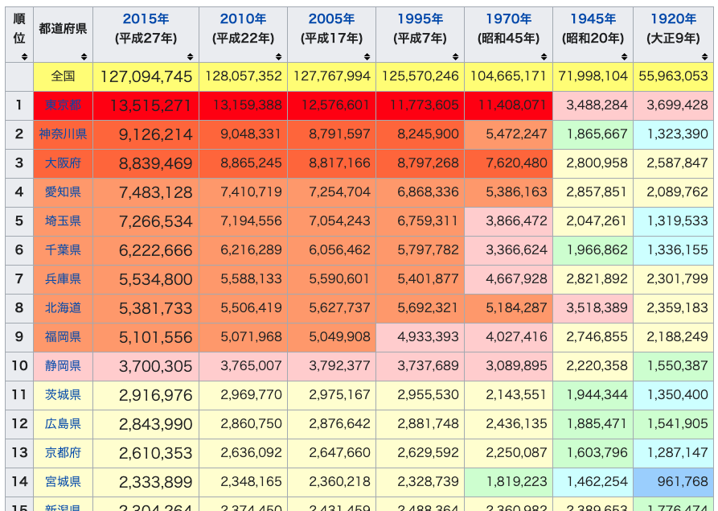

# 第11章　Scrapy Tutorial3

## はじめに

ここではScrapyの3つ目のチュートリアルとして、HTMLテーブルからのスクレイピング、画像のスクレイピング、JSONデータのスクレイピングなどを行います。

### テーブルをスクレイピング

ここでは、下記のようにテーブル形式でレイアウトされているデータを、Scrapyでスクレイピングする方法をまとめます。このテーブルはWikipediaの[都道府県の人口](https://ja.wikipedia.org/wiki/%E9%83%BD%E9%81%93%E5%BA%9C%E7%9C%8C%E3%81%AE%E4%BA%BA%E5%8F%A3%E4%B8%80%E8%A6%A7)に表示されているテーブルです。



このようなテーブルデータのHTMLは簡単に紹介すると、下記のようなHTMLになっています。`th(table header)`タグテーブルのヘッダを表示し、`tr(table row)`タグで行をまとめ、`td(table data)`タグが各値を表示します。

```markup
<table>
　<tr>
　　<th>col_A</th>
　　<th>col_B</th>
　</tr>
　<tr>
　　<td>A1</td>
　　<td>B2</td>
　</tr>
　<tr>
　　<td>A2</td>
　　<td>B2</td>
　</tr>
</table>
```

そのため、このようなテーブルデータをスクレイピングするためには、これまでと同じ要領で、行ごとに値を持つ`tr`をリストで取得し、それをループで回して、`td`から各値を取得すれば良さそうです。

では、さきほど表示したWikipediaの[都道府県の人口](https://ja.wikipedia.org/wiki/%E9%83%BD%E9%81%93%E5%BA%9C%E7%9C%8C%E3%81%AE%E4%BA%BA%E5%8F%A3%E4%B8%80%E8%A6%A7)に表示されているテーブルをスクレイピングしていきます。Scrapyのプロジェクトを下記の通り作ります。

```markup
$ scrapy startproject wiki_table_spider
$ cd wiki_table_spider
$ scrapy genspider table ja.wikipedia.org
```

あとは、いつもどおりxpathで欲しい情報を取得するようにします。

```python
# -*- coding: utf-8 -*-
from scrapy import Spider


class TableSpider(Spider):
    name = 'table'
    allowed_domains = ['ja.wikipedia.org']
    start_urls = ['https://ja.wikipedia.org/wiki/%E9%83%BD%E9%81%93%E5%BA%9C%E7%9C%8C%E3%81%AE%E4%BA%BA%E5%8F%A3%E4%B8%80%E8%A6%A7']

    def parse(self, response):
        table = response.xpath('//table[contains(@class, "wikitable sortable")]')[0]
        trs = table.xpath('.//tr')[3:]
        for tr in trs:
            rank = tr.xpath('.//th/text()').get().strip()
            pref = tr.xpath('.//td/a/text()').get().strip()
            y2015 = tr.xpath('.//td[2]/text()').get().strip()
            y2010 = tr.xpath('.//td[3]/text()').get().strip()
            y2005 = tr.xpath('.//td[4]/text()').get().strip()
            y1995 = tr.xpath('.//td[5]/text()').get().strip()
            y1970 = tr.xpath('.//td[6]/text()').get().strip()
            y1945 = tr.xpath('.//td[7]/text()').get().strip()
            y1920 = tr.xpath('.//td[8]/text()').get().strip()

            yield {
                "rank": rank,
                "pref": pref,
                "y2015": y2015,
                "y2010": y2010,
                "y2005": y2005,
                "y1995": y1995,
                "y1970": y1970,
                "y1945": y1945,
                "y1920": y1920
            }
```

それでは実行していきましょう。数秒で終了すると思います。中身を確認すると問題なく47都道府県の人口推移の情報を取得できています。

```python
$ scrapy crawl table -o item.json
$ cat item.json
[
{"rank": "1", "pref": "東京都", "y2015": "13,515,271", "y2010": "13,159,388", "y2005": "12,576,601", "y1995": "11,773,605", "y1970": "11,408,071", "y1945": "3,488,284", "y1920": "3,699,428"},
{"rank": "2", "pref": "神奈川県", "y2015": "9,126,214", "y2010": "9,048,331", "y2005": "8,791,597", "y1995": "8,245,900", "y1970": "5,472,247", "y1945": "1,865,667", "y1920": "1,323,390"},
{"rank": "3", "pref": "大阪府", "y2015": "8,839,469", "y2010": "8,865,245", "y2005": "8,817,166", "y1995": "8,797,268", "y1970": "7,620,480", "y1945": "2,800,958", "y1920": "2,587,847"},【】
【略】
{"rank": "45", "pref": "高知県", "y2015": "728,276", "y2010": "764,456", "y2005": "796,292", "y1995": "816,704", "y1970": "786,882", "y1945": "775,578", "y1920": "670,895"},
{"rank": "46", "pref": "島根県", "y2015": "694,352", "y2010": "717,397", "y2005": "742,223", "y1995": "771,441", "y1970": "773,575", "y1945": "860,275", "y1920": "714,712"},
{"rank": "47", "pref": "鳥取県", "y2015": "573,441", "y2010": "588,667", "y2005": "607,012", "y1995": "614,929", "y1970": "568,777", "y1945": "563,220", "y1920": "454,675"}
```

### 画像をスクレイピング

次は画像をスクレイピングしていきます。対象のサイトは、これまでも使ってきた架空のオンライン書店のサイトです。このサイトの下記書籍のタイトル画像を取得します。

* [Books to scrape](http://books.toscrape.com/)

```python
$ scrapy startproject image_spider
$ cd image_spider
$ scrapy genspider books books.toscrape.com
```

まずは`settings.py`の内容を変更していきます。`ITEM_PIPELINES`と`IMAGES_STORE`を追加します。`ITEM_PIPELINES`の`ImagesPipeline`は画像を扱えるようにするための設定です。`IMAGES_STORE`は画像の保存先を指定します。詳細は[ドキュメント](https://doc-ja-scrapy.readthedocs.io/ja/latest/topics/media-pipeline.html)を参照ください。ここではデスクトップに画像をダウンロードするようにしています。

```python
ITEM_PIPELINES = {
   'scrapy.pipelines.images.ImagesPipeline': 1,
   'image_spider.pipelines.BooksCrawlerPipeline': 2
}
IMAGES_STORE = '/Users/aki/Desktop/scrapy/image_spider/imgs'
```

`Items.py`には、タイトル、URL、画像を受け取れるようにしておきます。タイトルを取得するのは、ダウンロードした画像の名前をタイトルで変更するためです。

```python
import scrapy


class ImageSpiderItem(scrapy.Item):
    title = scrapy.Field()
    image_urls = scrapy.Field()
    images = scrapy.Field()
```

`books.py`では、[`ItemLoader()`](https://docs.scrapy.org/en/latest/topics/loaders.html)をインスタンス化し、URLやタイトルをスクレイピングします。そして、スクレイピングした値を[`ItemLoader()`](https://docs.scrapy.org/en/latest/topics/loaders.html)に`add_value()`で渡します。

```python
from scrapy import Spider
from scrapy.http import Request
from scrapy.loader import ItemLoader
from image_spider.items import ImageSpiderItem


class BooksSpider(Spider):
    name = 'books'
    allowed_domains = ['books.toscrape.com']
    start_urls = ['http://books.toscrape.com']

    def parse(self, response):
        books = response.xpath('//h3/a/@href').extract()
        for book in books:
            absolute_url = response.urljoin(book)
            yield Request(absolute_url, callback=self.parse_book)

        # ここでは1ページの画像だけをスクレイピングする
        # process next page
        # next_page_url = response.xpath('//a[text()="next"]/@href').extract_first()
        # if next_page_url is not None:
        #     absolute_next_page_url = response.urljoin(next_page_url)
        #     yield Request(absolute_next_page_url)

    def parse_book(self, response):
        l = ItemLoader(item=ImageSpiderItem(), response=response)

        title = response.xpath('//h1/text()').extract_first()

        image_urls = response.xpath('//img/@src').extract_first()
        image_urls = image_urls.replace('../..', 'http://books.toscrape.com/')

        l.add_value('title', title)
        l.add_value('image_urls', image_urls)

        return l.load_item()
```

`pipelines.py`では、ダウンロードされた画像がランダムな文字列になってしまうので、書籍のタイトルを使って、変更しています。

```python
import os

class BooksCrawlerPipeline(object):
    def process_item(self, item, spider):
        os.chdir('/Users/aki/Desktop/scrapy/image_spider/imgs')

        if item['images'][0]['path']:
            new_image_name = item['title'][0] + '.jpg'
            new_image_path = 'full/' + new_image_name

            os.rename(item['images'][0]['path'], new_image_path)
```

アイテムはこのような形で返されるので、この情報をもとに上記の名前変更のパイプラインを定義しています。

```python
item = {
 checksum: '4rfjewbfweg7hgbij3vu3rb',
 path: 'full/sncjabvyuwlv24g2ybk',
 title: 'Star in thr Sky'
 }
```

クローラーを実行し、画像の保存先を確認します。このような形でjpgの画像データが保存されていることがわかります。

```python
$ scrapy crawl books
2020-06-14 14:18:05 [scrapy.utils.log] INFO: Scrapy 2.0.1 started (bot: image_spider)
【略】
2020-06-14 14:20:09 [scrapy.core.engine] INFO: Spider closed (finished)

$ ls /Users/aki/Desktop/scrapy/image_spider/imgs/full
A Light in the Attic.jpg
It's Only the Himalayas.jpg
Libertarianism for Beginners.jpg
Mesaerion: The Best Science Fiction Stories 1800-1849.jpg
Olio.jpg
Our Band Could Be Your Life: Scenes from the American Indie Underground, 1981-1991.jpg
Rip it Up and Start Again.jpg
Sapiens: A Brief History of Humankind.jpg
Scott Pilgrim's Precious Little Life (Scott Pilgrim #1).jpg
Set Me Free.jpg
Shakespeare's Sonnets.jpg
Sharp Objects.jpg
Soumission.jpg
Starving Hearts (Triangular Trade Trilogy, #1).jpg
The Black Maria.jpg
The Boys in the Boat: Nine Americans and Their Epic Quest for Gold at the 1936 Berlin Olympics.jpg
The Coming Woman: A Novel Based on the Life of the Infamous Feminist, Victoria Woodhull.jpg
The Dirty Little Secrets of Getting Your Dream Job.jpg
The Requiem Red.jpg
Tipping the Velvet.jpg
```

このようにScrapyは画像のダウンロードもできるので、収集したデータを使って画像の機械学習モデルを作るのにも非常に便利です。画像の著作権には気をつける必要がありますが、openCVと掛け合わせて、ダウンロードした画像が人の画像なのかを判定したりもできるようです。

### JSONをスクレイピング

スクレイピングしていると、値の表示をJSONを呼び出して表示するようなサイトがあったりします。例えば、ECサイトに掲載している商品の金額を、通貨ごとに出し分けるために、JSONから金額を呼び出して表示するサイトなどです。この場合、参照もとのJSONにリクエストを送って、JSONのレスポンスを受け取り、そこから値をスクレイピングすることになります。一見面倒くさそうに見えますが、JSONであれば値も取得しやすいので、面倒くさいことはありません。ライブラリの[JSON](https://docs.python.org/ja/3/library/json.html)を使えば簡単に値を取り出せます。

リクエストを送って返ってきたのが下記のようなJSONだったとします。

```python
import json
data = '''
{
    "pId": 20023798,
    "pCode": "1686906",
    "pPrice": {
        "current": {
            "value": 158,
            "text": "¥158",
            "versionId": "REGP000002000100098793260000166981"
        },
        "pre": {
            "value": 190,
            "text": "¥190",
            "versionId": "REGP000002000100098793260000166981"
        },
        "currency": "USD",
        "isMarkedDown": false,
        "isOutletPrice": false,
        "startDateTime": "2020-01-20T10:07:35Z"
    }
}'''
```

JSONとして扱うために、`loads()`で読み込みます。

```python
data_json = json.loads(data)
```

JSONから値を取り出すには、キーを指定すればよいのので、幾つか試しに値を取得するとこうなります。

```python
data_json = json.loads(data)
data_json["pId"]
20023798

data_json["pPrice"]["current"]["text"]
'¥158'

data_json["pPrice"]["currency"]
'USD'
```

実際には、JSONが返ってきたら、必要であれば`decode()`でバイト列の内容をデコードしてJSONに変換し、キーを指定して、値をスクレイピングすることになります。

```python
def parse_price(self, response):
    jsonresponse = json.loads(response.body.decode('utf-8'))
    price = jsonresponse["pPrice"]["current"]["text"]

    yield {
        "price" : price
    }
```


