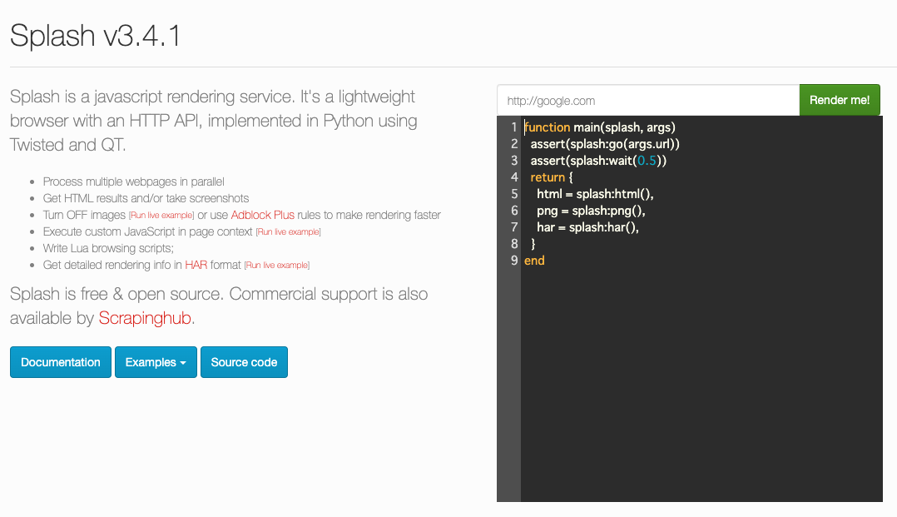
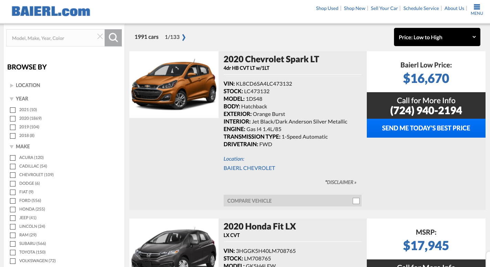
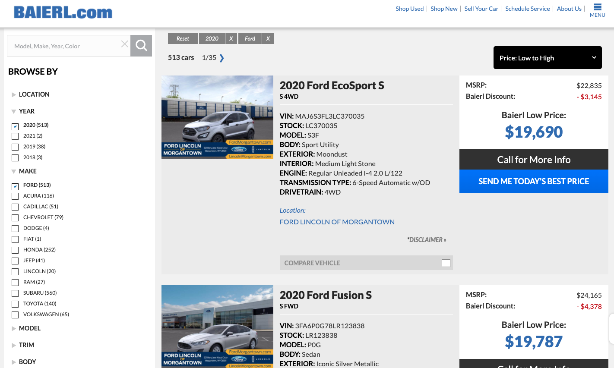

# 第12章　ScrapyとJavaScript

## はじめに

ここでは、JavaScriptで生成されるHTMLページをスクレイピングすることを手助けしてくれるSplashの使い方をまとめておきます。Scrapyはlxmlベースなので、JavaScriptを実行するなどはできません。そのため、JavaScriptを実行して結果をスクレイピングするためには、JavaScriptを実行し、実行後のHTMLをScrapyに渡す必要があります。そのJavaScriptを実行してHTMLを返すことをSplashはやってくれます。

### DockerとSplashのインストール

SplashはWebKitがベースのヘッドレスブラウザを組み込んだサーバーです。ヘッドレスブラウザというのは、サーバ環境などでHTMLをレンダリングするためにバックグラウンドで動作させるブラウザなので、GUIの画面をありません。機械のためのブラウザというイメージでしょうか。Splashは下記のようなことができるようです。

* 複数のウェブページを並行して処理できる。 
* HTML の結果を取得したり、スクリーンショットを撮影したりできる。 
* 画像を読み込みをOFFにしたり、Adblock Plus ルールを使用してレンダリングを高速化できる。
* ページコンテキストでカスタム JavaScript を実行できる。
*  Luaブラウジングスクリプトを書ける。 
* Splash-Jupyter Notebooks で Splash Lua スクリプトを開発できる。 
* レンダリングの詳細情報をHAR形式で取得できる。

では、公式の[ドキュメント](https://splash.readthedocs.io/en/stable/install.html#os-x-docker)に従ってDockerを利用した方法で行います。まずは、Dockerのアカウントを作ってログインし、DockerHubからDocker for Macをインストールします。

```python
$ docker version
Client: Docker Engine - Community
 Version:           19.03.8
 API version:       1.40
 Go version:        go1.12.17
 Git commit:        afacb8b
 Built:             Wed Mar 11 01:21:11 2020
 OS/Arch:           darwin/amd64
 Experimental:      false

Server: Docker Engine - Community
 Engine:
  Version:          19.03.8
  API version:      1.40 (minimum version 1.12)
  Go version:       go1.12.17
  Git commit:       afacb8b
  Built:            Wed Mar 11 01:29:16 2020
  OS/Arch:          linux/amd64
  Experimental:     false
 containerd:
  Version:          v1.2.13
  GitCommit:        7ad184331fa3e55e52b890ea95e65ba581ae3429
 runc:
  Version:          1.0.0-rc10
  GitCommit:        dc9208a3303feef5b3839f4323d9beb36df0a9dd
 docker-init:
  Version:          0.18.0
  GitCommit:        fec3683
```

Docker hubに置かれているScrapinghub社の[`scrapinghub/splash`](https://hub.docker.com/r/scrapinghub/splash)イメージを`docker pull`コマンドでダウンロードします。`docker run`コマンドでコンテナを作って実行します。ポートの意味は下記のとおりです。5023がtelnet、8050がhttp、8051がhttpsです。

```python
$ sudo docker pull scrapinghub/splash
$ sudo docker run -p 5023:5023 -p 8050:8050 -p 8051:8051 scrapinghub/splash
QStandardPaths: XDG_RUNTIME_DIR not set, defaulting to '/tmp/runtime-splash'
2020-06-20 03:05:50.051261 [-] Splash version: 3.4.1
2020-06-20 03:05:50.163295 [-] Qt 5.13.1, PyQt 5.13.1, WebKit 602.1, Chromium 73.0.3683.105, sip 4.19.19, Twisted 19.7.0, Lua 5.2
2020-06-20 03:05:50.165098 [-] Python 3.6.9 (default, Nov  7 2019, 10:44:02) [GCC 8.3.0]
2020-06-20 03:05:50.166229 [-] Open files limit: 1048576
2020-06-20 03:05:50.166437 [-] Can't bump open files limit
2020-06-20 03:05:50.188744 [-] proxy profiles support is enabled, proxy profiles path: /etc/splash/proxy-profiles
2020-06-20 03:05:50.189130 [-] memory cache: enabled, private mode: enabled, js cross-domain access: disabled
2020-06-20 03:05:50.401278 [-] verbosity=1, slots=20, argument_cache_max_entries=500, max-timeout=90.0
2020-06-20 03:05:50.402061 [-] Web UI: enabled, Lua: enabled (sandbox: enabled), Webkit: enabled, Chromium: enabled
2020-06-20 03:05:50.403264 [-] Site starting on 8050
2020-06-20 03:05:50.403699 [-] Starting factory <twisted.web.server.Site object at 0x7f675747b1d0>
2020-06-20 03:05:50.404881 [-] Server listening on http://0.0.0.0:8050
```

`http://0.0.0.0:8050`にアクセスして、コンテナ内のサーバーが起動していることを確認します。



Dockerのプロセスも確認しておきます。

```python
$ docker container ls
CONTAINER ID        IMAGE                COMMAND                  CREATED             STATUS              PORTS                                                      NAMES
b1ff5faed1ca        scrapinghub/splash   "python3 /app/bin/sp…"   3 hours ago         Up 3 hours          0.0.0.0:5023->5023/tcp, 0.0.0.0:8050-8051->8050-8051/tcp   amazing_zhukovsky
```

次は`scrapy_splash`をインストールします。

```python
$ sudo pip install scrapy_splash
```

これで必要なものがインストールできました。

### Javascriptで動的に生成されるページ

Scapye内でSplashを使用する場合、基本的には下記の順序で行います。

1. `scrapy_splash`ライブラリをインストール
2. Splashのサーバーを起動する\(Dockerコンテナ\)
3. settings.pyに必要な情報を記載する
4. SpiderでRequestクラスではなく、SplashRequestクラスを利用する。
5. Luaスクリプトでブラウザを操作する

ここでは、偉人の名言サイト"Quotes To Scrape"の[JavaScript版ページ](http://quotes.toscrape.com/js/)を対象にします。このサイトは、Webページ内にJavaScriptが仕込まれており、生のHTMLには名言は含まれていません。Webブラウザでページがレンダリングされたときに。JSON形式のデータオブジェクトを反復処理してDOMを作成することで、サイトに名言のブロックが作られる仕様になっています。そのため、Scrapyでそのままデータを抽出することはできません。

```python
<script src="/static/jquery.js"></script>
<script>
    var data = [
    {
        "tags": [
            "change",
            "deep-thoughts",
            "thinking",
            "world"
        ],
        "author": {
            "name": "Albert Einstein",
            "goodreads_link": "/author/show/9810.Albert_Einstein",
            "slug": "Albert-Einstein"
        },
        "text": "\u201cThe world as we have created it is a process of our thinking. It cannot be changed without changing our thinking.\u201d"
    },
    
    【略】
    
    {
        "tags": [
            "humor",
            "obvious",
            "simile"
        ],
        "author": {
            "name": "Steve Martin",
            "goodreads_link": "/author/show/7103.Steve_Martin",
            "slug": "Steve-Martin"
        },
        "text": "\u201cA day without sunshine is like, you know, night.\u201d"
    }
];
    for (var i in data) {
        var d = data[i];
        var tags = $.map(d['tags'], function(t) {
            return "<a class='tag'>" + t + "</a>";
        }).join(" ");
        document.write("<div class='quote'><span class='text'>" + d['text'] + "</span><span>by <small class='author'>" + d['author']['name'] + "</small></span><div class='tags'>Tags: " + tags + "</div></div>");
        }
</script>
```

ほかにも下記のようなページもJavaScriptで動的にHTMLが生成されます。よく見るような[車の通販サイト](https://www.baierl.com/new-inventory/)です。このページでは左側のボックスにチェックを入れることで表示される車が変更されます。



例えば、2020年のFORDにチェックを入れると表示が変更されます。このようなページをスクレイピングしたいのであれば、Splashを使って、Luaスクリプトでブラウザを操作する必要があります。他の方法としては、リクエストするURLを書き換えれば、Splashを使わなくてもスクレイピングできます。



### Scrapy×Splashのサンプルコード

まずはいつもどおりプロジェクト作成します。

```python
➜ scrapy startproject quotes_js
➜ cd quotes_js
➜ scrapy genspider quotes_spider_js quotes.toscrape.com
```

`settings.py`にSplashの情報を追記します。

```text
# Enable or disable downloader middlewares
# See https://docs.scrapy.org/en/latest/topics/downloader-middleware.html
DOWNLOADER_MIDDLEWARES = {
    'scrapy_splash.SplashCookiesMiddleware': 723,
    'scrapy_splash.SplashMiddleware': 725,
    'scrapy.downloadermiddlewares.httpcompression.HttpCompressionMiddleware': 810
}

SPLASH_URL = 'http://localhost:8050/'

DUPEFILTER_CLASS = 'scrapy_splash.SplashAwareDupeFilter'
HTTPCACHE_STORAGE = 'scrapy_splash.SplashAwareFSCacheStorage'
```

クローラーのコードはこのようになります。いつもと違う点は、`scrapy_splash`ライブラリが呼ばれ、`SplashRequest()`が使用され、Luaスクリプトがある点です。ここでは、Luaスクリプトでなくてもページを移動できますが、サンプルとしてボタンをクリックするLuaスクリプトを記載しています。

```python
# -*- coding: utf-8 -*-
import scrapy
from scrapy_splash import SplashRequest

class QuotesSpiderJsSpider(scrapy.Spider):
    name = 'quotes_spider_js'
    allowed_domains = ['quotes.toscrape.com']
    start_urls = ['http://quotes.toscrape.com/js']

    def start_requests(self):
        for url in self.start_urls:
            yield SplashRequest(url = url, callback = self.parse, endpoint = "render.html")

    def parse(self, response):
        quotes = response.xpath('//*[@class="quote"]')
        for quote in quotes:
            author = quote.xpath('.//*[@class="author"]/text()').get()
            quote = quote.xpath('.//*[@class="text"]/text()').get()
            yield {'author': author,
                   'quote': quote}

        # レンダリングされたHTMLなので、これでも問題ない
        # next_page_url = response.xpath('//*[@class="next"]/a/@href').get()
        # abs_next_page_url = response.urljoin(next_page_url)
        # if abs_next_page_url is not None:
        #     yield SplashRequest(abs_next_page_url, callback=self.parse)

        # Lua Scriptバージョン
        # URLに移動し、Nextボタンをクリックし、次のページのURLとHTMLを返す
        script = """function main(splash)
                assert(splash:go(splash.args.url))
                splash:wait(1)
                button = splash:select("li[class=next] a")
                splash:set_viewport_full()
                splash:wait(1)
                button:mouse_click()
                splash:wait(1)
                return {url = splash:url(),
                        html = splash:html()}
            end"""

        yield SplashRequest(url=response.url,
                            callback=self.parse,
                            endpoint='execute',
                            args={'lua_source': script})


```

`SplashRequest()`の[`render.html`](https://splash.readthedocs.io/en/stable/api.html#render-html)はJavaScriptでレンダリングされたページのHTMLを返す設定です。Luaスクリプトについては[ドキュメント](https://splash.readthedocs.io/en/stable/scripting-overview.html)の詳細を確認してください。それではクローラーを実行していきましょう。

```python
$ scrapy crawl quotes_spider_js -o item_js.json
```

問題なく100個分の名言が取得できています。

```python
➜ cat item_js.json 
[
{"author": "Albert Einstein", "quote": "\u201cThe world as we have created it is a process of our thinking. It cannot be changed without changing our thinking.\u201d"},
{"author": "J.K. Rowling", "quote": "\u201cIt is our choices, Harry, that show what we truly are, far more than our abilities.\u201d"},
【略】
{"author": "Dr. Seuss", "quote": "\u201cA person's a person, no matter how small.\u201d"},
{"author": "George R.R. Martin", "quote": "\u201c... a mind needs books as a sword needs a whetstone, if it is to keep its edge.\u201d"}
]
```


