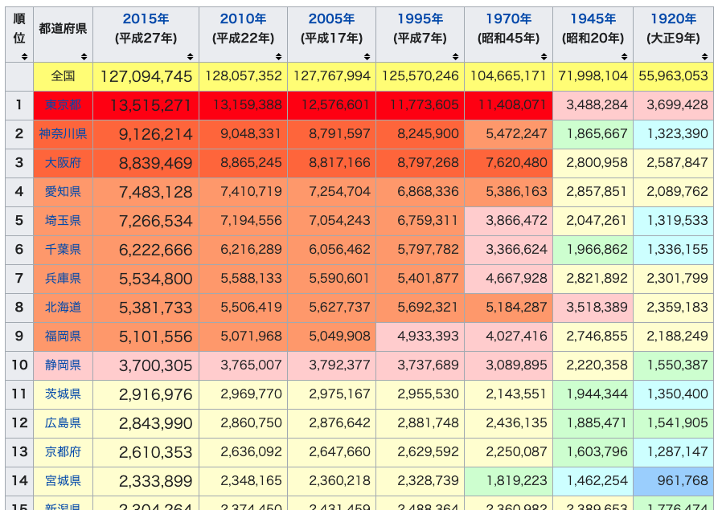

# 第12章　Scrapy Tutorial3

## はじめに

ここではScrapyの3つ目のチュートリアルとして、HTMLテーブルからのスクレイピング、画像のスクレイピング、JavaScriptを用いたサイトからのスクレイピングなどを行います。

### テーブルをスクレイピング

ここでは、下記のようにサイト内でテーブルにレイアウトされているデータを、Scrapyでスクレイピングする方法をまとめます。このテーブルはWikipediaの[都道府県の人口](https://ja.wikipedia.org/wiki/%E9%83%BD%E9%81%93%E5%BA%9C%E7%9C%8C%E3%81%AE%E4%BA%BA%E5%8F%A3%E4%B8%80%E8%A6%A7)に表示されているテーブルです。



このようなテーブルデータのHTMLは簡単に紹介すると、下記のようなHTMLになっています。`th(table header)`タグテーブルのヘッダを表示し、`tr(table row)`タグで行をまとめ、`td(table data)`タグが各値を表示します。

```markup
<table>
　<tr>
　　<th>col_A</th>
　　<th>col_B</th>
　</tr>
　<tr>
　　<td>A1</td>
　　<td>B2</td>
　</tr>
　<tr>
　　<td>A2</td>
　　<td>B2</td>
　</tr>
</table>
```

そのため、このようなテーブルデータをスクレイピングするためには、これまでと同じ要領で、行ごとに値を持つ`tr`をリストで取得し、それをループで回して、`td`から各値を取得すれば良さそうです。

では、さきほど表示したWikipediaの[都道府県の人口](https://ja.wikipedia.org/wiki/%E9%83%BD%E9%81%93%E5%BA%9C%E7%9C%8C%E3%81%AE%E4%BA%BA%E5%8F%A3%E4%B8%80%E8%A6%A7)に表示されているテーブルをスクレイピングしていきます。Scrapyのプロジェクトを下記の通り作ります。

```markup
$ scrapy startproject wiki_table_spider
$ cd wiki_table_spider
$ scrapy genspider table ja.wikipedia.org
```

あとは、いつもどおりxpathで欲しい情報を取得するようにします。

```python
# -*- coding: utf-8 -*-
from scrapy import Spider


class TableSpider(Spider):
    name = 'table'
    allowed_domains = ['ja.wikipedia.org']
    start_urls = ['https://ja.wikipedia.org/wiki/%E9%83%BD%E9%81%93%E5%BA%9C%E7%9C%8C%E3%81%AE%E4%BA%BA%E5%8F%A3%E4%B8%80%E8%A6%A7']

    def parse(self, response):
        table = response.xpath('//table[contains(@class, "wikitable sortable")]')[0]
        trs = table.xpath('.//tr')[3:]
        for tr in trs:
            rank = tr.xpath('.//th/text()').get().strip()
            pref = tr.xpath('.//td/a/text()').get().strip()
            y2015 = tr.xpath('.//td[2]/text()').get().strip()
            y2010 = tr.xpath('.//td[3]/text()').get().strip()
            y2005 = tr.xpath('.//td[4]/text()').get().strip()
            y1995 = tr.xpath('.//td[5]/text()').get().strip()
            y1970 = tr.xpath('.//td[6]/text()').get().strip()
            y1945 = tr.xpath('.//td[7]/text()').get().strip()
            y1920 = tr.xpath('.//td[8]/text()').get().strip()

            yield {
                "rank": rank,
                "pref": pref,
                "y2015": y2015,
                "y2010": y2010,
                "y2005": y2005,
                "y1995": y1995,
                "y1970": y1970,
                "y1945": y1945,
                "y1920": y1920
            }
```

それでは実行していきましょう。数秒で終了すると思います。中身を確認すると問題なく47都道府県の人口推移の情報を取得できています。

```python
$ scrapy crawl table -o item.json
$ cat item.json
[
{"rank": "1", "pref": "東京都", "y2015": "13,515,271", "y2010": "13,159,388", "y2005": "12,576,601", "y1995": "11,773,605", "y1970": "11,408,071", "y1945": "3,488,284", "y1920": "3,699,428"},
{"rank": "2", "pref": "神奈川県", "y2015": "9,126,214", "y2010": "9,048,331", "y2005": "8,791,597", "y1995": "8,245,900", "y1970": "5,472,247", "y1945": "1,865,667", "y1920": "1,323,390"},
{"rank": "3", "pref": "大阪府", "y2015": "8,839,469", "y2010": "8,865,245", "y2005": "8,817,166", "y1995": "8,797,268", "y1970": "7,620,480", "y1945": "2,800,958", "y1920": "2,587,847"},【】
【略】
{"rank": "45", "pref": "高知県", "y2015": "728,276", "y2010": "764,456", "y2005": "796,292", "y1995": "816,704", "y1970": "786,882", "y1945": "775,578", "y1920": "670,895"},
{"rank": "46", "pref": "島根県", "y2015": "694,352", "y2010": "717,397", "y2005": "742,223", "y1995": "771,441", "y1970": "773,575", "y1945": "860,275", "y1920": "714,712"},
{"rank": "47", "pref": "鳥取県", "y2015": "573,441", "y2010": "588,667", "y2005": "607,012", "y1995": "614,929", "y1970": "568,777", "y1945": "563,220", "y1920": "454,675"}
```

### 画像をスクレイピング

次は画像をスクレイピングしていきます。対象のサイトは、これまでも使ってきた架空のオンライン書店のサイトです。このサイトの下記書籍のタイトル画像を取得します。

* [Books to scrape](http://books.toscrape.com/)

```python
$ scrapy startproject image_spider
$ cd image_spider
$ scrapy genspider books books.toscrape.com
```

まずは`settings.py`の内容を変更していきます。`ITEM_PIPELINES`と`IMAGES_STORE`を追加します。`ITEM_PIPELINES`の`ImagesPipeline`は画像を扱えるようにするための設定です。`IMAGES_STORE`は画像の保存先を指定します。詳細は[ドキュメント](https://doc-ja-scrapy.readthedocs.io/ja/latest/topics/media-pipeline.html)を参照ください。

```python
ITEM_PIPELINES = {
   'scrapy.pipelines.images.ImagesPipeline': 1,
   'image_spider.pipelines.BooksCrawlerPipeline': 2
}
IMAGES_STORE = '/Users/aki/Desktop/scrapy/image_spider/imgs'
```

`Items.py`には、タイトル、URL、画像を受け取れるようにしておきます。タイトルを取得するのは、ダウンロードした画像の名前をタイトルで変更するためです。

```python
import scrapy


class ImageSpiderItem(scrapy.Item):
    title = scrapy.Field()
    image_urls = scrapy.Field()
    images = scrapy.Field()
```

`Items.py`では、[`ItemLoader()`](https://docs.scrapy.org/en/latest/topics/loaders.html)をインスタンス化し、URLやタイトルをスクレイピングします。そして、スクレイピングした値を[`ItemLoader()`](https://docs.scrapy.org/en/latest/topics/loaders.html)に`add_value()`で渡します。

