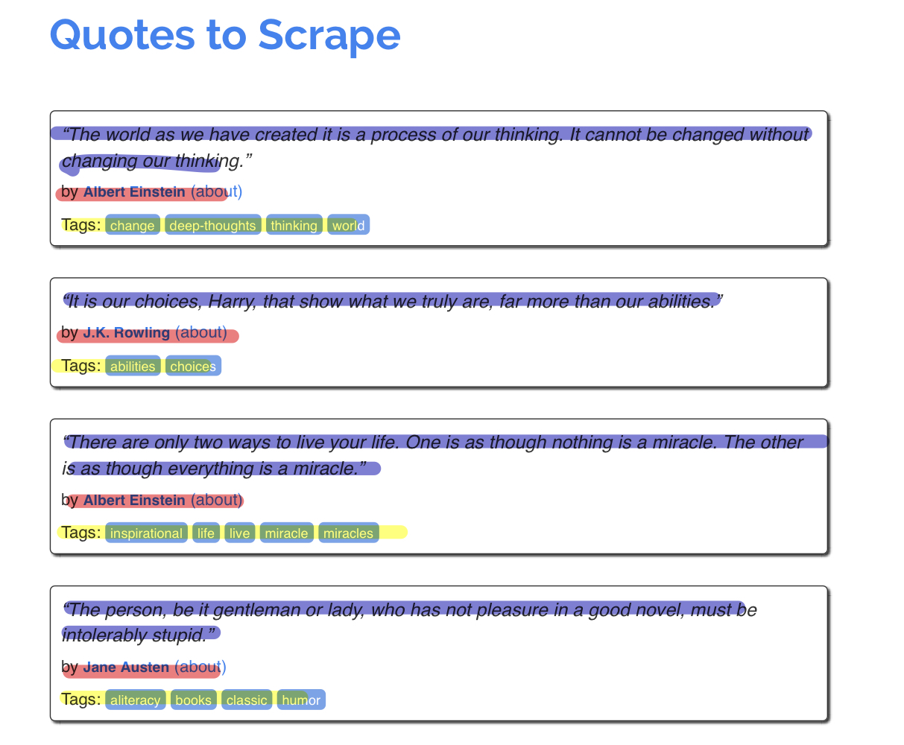
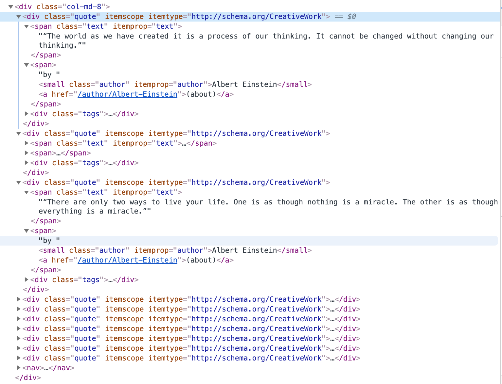

# 第4章　Scrapy Tutorial

## はじめに

ここでは、Scrapyのドキュメントに載っている[チュートリアル](https://docs.scrapy.org/en/latest/intro/tutorial.html)を参考に、Scrapyでクローラーを作成する。チュートリアルを完全に再現するわけではなく、チュートリアルを題材にしながら寄り道しながら進めていきます。チュートリアルを実行されたい方はドキュメントを参照ください。スクレイピングの対象にするサイトは、チュートリアルと同じで下記の有名人の名言サイトです。

* [quotes.toscrape.com](http://quotes.toscrape.com/) 

### プロジェクトの作成

まずはプロジェクトを作成します。ここではプロジェクトの名前は「sample\_quotes」で、クローラーの名前を「quotes\_spider」としています。プロジェクトを作ったら、settings.pyの中身を礼儀が正しいように書き換えるのは忘れずに行います。

```text
$ scrapy startproject sample_quotes
$ cd sample_quotes
$ scrapy genspider quotes_spider quotes.toscrape.com
```

### HTML構造の調査と設計

スクレイピングする前に、スクレイピングするページのHTML構造を確認します。こんページであれば、黒枠のブロックごとに青い線の「名言」、赤い線の「名前」、黄色い線の「タグ」が同じようなレイアウトで表示されています。



同じようなレイアウトで表示されているということは、HTMLの書き方も同じようになっているということです。実際にブラウザの検証機能で確認すると、同じようなHTML構造になっています。



これであれば、ブロックを取得→詳細をスクレイピング→次のブロック→詳細をスクレイピングということを繰り返せば取得できそうです。

### クローラーの実行

### ログ情報


