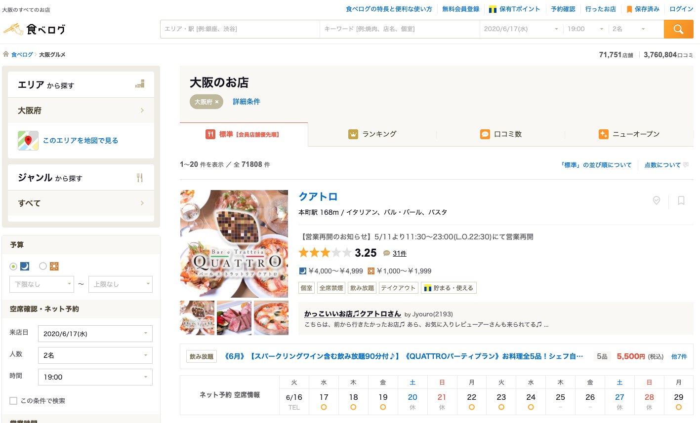
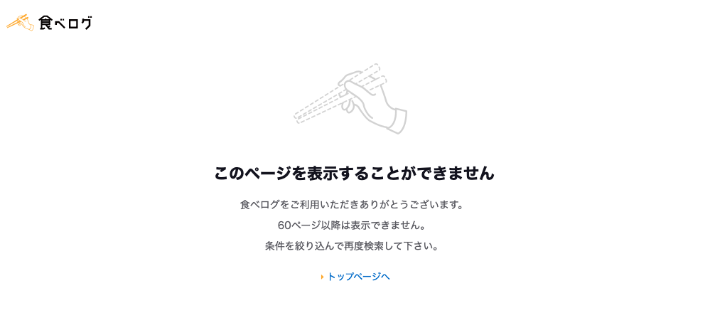

# 補章2　R言語とクローラー

## はじめに

ここでは、R言語を用いて、簡単なスクレイピングのコードを作成します。データ分析言語と言えば、R、Python…最近だとJuliaなどだと思うので、本章ではPythonのScrapyを中心に内容を扱ってきたので、補章では、Rでのクローラー作成方法も紹介しておきます。サイトの情報をスクレイピングし、その情報をMySQLに保存するまでを紹介します。

### 対象サイトとライブラリの読み込み

対象のサイトは「食べログ」です。大阪エリアの店舗をスクレイピングしてみます。



まずは必要なライブラリを読み込みます。ここでは`base`ではなく`tidyverse`の関数を中心にコードを組み立てます。加えて、Beautiful Soupをベースにしている`rvest`を読み込みます。

```text
pacman::p_load(tidyverse, rvest)
```

セッションインフォも載せておきます。

```text
> sessionInfo()
R version 3.6.3 (2020-02-29)
Platform: x86_64-apple-darwin15.6.0 (64-bit)
Running under: macOS Catalina 10.15.5

Matrix products: default
BLAS:   /System/Library/Frameworks/Accelerate.framework/Versions/A/Frameworks/vecLib.framework/Versions/A/libBLAS.dylib
LAPACK: /Library/Frameworks/R.framework/Versions/3.6/Resources/lib/libRlapack.dylib

locale:
  [1] ja_JP.UTF-8/ja_JP.UTF-8/ja_JP.UTF-8/C/ja_JP.UTF-8/ja_JP.UTF-8

attached base packages:
  [1] stats     graphics  grDevices utils     datasets  methods   base     

other attached packages:
  [1] rvest_0.3.5     xml2_1.3.1      forcats_0.5.0   stringr_1.4.0   dplyr_1.0.0    
[6] purrr_0.3.3     readr_1.3.1     tidyr_1.0.2     tibble_3.0.0    ggplot2_3.3.0  
[11] tidyverse_1.3.0

loaded via a namespace (and not attached):
[1] Rcpp_1.0.4.6     cellranger_1.1.0 pillar_1.4.3     compiler_3.6.3  
[5] dbplyr_1.4.4     tools_3.6.3      lubridate_1.7.8  jsonlite_1.6.1  
[9] lifecycle_0.2.0  nlme_3.1-144     gtable_0.3.0     lattice_0.20-38 
[13] pkgconfig_2.0.3  rlang_0.4.6      reprex_0.3.0     DBI_1.1.0       
[17] cli_2.0.2        rstudioapi_0.11  haven_2.2.0      withr_2.2.0     
[21] httr_1.4.1       fs_1.4.1         generics_0.0.2   vctrs_0.3.0     
[25] hms_0.5.3        grid_3.6.3       tidyselect_1.1.0 glue_1.4.1      
[29] R6_2.4.1         fansi_0.4.1      readxl_1.3.1     modelr_0.1.6    
[33] blob_1.2.1       magrittr_1.5     backports_1.1.6  scales_1.1.0    
[37] ellipsis_0.3.0   assertthat_0.2.1 colorspace_1.4-1 stringi_1.4.6   
[41] munsell_0.5.0    broom_0.5.5      crayon_1.3.4  
```

### 各店舗のURLの取得

まずは店名一覧のページから店舗の詳細ページへのURLと、クローラーを次のページ進めるかどうかを判定する関数を作ります。もちろん、ページ番号とURLを結合して、リクエストを送る方法でもかまいません。

ですが、ページネーションの部分をみると71751店舗あるようなので、1ページに20店舗なので、3588回ページをループさせるコードを書くと、途中でエラーが返されます。その理由は下記の通り、60ページ目以降は表示されないので、1200店舗のURLしか取得できません。



上限ページ数がわかったので、その番号をもとにURLを作ってループさせる方法でも良いですが、ここでは次のページのURLがあれば、次のページに進むようにしています。

```text
list_url_parse <- function(html){
  tmp <- html %>%
    rvest::html_nodes(., xpath = "//*[@class = 'list-rst__rst-name-target cpy-rst-name']") %>% 
    rvest::html_attr("href")

  res <- tibble::tibble(urls = tmp)
  return(res)
}

is_next_url <- function(html){
  res <- html %>%
    rvest::html_nodes(., xpath = "//*[@class = 'c-pagination__arrow c-pagination__arrow--next']") %>% 
    rvest::html_attr("href")

  return(res)
}
```

さきほど作った関数たちを使って、ページのURL一覧を取得する関数を作ります。ここでは、サーバーに負荷がかからないように、`Sys.sleep(10)`として、スリープを10秒いれています。

```text
get_urls <- function(start_url) {
  df <- NULL
  url <- start_url

  cat("Log: Stsrt\n")
  cat("Log:", as.character(Sys.time()), url, "\n")

  while (length(url) != 0) {
    html <- url %>% xml2::read_html()
    tmp <- list_url_parse(html = html)
    url <- is_next_url(html = html)
    df <- rbind(df, tmp)
    Sys.sleep(10)
    cat("Log:", as.character(Sys.time()), url, "\n")
  }

  cat("Log: End\n")
  return(df)
}
```

食べログの1ページ目をスタートURLに指定し、ページがある分クローラーを走らせます。ログを出力するように関数を作っているので、実行すれば、ログが出力されます。1枚20店舗のURLが取得できるので、合計で1200URLあれば問題なく取得できていることになります。

```text
start_url <- "https://tabelog.com/osaka/rstLst/1"
df <- get_urls(start_url = start_url)

Log: Start
Log: 2020-06-07 02:57:30 https://tabelog.com/osaka/rstLst/1 
Log: 2020-06-07 02:57:41 https://tabelog.com/osaka/rstLst/2/ 
・・・
Log: 2020-06-07 03:08:35 https://tabelog.com/osaka/rstLst/59/ 
Log: 2020-06-07 03:08:46 https://tabelog.com/osaka/rstLst/60/ 
Log: 2020-06-07 03:08:58  
Log: End

# １２００個のURLが取得できている
df %>% 
  dplyr::count()
# A tibble: 1 x 1
      n
  <int>
1  1200

# 重複URLもなし
df %>% 
  dplyr::n_distinct()
[1] 1200
```

### 店舗の詳細ページから店舗情報を取得

ここまでの作業で、大阪エリアのURLの一覧が手に入ったので、このURLを渡す関数を作ります。この関数は、詳細ページの店名、住所、電話番号、緯度、経度を取得します。

```text
page_url_parse <- function(url){
  detail_html <- url %>% xml2::read_html()

  name <- detail_html %>%
    rvest::html_node(., xpath = "//*[@class = 'display-name']") %>% 
    rvest::html_text(trim = TRUE)

  address <- detail_html %>%
    rvest::html_node(., xpath = "//*[@class = 'rstinfo-table__address']") %>% 
    rvest::html_text(trim = TRUE)

  # 先に表示される店舗の電話番号を取得
  phone <- detail_html %>%
    rvest::html_node(., xpath = "//*[@class = 'rstinfo-table__tel-num']") %>% 
    rvest::html_text(trim = TRUE)

  latlong <- detail_html %>%
    rvest::html_nodes(., xpath = './/*[@class="rstinfo-table__map-wrap"]/div/a/img') %>% 
    rvest::html_attr("data-original") %>% 
    stringr::str_extract(., pattern = "([\\d.]+),([\\d.]+)") %>% 
    stringr::str_split(., pattern = ",")

  lat <- latlong[[1]][[1]]
  long <- latlong[[1]][[2]]

  res <- tibble::tibble(name, address, phone, lat, long)
  cat("Log:{'name':", name, ", 'address':", address, ", 'phone':", phone, ", 'lat':", lat, ", 'long':", long, "}\n")

  return(res)
}
```

もちろん`for-loop`でも良いのですが、ここでは`purrr::map()`を使います。`furrr`パッケージの`future_map()`を使うことで並列処理できますが、サーバーへの負担を考えて使用しません。この関数も実行するとログを出力するようにしているので、実行すると店舗の詳細情報が取得されていることがわかります。

```text
df_osaka <- df %>% 
  dplyr::mutate(tmp = purrr::map(.x = urls, 
                                 .f = function(x){
                                 Sys.sleep(10)
                                 page_url_parse(x)})) %>% 
  tidyr::unnest(cols = c(tmp), keep_empty = TRUE)

Log:{'name': 夜景 チーズとお肉のソラバル 梅田店 , 'address': 大阪府大阪市北区小松原町1-27 梅田エビスビル 9F , 'phone': 050-5595-3405 , 'lat': 34.70228264268257 , 'long': 135.50153635551814 }
Log:{'name': 活さば問屋 , 'address': 大阪府大阪市北区堂山町5-4 ABC観光ビル 1F , 'phone': 050-5596-4471 , 'lat': 34.70283704028684 , 'long': 135.50224960409074 }
Log:{'name': しゃかりき432" 堂山店 , 'address': 大阪府大阪市北区堂山町10-15 天神ビル 1F , 'phone': 050-5456-9194 , 'lat': 34.70337007924187 , 'long': 135.5045632762873 }…
```

実行が終わった後に結果を確認すると、1200件の店舗情報が取得できていることがわかります。

```text
df_osaka
# A tibble: 1,200 x 6
   urls                                              name                                 address                                        phone         lat                long             
   <chr>                                             <chr>                                <chr>                                          <chr>         <chr>              <chr>            
 1 https://tabelog.com/osaka/A2701/A270101/27103352/ "夜景 チーズとお肉のソラバル 梅田店" 大阪府大阪市北区小松原町1-27 梅田エビスビル 9F 050-5595-3405 34.70228264268257  135.501536355518…
 2 https://tabelog.com/osaka/A2701/A270101/27090601/ "活さば問屋"                         大阪府大阪市北区堂山町5-4 ABC観光ビル 1F       050-5596-4471 34.70283704028684  135.502249604090…
 3 https://tabelog.com/osaka/A2701/A270101/27116951/ "しゃかりき432\" 堂山店"             大阪府大阪市北区堂山町10-15 天神ビル 1F        050-5456-9194 34.70337007924187  135.5045632762873
 4 https://tabelog.com/osaka/A2701/A270101/27116105/ "鉄板焼き 華粋"                      大阪府大阪市北区曽根崎新地1-5-31  JMビル B1F   080-2149-1779 34.69764613094936  135.497917425098…
 5 https://tabelog.com/osaka/A2701/A270101/27073634/ "北新地 湯木 新店"                   大阪府大阪市北区堂島1-5-39 マルタビル 1F       050-5869-6949 34.69616766207376  135.497007013224…
 6 https://tabelog.com/osaka/A2701/A270104/27115083/ "akala"                              大阪府大阪市中央区内淡路町2-3-17               050-5456-5607 34.68641842867681  135.513001133786…
 7 https://tabelog.com/osaka/A2701/A270103/27084786/ "輝楽家"                             大阪府大阪市北区天神橋1-11-13                  050-5571-8107 34.69405370101387  135.511735887323…
 8 https://tabelog.com/osaka/A2701/A270101/27073090/ "今井きしょう"                       大阪府大阪市北区梅田1-3-1 大阪駅前第1ビル  B1F 050-5596-5109 34.699063725204596 135.496091400370…
 9 https://tabelog.com/osaka/A2701/A270101/27007749/ "サントロペ"                         大阪府大阪市北区鶴野町4 コープ野村B棟 101      050-5868-0928 34.70930717432185  135.501834618436…
10 https://tabelog.com/osaka/A2701/A270202/27092954/ "THE WALL CABANA"                    大阪府大阪市中央区西心斎橋2-17-9 8F            06-6212-1730  34.670589851643655 135.4975398132911
# … with 1,190 more rows
```

### MySQLで情報を保存

スクレイピングしたデータをMySQLにインサートして保存しておきます。まずは保存するためのデータベースをMySQLに作成します。ここでは`tabelog`データベースを作ります。

```text
mysql> create database tabelog;
Query OK, 1 row affected (0.00 sec)
```

`RMySQL`、`DBI`パッケージを読み込み、コネクションを作ったあとは、`dbWriteTable()`でインサートします。

```text
library(DBI)
library(RMySQL)

con <- dbConnect(
  drv = RMySQL::MySQL(),
  dbname = "tabelog",
  user = "****", 
  password = "****",
  host = "localhost",
  port = 3306
)

dbWriteTable(con, "osaka_tbl", df_osaka)
[1] TRUE
```

MySQL側でも確認しておきます。問題なく1200件の店舗情報が取得できています。

```text
mysql> select * from osaka_tbl limit 10;
+-----------+---------------------------------------------------+----------------------------------------------------+-------------------------------------------------------------------+---------------+--------------------+--------------------+
| row_names | urls                                              | name                                               | address                                                           | phone         | lat                | long               |
+-----------+---------------------------------------------------+----------------------------------------------------+-------------------------------------------------------------------+---------------+--------------------+--------------------+
| 1         | https://tabelog.com/osaka/A2701/A270101/27103352/ | 夜景 チーズとお肉のソラバル 梅田店                 | 大阪府大阪市北区小松原町1-27 梅田エビスビル 9F                    | 050-5595-3405 | 34.70228264268257  | 135.50153635551814 |
| 2         | https://tabelog.com/osaka/A2701/A270101/27090601/ | 活さば問屋                                         | 大阪府大阪市北区堂山町5-4 ABC観光ビル 1F                          | 050-5596-4471 | 34.70283704028684  | 135.50224960409074 |
| 3         | https://tabelog.com/osaka/A2701/A270101/27116951/ | しゃかりき432" 堂山店                              | 大阪府大阪市北区堂山町10-15 天神ビル 1F                           | 050-5456-9194 | 34.70337007924187  | 135.5045632762873  |
| 4         | https://tabelog.com/osaka/A2701/A270101/27116105/ | 鉄板焼き 華粋                                      | 大阪府大阪市北区曽根崎新地1-5-31  JMビル B1F                      | 080-2149-1779 | 34.69764613094936  | 135.49791742509896 |
| 5         | https://tabelog.com/osaka/A2701/A270101/27073634/ | 北新地 湯木 新店                                   | 大阪府大阪市北区堂島1-5-39 マルタビル 1F                          | 050-5869-6949 | 34.69616766207376  | 135.49700701322436 |
| 6         | https://tabelog.com/osaka/A2701/A270104/27115083/ | akala                                              | 大阪府大阪市中央区内淡路町2-3-17                                  | 050-5456-5607 | 34.68641842867681  | 135.51300113378682 |
| 7         | https://tabelog.com/osaka/A2701/A270103/27084786/ | 輝楽家                                             | 大阪府大阪市北区天神橋1-11-13                                     | 050-5571-8107 | 34.69405370101387  | 135.51173588732354 |
| 8         | https://tabelog.com/osaka/A2701/A270101/27073090/ | 今井きしょう                                       | 大阪府大阪市北区梅田1-3-1 大阪駅前第1ビル  B1F                    | 050-5596-5109 | 34.699063725204596 | 135.49609140037037 |
| 9         | https://tabelog.com/osaka/A2701/A270101/27007749/ | サントロペ                                         | 大阪府大阪市北区鶴野町4 コープ野村B棟 101                         | 050-5868-0928 | 34.70930717432185  | 135.50183461843628 |
| 10        | https://tabelog.com/osaka/A2701/A270202/27092954/ | THE WALL CABANA                                    | 大阪府大阪市中央区西心斎橋2-17-9 8F                               | 06-6212-1730  | 34.670589851643655 | 135.4975398132911  |
+-----------+---------------------------------------------------+----------------------------------------------------+-------------------------------------------------------------------+---------------+--------------------+--------------------+
10 rows in set (0.00 sec)

mysql> select count(1)  from osaka_tbl;
+----------+
| count(1) |
+----------+
|     1200 |
+----------+
1 row in set (0.00 sec)
```

データベースに入れた値を読み出す際には注意が必要です。そのままクエリを飛ばすと、文字化けが起きてしまいます。

```text
data1 <- dbGetQuery(con, "select * from osaka_tbl limit 5;")
data1
  row_names                                              urls               name                       address
1         1 https://tabelog.com/osaka/A2701/A270101/27103352/ ?? ??????????? ???   ????????????1-27 ??????? 9F
2         2 https://tabelog.com/osaka/A2701/A270101/27090601/              ?????     ???????????5-4 ABC???? 1F
3         3 https://tabelog.com/osaka/A2701/A270101/27116951/      ?????432" ???      ???????????10-15 ???? 1F
4         4 https://tabelog.com/osaka/A2701/A270101/27116105/            ???? ?? ?????????????1-5-31  JM?? B1F
5         5 https://tabelog.com/osaka/A2701/A270101/27073634/          ??? ?? ??     ??????????1-5-39 ????? 1F
          phone               lat               long
1 050-5595-3405 34.70228264268257 135.50153635551814
2 050-5596-4471 34.70283704028684 135.50224960409074
3 050-5456-9194 34.70337007924187  135.5045632762873
4 080-2149-1779 34.69764613094936 135.49791742509896
5 050-5869-6949 34.69616766207376 135.49700701322436
```

そのため、`dbGetQuery()`で文字コードをセットしてから読み込むことで、この問題は解消されます。

```text
data <- dbGetQuery(con, "set names utf8") 
data <- dbGetQuery(con, "select * from osaka_tbl limit 5;")
data
  row_names                                              urls                               name
1         1 https://tabelog.com/osaka/A2701/A270101/27103352/ 夜景 チーズとお肉のソラバル 梅田店
2         2 https://tabelog.com/osaka/A2701/A270101/27090601/                         活さば問屋
3         3 https://tabelog.com/osaka/A2701/A270101/27116951/              しゃかりき432" 堂山店
4         4 https://tabelog.com/osaka/A2701/A270101/27116105/                      鉄板焼き 華粋
5         5 https://tabelog.com/osaka/A2701/A270101/27073634/                   北新地 湯木 新店
                                         address         phone               lat               long
1 大阪府大阪市北区小松原町1-27 梅田エビスビル 9F 050-5595-3405 34.70228264268257 135.50153635551814
2       大阪府大阪市北区堂山町5-4 ABC観光ビル 1F 050-5596-4471 34.70283704028684 135.50224960409074
3        大阪府大阪市北区堂山町10-15 天神ビル 1F 050-5456-9194 34.70337007924187  135.5045632762873
4   大阪府大阪市北区曽根崎新地1-5-31  JMビル B1F 080-2149-1779 34.69764613094936 135.49791742509896
5       大阪府大阪市北区堂島1-5-39 マルタビル 1F 050-5869-6949 34.69616766207376 135.49700701322436
```

実際には、入力値のバリデーション関数やエラー処理のtry-catch、ログ出力などが改善する箇所は多いですが、R言語で作る簡単なクローラーの紹介はここで終わりです。

他にも、R言語には、スクレイピングやクローラー作成に役立つパッケージとして、[polite](https://github.com/dmi3kno/polite)、[memoise](https://github.com/r-lib/memoise)、[RSelenium](https://github.com/ropensci/RSelenium)、[cronR](https://github.com/bnosac/cronR)などがありますので、これらを組みあわせることで、より負荷も少なく効率的なクローラーが作れるかと思います。

