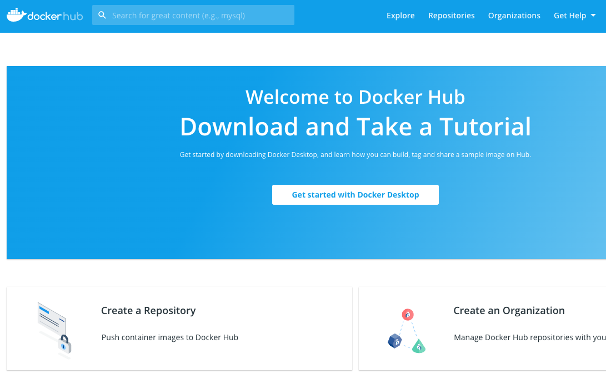
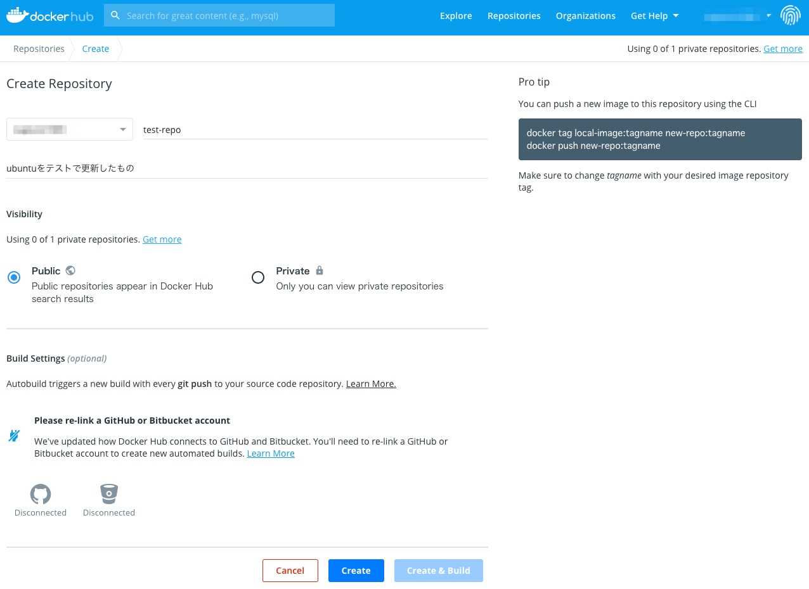
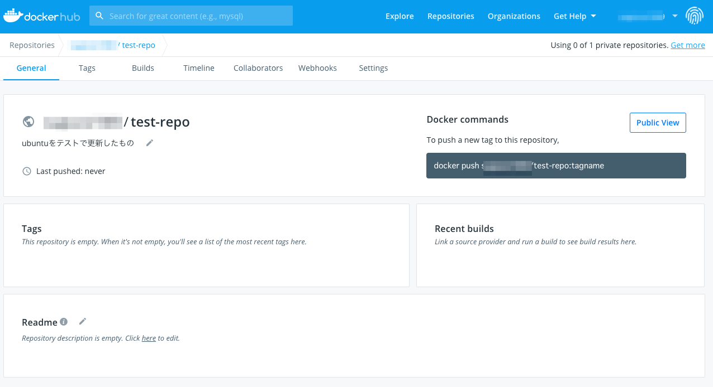
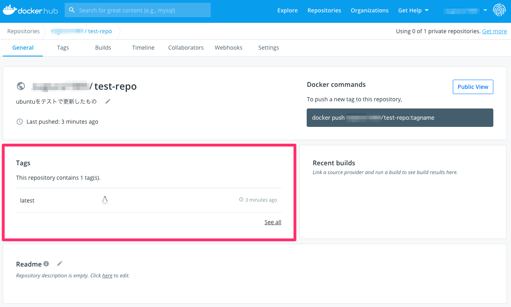

# 補章3　DockerとSplash

## はじめに

JavaScriptで動的にHTMLページが生成されるサイトをスクレイピングする場合、Splashを使う必要があります。その際にDockerを使うことが推奨されていますが、Dockerとは何なのでしょうか。ここではDockerの基本的な説明と使い方をまとめておきます。

### ログインしてHello Worldする

まずはDockerにログイン\(`docker login`\)して、hello-worldというイメージを取得\(`docker pull <image>`\)します。

```text
$ docker login
Username:****
Password:****

$ docker pull hello-world
Using default tag: latest
latest: Pulling from library/hello-world
0e03bdcc26d7: Pull complete 
Digest: sha256:d58e752213a51785838f9eed2b7a498ffa1cb3aa7f946dda11af39286c3db9a9
Status: Downloaded newer image for hello-world:latest
docker.io/library/hello-world:latest
```

ホストにあるDockerのイメージの一覧\(`docker images`\)を確認します。第12章で利用した`splash`と今回取得した`hello-world`があることがわかります。

```text
$ docker images
REPOSITORY           TAG                 IMAGE ID            CREATED             SIZE
scrapinghub/splash   latest              4ddd2efcb0df        5 months ago        2.17GB
hello-world          latest              bf756fb1ae65        5 months ago        13.3kB
```

それでは`hello-world`というイメージを使ってコンテナを作ります。`hello-world`は、テキストを出力してコンテナから抜けるだけのものです。

```text
$ docker run hello-world

Hello from Docker!
This message shows that your installation appears to be working correctly.

To generate this message, Docker took the following steps:
 1. The Docker client contacted the Docker daemon.
 2. The Docker daemon pulled the "hello-world" image from the Docker Hub.
    (amd64)
 3. The Docker daemon created a new container from that image which runs the
    executable that produces the output you are currently reading.
 4. The Docker daemon streamed that output to the Docker client, which sent it
    to your terminal.

To try something more ambitious, you can run an Ubuntu container with:
 $ docker run -it ubuntu bash

Share images, automate workflows, and more with a free Docker ID:
 https://hub.docker.com/

For more examples and ideas, visit:
 https://docs.docker.com/get-started/

```

Dockerのイメージの一覧\(`docker ps`\)を確認すると、`hello-world`のステータスは`Exited`になっています。

```text
➜ docker ps -a
CONTAINER ID        IMAGE                COMMAND                  CREATED             STATUS                      PORTS               NAMES
c28ebaec5aeb        hello-world          "/hello"                 18 seconds ago      Exited (0) 17 seconds ago                       crazy_wiles
b1ff5faed1ca        scrapinghub/splash   "python3 /app/bin/sp…"   19 hours ago        Exited (0) 16 hours ago                         amazing_zhukovsky
```

これだとコンテナというのがよくわからないので、`scrapinghub/splash`イメージを使って、コンテナを起動してみます。

```text
$ docker run -p 5023:5023 -p 8050:8050 -p 8051:8051 scrapinghub/splash
2020-06-20 22:26:10+0000 [-] Log opened.
2020-06-20 22:26:10.542305 [-] Xvfb is started: ['Xvfb', ':1821953234', '-screen', '0', '1024x768x24', '-nolisten', 'tcp']
QStandardPaths: XDG_RUNTIME_DIR not set, defaulting to '/tmp/runtime-splash'
2020-06-20 22:26:10.727403 [-] Splash version: 3.4.1
2020-06-20 22:26:10.821136 [-] Qt 5.13.1, PyQt 5.13.1, WebKit 602.1, Chromium 73.0.3683.105, sip 4.19.19, Twisted 19.7.0, Lua 5.2
2020-06-20 22:26:10.821950 [-] Python 3.6.9 (default, Nov  7 2019, 10:44:02) [GCC 8.3.0]
2020-06-20 22:26:10.823486 [-] Open files limit: 1048576
2020-06-20 22:26:10.826528 [-] Can't bump open files limit
2020-06-20 22:26:10.851621 [-] proxy profiles support is enabled, proxy profiles path: /etc/splash/proxy-profiles
2020-06-20 22:26:10.851879 [-] memory cache: enabled, private mode: enabled, js cross-domain access: disabled
2020-06-20 22:26:11.059273 [-] verbosity=1, slots=20, argument_cache_max_entries=500, max-timeout=90.0
2020-06-20 22:26:11.059877 [-] Web UI: enabled, Lua: enabled (sandbox: enabled), Webkit: enabled, Chromium: enabled
2020-06-20 22:26:11.060966 [-] Site starting on 8050
2020-06-20 22:26:11.061147 [-] Starting factory <twisted.web.server.Site object at 0x7f44809771d0>
2020-06-20 22:26:11.062130 [-] Server listening on http://0.0.0.0:8050
```

コンテナの状況を確認します。ステータスがUPになっていることがわかります。

```text
$ docker ps 
CONTAINER ID        IMAGE                COMMAND                  CREATED             STATUS              PORTS                                                      NAMES
1b0497e57c41        scrapinghub/splash   "python3 /app/bin/sp…"   3 minutes ago       Up 3 minutes        0.0.0.0:5023->5023/tcp, 0.0.0.0:8050-8051->8050-8051/tcp   boring_shtern
```

この状況で作業なりを行って、必要なくなればコンテナを停止\(`docker stop <CONTAINER ID>`\)します。

```text
$ docker stop 1b0497e57c41
1b0497e57c41
 
$ docker ps -a
CONTAINER ID        IMAGE                COMMAND                  CREATED             STATUS                      PORTS               NAMES
1b0497e57c41        scrapinghub/splash   "python3 /app/bin/sp…"   5 minutes ago       Exited (0) 6 seconds ago                        boring_shtern
c28ebaec5aeb        hello-world          "/hello"                 10 minutes ago      Exited (0) 10 minutes ago                       crazy_wiles
b1ff5faed1ca        scrapinghub/splash   "python3 /app/bin/sp…"   19 hours ago        Exited (0) 16 hours ago                         amazing_zhukovsky
```

これらの一連の作業を`hello-world`では、一瞬で作業しているので、コンテナというもののイメージが掴みにくいですが、Dockerイメージから、コンテナを作る、コンテナ環境で作業する、このコンテナをイメージにして他者も使えるようにすることで、**環境を統一**するというのが、Dockerの役割になるかと思います。

### コンテナで作業

ここではDcokerイメージから、コンテナを作り、コンテナで作業したものをDocker Hubにアップロードし、そのイメージをもう一度、取得することで、環境を統一するというイメージを体験してみます。

まずはDocker HubにアップされているUbuntuのOSイメージを取得します。ここでは、いきなり`docker run`してみます。`docker pull`は必要ないのかというと、`docker run`してホストにイメージがなければ、`docker pull`してから`docker run`してくれます。ログの出力を確認すると、ローカルにイメージがないので、プルしておきますね、というメッセージが出力されています。

最後の部分では、ubuntuのbashが使える状態になっています。`-it`というオプションは、ubuntuを起動した際に、標準入力\(stdin\)のチャネルを開くことでインプット可能になる`-i`、表示を整える`-t`というオプションです。

```text
$ docker run -it ubuntu bash
Unable to find image 'ubuntu:latest' locally
latest: Pulling from library/ubuntu
a4a2a29f9ba4: Pull complete 
127c9761dcba: Pull complete 
d13bf203e905: Pull complete 
4039240d2e0b: Pull complete 
Digest: sha256:35c4a2c15539c6c1e4e5fa4e554dac323ad0107d8eb5c582d6ff386b383b7dce
Status: Downloaded newer image for ubuntu:latest

root@c4c6b6545289:/# 
```

コンテナ内で起動しているubuntuのbashを使って、バージョンを確認してみます。問題なくコンテナ内のubuntuを操作できるようになっています。

```text
root@c4c6b6545289:/# cat /etc/lsb-release
DISTRIB_ID=Ubuntu
DISTRIB_RELEASE=20.04
DISTRIB_CODENAME=focal
DISTRIB_DESCRIPTION="Ubuntu 20.04 LTS"
```

ここでイメージレイヤーについて少し補足をします。例えば、centOSのイメージでコンテナを作ると、このようにイメージレイヤーは1つ\(`6910e5a164f7`\)です。

```text
➜ docker run -it centos bash
Unable to find image 'centos:latest' locally
latest: Pulling from library/centos
6910e5a164f7: Pull complete 
Digest: sha256:4062bbdd1bb0801b0aa38e0f83dece70fb7a5e9bce223423a68de2d8b784b43b
Status: Downloaded newer image for centos:latest

[root@fcc850c3e81a /]# cat /etc/redhat-release
CentOS Linux release 8.2.2004 (Core) 
```

ubuntuの場合は、`a4a2a29f9ba4`、`127c9761dcba`、`d13bf203e905`、`4039240d2e0b`の4つが取得されています。このイメージレイヤーを使ってコンテン内にubuntuを構築しています。

そのため、何らかの修正を加えた場合、新しい5個目のイメージレイヤが追加されることになります。ルートディレクトリにテキストファイルを追加し、コンテナから抜けておきます。

```text
root@c4c6b6545289:/# ls
bin  boot  dev  etc  home  lib  lib32  lib64  libx32  media  mnt  opt  proc  root  run  sbin  srv  sys  tmp  usr  var

root@c4c6b6545289:/# echo "This is a sample text" > a_sample.txt
root@c4c6b6545289:/# ls
a_sample.txt  bin  boot  dev  etc  home  lib  lib32  lib64  libx32  media  mnt  opt  proc  root  run  sbin  srv  sys  tmp  usr  var

root@c4c6b6545289:/# exit
exit
```

再度コンテナに入り、先程のテキストファイルが残っているか確認します。ステータスがexitedの場合は、コンテナに入ることができないので、リスタート\(`docker restart <CONTAINER ID>`\)してから、コンテナIDを使って入ります\(`docker exec -it <CONTAINER ID> bash`\)。

```text
$ docker ps -a
CONTAINER ID        IMAGE                COMMAND                  CREATED             STATUS                         PORTS               NAMES
fcc850c3e81a        831691599b88         "bash"                   30 minutes ago      Exited (130) 8 minutes ago                         condescending_banzai
c4c6b6545289        ubuntu               "bash"                   55 minutes ago      Exited (0) 36 seconds ago                          eloquent_bohr
1b0497e57c41        scrapinghub/splash   "python3 /app/bin/sp…"   About an hour ago   Exited (0) About an hour ago                       boring_shtern
c28ebaec5aeb        hello-world          "/hello"                 About an hour ago   Exited (0) About an hour ago                       crazy_wiles
b1ff5faed1ca        scrapinghub/splash   "python3 /app/bin/sp…"   21 hours ago        Exited (0) 17 hours ago                            amazing_zhukovsky
 
$ docker exec -it c4c6b6545289 bash
Error response from daemon: Container c4c6b6545289d8b5cc2d6349eaa9ab39ca407ba811fb1116da41d9640a16c41b is not running
 
$ docker restart c4c6b6545289
c4c6b6545289
 
$ docker exec -it c4c6b6545289 bash
```

さきほど作ったサンプルファイルは消えずに残っていることが確認できます。

```text
root@c4c6b6545289:/# ls
a_sample.txt  bin  boot  dev  etc  home  lib  lib32  lib64  libx32  media  mnt  opt  proc  root  run  sbin  srv  sys  tmp  usr  var

root@c4c6b6545289:/# cat a_sample.txt 
This is a sample text
```

では更新されたコンテナをDockerファイル\(`docker commit <CONTAINER ID>`\)にしていきます。

```text
$ docker ps -a 
CONTAINER ID        IMAGE                COMMAND                  CREATED             STATUS                         PORTS               NAMES
fcc850c3e81a        831691599b88         "bash"                   40 minutes ago      Exited (130) 19 minutes ago                        condescending_banzai
c4c6b6545289        ubuntu               "bash"                   About an hour ago   Up 4 minutes                                       eloquent_bohr
1b0497e57c41        scrapinghub/splash   "python3 /app/bin/sp…"   About an hour ago   Exited (0) About an hour ago                       boring_shtern
c28ebaec5aeb        hello-world          "/hello"                 About an hour ago   Exited (0) About an hour ago                       crazy_wiles
b1ff5faed1ca        scrapinghub/splash   "python3 /app/bin/sp…"   21 hours ago        Exited (0) 17 hours ago                            amazing_zhukovsky
 
$ docker commit c4c6b6545289 ubuntu:test_update
sha256:a08a259e2ad0c475670dd1535e8d8a49188d1b994e12752aae284103ee30cc8b
```

Dockerイメージを確認します。新しいタグで先程コミットしたイメージが作られていることがわかります。

```text
$ docker images
REPOSITORY           TAG                 IMAGE ID            CREATED             SIZE
ubuntu               test_update         a08a259e2ad0        8 seconds ago       73.9MB
ubuntu               latest              74435f89ab78        3 days ago          73.9MB
scrapinghub/splash   latest              4ddd2efcb0df        5 months ago        2.17GB
hello-world          latest              bf756fb1ae65        5 months ago        13.3kB
```

更新されたイメージをプッシュするためにタグ付けを行っておきます。

```text
$ docker tag ubuntu:test_update <repo_name>/test-repo
 
$ docker images
REPOSITORY              TAG                 IMAGE ID            CREATED             SIZE
ubuntu                  test_update         a08a259e2ad0        8 minutes ago       73.9MB
<repo_name>/test-repo   latest              a08a259e2ad0        8 minutes ago       73.9MB
ubuntu                  latest              74435f89ab78        3 days ago          73.9MB
scrapinghub/splash      latest              4ddd2efcb0df        5 months ago        2.17GB
hello-world             latest              bf756fb1ae65        5 months ago        13.3kB
```

タグ付けしたイメージをプッシュするには、リポジトリが必要です。このリポジトリをDocker Hubに作っておきます。Docker Hubの「Create a Repository」を押して、



必要な情報を記入します。



これでプッシュするためのリポジトリが作られました。



ここに先程更新したイメージをプッシュ\(`docker push <REPOSITORY>`\)していきましょう。プッシュされたのは`880a502881dc`だけで、他のは`library/ubuntu`からマウントされています。これは、DockerHubにあるUbuntuのイメージレイヤを共有しているためです。

```text
$ docker push <repo_name>/test-repo
The push refers to repository [docker.io/<repo_name>/test-repo]
880a502881dc: Pushed 
05f3b67ed530: Mounted from library/ubuntu 
ec1817c93e7c: Mounted from library/ubuntu 
9e97312b63ff: Mounted from library/ubuntu 
e1c75a5e0bfa: Mounted from library/ubuntu 
latest: digest: sha256:494ca8c9c87c8304caf60cf11341d0d4969e04248671114d3806494ec8bce9a8 size: 1359
```

Docker Hubを確認すると、問題なくプッシュされていることがわかります。



先程プッシュしたイメージは、他人が使うことになるので、この作業は必要ないですが、イメージがあるとDoker Hubから取得できないので、イメージを削除しておきます。

```text
$ docker rmi <repo_name>/test-repo
Untagged: <repo_name>/test-repo:latest
Untagged: <repo_name>/test-repo@sha256:494ca8c9c87c8304caf60cf11341d0d4969e04248671114d3806494ec8bce9a8
 
$ docker images
REPOSITORY           TAG                 IMAGE ID            CREATED             SIZE
ubuntu               test_update         a08a259e2ad0        23 minutes ago      73.9MB
ubuntu               latest              74435f89ab78        3 days ago          73.9MB
scrapinghub/splash   latest              4ddd2efcb0df        5 months ago        2.17GB
hello-world          latest              bf756fb1ae65        5 months ago        13.3kB
```

イメージを取得\(`docker pull`\)して、コンテナを作り\(`docker run`\)、更新されたイメージが取得できているか確認\(`cat`\)します。

```text
$ docker pull <repo_name>/test-repo:latest
latest: Pulling from <repo_name>/test-repo
Digest: sha256:494ca8c9c87c8304caf60cf11341d0d4969e04248671114d3806494ec8bce9a8
Status: Downloaded newer image for <repo_name>/test-repo:latest
docker.io/<repo_name>/test-repo:latest
~ took 3s 

$ docker images
REPOSITORY              TAG                 IMAGE ID            CREATED             SIZE
<repo_name>/test-repo   latest              a08a259e2ad0        28 minutes ago      73.9MB
ubuntu                  test_update         a08a259e2ad0        28 minutes ago      73.9MB
ubuntu                  latest              74435f89ab78        3 days ago          73.9MB
scrapinghub/splash      latest              4ddd2efcb0df        5 months ago        2.17GB
hello-world             latest              bf756fb1ae65        5 months ago        13.3kB
 
$ docker run -it <repo_name>/test-repo bash

root@4ef71bdfe48a:/# cat a_sample.txt 
This is a sample text
```

更新されたイメージを取得できていることがわかります。このようにして、環境を統一することで、再現性を担保することになります。

### Dockerファイル

Dockerイメージを作る元になるDockerファイルについて、簡単にまとめておきます。役割としては、DockerファイルからDockerイメージを作り、Dockerイメージからコンテナを作るための、大本の設計図となるのがDockerファイルです。ビルドの方法までは扱いませんが、Dockerファイルがどんなものなのかをまとめておきます。

DockerファイルをDockerインストラクションで構成されます。主なインストラクションとして、FROM、RUN、CMD、ADD、COPYなどがあります。DockerファイルはFROMから始まります。FROMでは基本的にはOSのイメージを指定します。RUNでは実行するLinuxコマンドを記載します。また、RUNごとにイメージレイヤーが作られます。Dockerファイルの末尾には、コンテナを立ち上げた際に実行したいコマンドを記載します。

```text
FROM ubuntu:latest
RUN apt-get -y update && apt-get -y install \
hoge \
fuga \
piyo

CMD ["/bin/bash"]
```

このすごくシンプルなDockerファイルをイメージビルド\(`docker build`\)して、コンテナを構築すると、ubuntuのイメージからコンテナ内にubuntuを構築\(`ubuntu:latest`\)して、インストール可能なパッケージ一覧を更新\(`apt-get update`\)し、`hoge`、`fuga`、`piyo`をインストール\(`apt-get install`\)して、bashが使える状態\(`/bin/bash`\)でコンテナが立ち上がります。

### DockerとScrapy

DockerでScrapyを動かすための最低限のDockerFile。

```text
FROM python:3.8.6

USER root

RUN apt-get update && \
    apt-get -y install locales && \
    localedef -f UTF-8 -i ja_JP ja_JP.UTF-8 && \
    mkdir py-work

ENV LANG ja_JP.UTF-8
ENV LANGUAGE ja_JP:ja
ENV LC_ALL ja_JP.UTF-8
ENV TZ JST-9

# python package
RUN pip install --upgrade pip && \
    # pip install pymysql && \
    # pip install requests && \
    # pip install bs4 && \
    pip install scrapy==2.3.0

CMD [ "/bin/bash" ]
```


